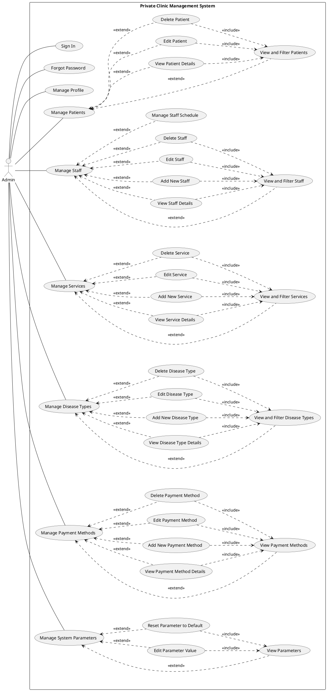
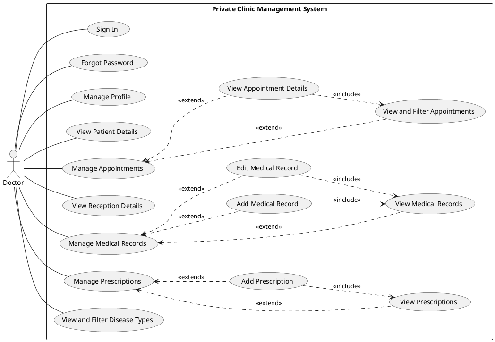
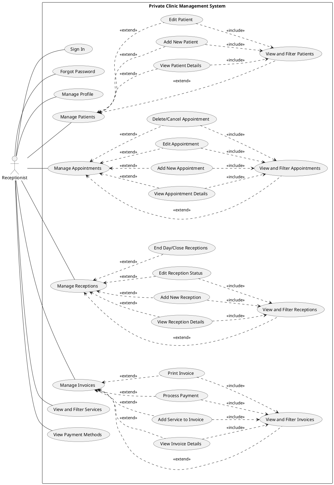
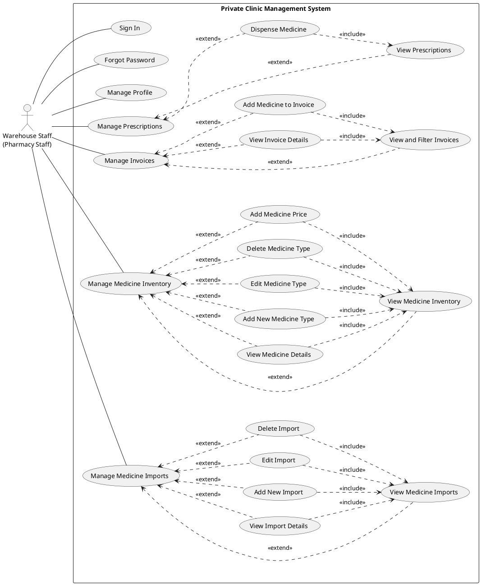
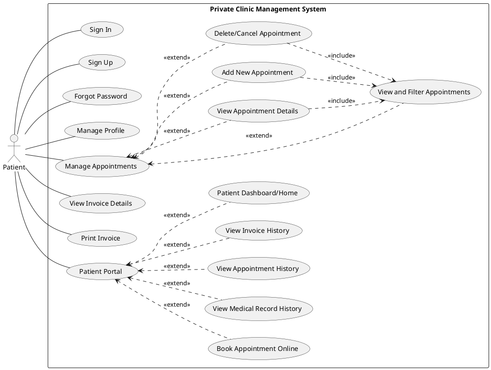

# Use Case Diagrams - Private Clinic Management System

---

## 6.1. Use Case Diagrams

### 6.1.1. Use Case Diagram - Admin

---

### 6.1.2. Use Case Diagram - Doctor

---

### 6.1.3. Use Case Diagram - Receptionist

---

### 6.1.4. Use Case Diagram - Warehouse Staff (Pharmacy Staff)

---

### 6.1.5. Use Case Diagram - Patient

---

### 6.1.6. Use Case Diagram - Overview (All Actors)

```plantuml
@startuml
left to right direction
skinparam packageStyle rectangle

actor Admin
actor Doctor
actor Receptionist
actor "Warehouse Staff" as WarehouseStaff
actor Patient

rectangle "Private Clinic Management System" {

  package "Authentication" {
    usecase UC_AUTH_01 as "Sign In"
    usecase UC_AUTH_02 as "Sign Up"
    usecase UC_AUTH_03 as "Forgot Password"
    usecase UC_AUTH_04 as "Manage Profile"
  }

  package "Patient Management" {
    usecase UC_PAT as "Manage Patients"
  }

  package "Appointment Management" {
    usecase UC_APT as "Manage Appointments"
  }

  package "Reception Management" {
    usecase UC_RCP as "Manage Receptions"
  }

  package "Medical Record Management" {
    usecase UC_MR as "Manage Medical Records"
  }

  package "Prescription Management" {
    usecase UC_PRESC as "Manage Prescriptions"
  }

  package "Invoice Management" {
    usecase UC_INV as "Manage Invoices"
  }

  package "Staff Management" {
    usecase UC_STF as "Manage Staff"
  }

  package "Medicine Inventory" {
    usecase UC_MED as "Manage Medicine Inventory"
  }

  package "Medicine Import" {
    usecase UC_IMP as "Manage Medicine Imports"
  }

  package "Service Management" {
    usecase UC_SVC as "Manage Services"
  }

  package "Disease Type Management" {
    usecase UC_DIS as "Manage Disease Types"
  }

  package "Payment Method Management" {
    usecase UC_PAY as "Manage Payment Methods"
  }

  package "System Parameters" {
    usecase UC_PAR as "Manage System Parameters"
  }

  package "Patient Portal" {
    usecase UC_PORTAL as "Patient Portal"
  }
}

' Admin connections
Admin -- UC_AUTH_01
Admin -- UC_AUTH_03
Admin -- UC_AUTH_04
Admin -- UC_PAT
Admin -- UC_STF
Admin -- UC_SVC
Admin -- UC_DIS
Admin -- UC_PAY
Admin -- UC_PAR

' Doctor connections
Doctor -- UC_AUTH_01
Doctor -- UC_AUTH_03
Doctor -- UC_AUTH_04
Doctor -- UC_APT
Doctor -- UC_MR
Doctor -- UC_PRESC
Doctor -- UC_DIS

' Receptionist connections
Receptionist -- UC_AUTH_01
Receptionist -- UC_AUTH_03
Receptionist -- UC_AUTH_04
Receptionist -- UC_PAT
Receptionist -- UC_APT
Receptionist -- UC_RCP
Receptionist -- UC_INV
Receptionist -- UC_SVC
Receptionist -- UC_PAY

' Warehouse Staff connections
WarehouseStaff -- UC_AUTH_01
WarehouseStaff -- UC_AUTH_03
WarehouseStaff -- UC_AUTH_04
WarehouseStaff -- UC_PRESC
WarehouseStaff -- UC_INV
WarehouseStaff -- UC_MED
WarehouseStaff -- UC_IMP

' Patient connections
Patient -- UC_AUTH_01
Patient -- UC_AUTH_02
Patient -- UC_AUTH_03
Patient -- UC_AUTH_04
Patient -- UC_APT
Patient -- UC_INV
Patient -- UC_PORTAL

@enduml
```

---

# Authentication & Account Management Use Case Specifications

---

## 6.2.1. Use-case Specification: "Sign In"

### 6.2.1.1. Brief Description

Allows users to log into the system to perform available functions based on their assigned role.

### 6.2.1.2. Event Flow

#### 6.2.1.2.1. Main Event Flow

1. The user selects the "Login" function on the system interface.
2. The system prompts the user to enter their email/username and password.
3. The user enters the login information and clicks "Login."
4. The system verifies the login information against the database.
5. If the information is correct, the system authenticates the user, generates a JWT token, and redirects them to the appropriate dashboard based on their role (Doctor Dashboard, Receptionist Dashboard, Pharmacy Dashboard, Admin Dashboard, or Patient Dashboard).

#### 6.2.1.2.2. Alternative Event Flows

##### 6.2.1.2.2.1. Incorrect Email/Username or Password

If the information is incorrect, the system displays the error message "Incorrect email or password" and asks the user to try again. The system increments the failed login attempt counter.

##### 6.2.1.2.2.2. Account Locked

If the account is locked (is_lock = true), the system displays the error message "Your account has been locked. Please contact administrator."

##### 6.2.1.2.2.3. Too Many Failed Attempts

If the user fails to login more than 5 times within 15 minutes, the system temporarily locks the account for 30 minutes and displays an appropriate message.

### 6.2.1.3. Special Requirements

- The password must be encrypted using bcrypt (cost ≥ 10) before being stored.
- JWT Token expiry: Access Token (1 hour), Refresh Token (7 days).
- All login attempts (successful and failed) must be logged for security auditing.
- Rate limiting must be implemented to prevent brute force attacks.

### 6.2.1.4. Pre-condition

- The user has an account in the system but has not logged in.
- The account is not locked (is_lock = false).

### 6.2.1.5. Post-condition

- If successful: The system grants access to system features based on user role, JWT token is generated and stored.
- If unsuccessful: The system prompts the user to try again with an error message.

### 6.2.1.6. Extension Points

- If the user does not have an account, they can register one by themselves (patients only).
- If the user forgot their password, they can use the "Forgot Password" function.
- Doctor, Receptionist, Pharmacist, and Admin accounts must be created by the admin (cannot be self-registered).

---

## 6.2.2. Use-case Specification: "Sign Up"

### 6.2.2.1. Brief Description

Allows new patients to register an account to use the clinic's services through the online portal.

### 6.2.2.2. Event Flow

#### 6.2.2.2.1. Main Event Flow

1. The user selects the "Sign Up" or "Register" function on the system interface.
2. The system displays a registration form with required fields: Username, Password, Full name, Email, Phone number, Date of Birth, Gender, and Address.
3. The user enters the registration information and clicks "Sign Up."
4. The system validates the input data format and business rules.
5. The system checks if the username and email are unique in the database.
6. The system hashes the password and creates a new Account record with role 'PATIENT'.
7. The system creates a corresponding Patient record linked to the account.
8. The system generates a JWT token and automatically logs the user in.
9. The system redirects the user to the Patient Dashboard.

#### 6.2.2.2.2. Alternative Event Flows

##### 6.2.2.2.2.1. Invalid Data Format

If any input data is invalid (e.g., invalid email format, password too short), the system displays specific error messages for each field and retains the entered data (except password) for correction.

##### 6.2.2.2.2.2. Username or Email Already Exists

If the username or email already exists in the system, the system displays the error message "Username or email already exists" and asks the user to provide different credentials.

### 6.2.2.3. Special Requirements

- Username: Must be unique, no whitespace, 3-50 characters.
- Email: Must be unique and in valid email format.
- Password: Minimum 8 characters, must contain uppercase, lowercase, and numbers.
- Phone: Must be 10-11 digits.
- Password must be hashed using bcrypt before storage.

### 6.2.2.4. Pre-condition

- The user does not have an existing account in the system.
- The username and email are not already registered.

### 6.2.2.5. Post-condition

- If successful: A new Account and Patient record are created, user is automatically logged in with JWT token.
- If unsuccessful: The system displays error messages and allows the user to correct the input.

### 6.2.2.6. Extension Points

- Only patient accounts can be self-registered.
- Staff accounts (Doctor, Receptionist, Pharmacist, Admin) must be created by an administrator through the Staff Management module.

---

## 6.2.3. Use-case Specification: "Forgot Password"

### 6.2.3.1. Brief Description

Allows users who have forgotten their password to reset it through email verification.

### 6.2.3.2. Event Flow

#### 6.2.3.2.1. Main Event Flow

1. The user selects the "Forgot Password" link on the login page.
2. The system displays a form requesting the user's registered email address.
3. The user enters their email and clicks "Send Reset Link."
4. The system searches for the account associated with the email.
5. The system generates a unique reset token with a 1-hour expiration time.
6. The system stores the token and sends an email containing a password reset link.
7. The system displays a confirmation message: "Check your email for reset instructions."
8. The user clicks the reset link from their email.
9. The system validates the token and its expiration.
10. The system displays a form to enter a new password (with confirmation).
11. The user enters and confirms the new password, then clicks "Reset Password."
12. The system validates the new password, hashes it, and updates the account.
13. The system invalidates the reset token and redirects to the login page with a success message.

#### 6.2.3.2.2. Alternative Event Flows

##### 6.2.3.2.2.1. Email Not Found

If the email is not registered in the system, the system still displays the same success message (for security reasons) but does not send any email.

##### 6.2.3.2.2.2. Invalid or Expired Token

If the reset link contains an invalid or expired token, the system displays the error message "Reset link is invalid or expired" and prompts the user to request a new reset link.

##### 6.2.3.2.2.3. Password Validation Failed

If the new password does not meet requirements, the system displays specific error messages and allows the user to re-enter.

### 6.2.3.3. Special Requirements

- Reset token must be cryptographically random and expire after 1 hour.
- For security, the system should not reveal whether an email exists in the database.
- New password must meet the same requirements as registration (min 8 chars, uppercase, lowercase, numbers).
- Old reset tokens must be invalidated when a new one is requested.

### 6.2.3.4. Pre-condition

- The user has a registered account with a valid email address.

### 6.2.3.5. Post-condition

- If successful: The password is updated, user can log in with the new password.
- If unsuccessful: The system displays appropriate error messages and guides the user.

### 6.2.3.6. Extension Points

- User can request a new reset link if the previous one expired.
- After successful reset, user is redirected to login page to authenticate with new credentials.

---

## 6.2.4. Use-case Specification: "Manage Profile"

### 6.2.4.1. Brief Description

Allows authenticated users to view and update their personal profile information.

### 6.2.4.2. Event Flow

#### 6.2.4.2.1. Main Event Flow

1. The user selects the "Profile" or "My Account" option from the navigation menu.
2. The system retrieves and displays the user's current profile information (name, email, phone, address, etc.).
3. The user clicks "Edit Profile" to modify their information.
4. The system displays an editable form with the current values pre-populated.
5. The user modifies the desired fields and clicks "Save Changes."
6. The system validates the updated information.
7. The system updates the user's profile in the database.
8. The system displays a success message: "Profile updated successfully."

#### 6.2.4.2.2. Alternative Event Flows

##### 6.2.4.2.2.1. Validation Error

If any updated field contains invalid data, the system displays specific error messages and retains the form for correction.

##### 6.2.4.2.2.2. Email Already In Use

If the user tries to change their email to one that is already registered, the system displays "This email is already in use" and prevents the update.

##### 6.2.4.2.2.3. Change Password

If the user wants to change their password, they must provide the current password for verification before setting a new one.

### 6.2.4.3. Special Requirements

- Users cannot change their username or role.
- Email changes may require re-verification depending on security settings.
- Password changes require current password verification.
- Profile changes should be logged for audit purposes.

### 6.2.4.4. Pre-condition

- The user is authenticated and logged into the system.

### 6.2.4.5. Post-condition

- If successful: The user's profile information is updated in the database.
- If unsuccessful: The system displays error messages and retains the original data.

### 6.2.4.6. Extension Points

- Users can upload or change their profile picture.
- Users can enable/disable notification preferences.
- Password change functionality is available within the profile management
- 11a.2. Cho phép yêu cầu reset mới
- 11a.3. Quay lại bước 1

### Ràng buộc nghiệp vụ

# Manage Appointment Use Case Specifications

## 6.2.1. Use-case Specification: View and Filter Appointments

### 6.2.1.1. Brief Description

Receptionists, doctors, and patients browse the clinic's appointment roster, applying filters such as date range, doctor, or status so they can focus on the slots most relevant to their needs.

### 6.2.1.2. Event Flow

#### 6.2.1.2.1. Main Event Flow

1. The user selects the "View Appointments" option from the dashboard or menu.
2. The system displays an initial paginated list showing patient name, doctor, date and time, and current status.
3. The user applies filters (e.g., date range, doctor, status, clinic location) and submits the request.
4. The system validates the filters, retrieves matching appointments, sorts them by date/time, and refreshes the list with up-to-date records.

#### 6.2.1.2.2. Alternative Event Flows

##### 6.2.1.2.2.1. Filters return no results

The system shows a friendly message ("No appointments match the selected filters"), retains the current filter selection, and leaves the list empty so the user can adjust inputs.

##### 6.2.1.2.2.2. Data retrieval fails

If the system cannot load appointments (e.g., database timeout), it displays an error banner and allows the user to retry or contact support.

### 6.2.1.3. Special Requirements

- Results must reflect changes made in the last minute to avoid stale scheduling information.
- Server-side filtering must support date ranges, doctor IDs, and status codes with efficient pagination.
- The displayed list should never surface more than 50 rows per page by default.

### 6.2.1.4. Pre-condition

The logged-in user is a receptionist, doctor, or patient with permission to view appointment data, and at least one appointment exists in the system.

### 6.2.1.5. Post-condition

The appointment list is refreshed according to the filters; the user may proceed to select an appointment for more actions or close the list.

### 6.2.1.6. Extension Points

- Selecting an appointment launches the View Appointment Details use case.
- Inline actions can branch to Edit Appointment or Delete/Cancel Appointment if permissions allow.

---

## 6.2.2. Use-case Specification: View Appointment Details

### 6.2.2.1. Brief Description

Authorized staff or patients inspect a selected appointment's comprehensive information so they can verify patient/doctor data, status, and any linked services.

### 6.2.2.2. Event Flow

#### 6.2.2.2.1. Main Event Flow

1. The user clicks or taps an appointment entry from the list.
2. The system loads the appointment record along with patient demographics, doctor details, room, services requested, and status notes.
3. The system displays a detailed view or modal with contact information and relevant links (e.g., linked medical record or invoices).

#### 6.2.2.2.2. Alternative Event Flows

##### 6.2.2.2.2.1. Appointment has been removed

If the record was deleted or cancelled since the list loaded, the system alerts the user that the appointment no longer exists and refreshes the list.

##### 6.2.2.2.2.2. Access denied

If the user lacks permission for the requested appointment (e.g., a patient viewing another patient's slot), the system shows an authorization error and stays on the list view.

### 6.2.2.3. Special Requirements

- The detail view must include contact information and allow for quick navigation to the patient profile or doctor schedule.
- Data must be read-only unless the user initiates an edit or cancellation workflow.

### 6.2.2.4. Pre-condition

An appointment is selected from the list and the user remains authenticated with the appropriate role.

### 6.2.2.5. Post-condition

The detailed information is presented; the user can close the view or trigger extensions (edit, cancel, invoice).

### 6.2.2.6. Extension Points

- "Edit" launches the Edit Appointment use case.
- "Cancel" navigates to the Delete/Cancel Appointment use case.
- "Print" or "Generate Invoice" links out to billing flows.

---

## 6.2.3. Use-case Specification: Add New Appointment

### 6.2.3.1. Brief Description

Receptionists or patients schedule a new appointment by selecting an available slot, patient, and doctor while the system enforces capacity and availability constraints.

### 6.2.3.2. Event Flow

#### 6.2.3.2.1. Main Event Flow

1. The user activates the "Book Appointment" or "Add New Appointment" control.
2. The system displays a form requesting patient selection (existing or new), doctor, reason, preferred date/time, and optional notes.
3. The user chooses a time slot, doctor, and any required services, then submits the form.
4. The system verifies the slot against the doctor's schedule and daily patient limit for that doctor/clinic, ensuring no conflict.
5. Upon successful validation, the system persists the appointment with status "Scheduled" and dispatches a confirmation notification (email/SMS) to the patient and doctor.

#### 6.2.3.2.2. Alternative Event Flows

##### 6.2.3.2.2.1. Time slot unavailable

If the selected slot conflicts with an existing booking or blocked time, the system highlights the conflict, suggests the next available slots, and keeps the form data for correction.

##### 6.2.3.2.2.2. Daily limit reached

If the doctor or clinic has met the configurable daily limit, the system prevents saving and displays a message advising to choose another day or doctor.

### 6.2.3.3. Special Requirements

- Appointment creation should check both general availability and any leave/holidays on the doctor schedule.
- Notifications must be queued for delivery within 30 seconds of creation.
- Patient and doctor time zones must be aligned to prevent off-by-one-day errors.

### 6.2.3.4. Pre-condition

The user is authenticated and has permission to schedule appointments; the patient record exists (or is created on-the-fly); a doctor schedule is published.

### 6.2.3.5. Post-condition

A new appointment record exists with status "Scheduled," relevant staff/patient notified, and availability grids updated.

### 6.2.3.6. Extension Points

- After creation, the system can auto-create an initial medical record or pre-authorize services in the Add Medical Record workflow.
- Invoice creation or patient intake steps might be triggered from the confirmation screen.

---

## 6.2.4. Use-case Specification: Edit Appointment

### 6.2.4.1. Brief Description

Receptionists adjust existing appointments to update date/time, assigned doctor, or status while verifying new slot availability.

### 6.2.4.2. Event Flow

#### 6.2.4.2.1. Main Event Flow

1. The user opens an appointment from the list or detail view and chooses "Edit."
2. The system pre-populates the edit form with current details and refreshes available time slots for the selected doctor or clinic.
3. The user modifies the appointment data (date, time, doctor, status, notes) and saves changes.
4. The system validates the new slot, ensures it does not collide with other commitments, and updates the appointment record.
5. A notification is sent to affected parties about the change.

#### 6.2.4.2.2. Alternative Event Flows

##### 6.2.4.2.2.1. New slot conflict

If the new date/time conflicts with another booking or clinic closure, the system warns the user and keeps the edited form for correction.

##### 6.2.4.2.2.2. Editing prohibited

If the appointment is already marked as completed or in progress, the system blocks the edit and explains that only future or scheduled appointments can be modified.

### 6.2.4.3. Special Requirements

- Changes must be logged with timestamps and user identity for audit purposes.
- The edit form must respect the same validation rules as creation (slot available, daily limits).

### 6.2.4.4. Pre-condition

The appointment exists with status "Scheduled" or similar, and the user has rights to modify the slot.

### 6.2.4.5. Post-condition

The appointment reflects the updated input; schedules and notifications are updated accordingly.

### 6.2.4.6. Extension Points

- After editing, the user may proceed to Generate Invoice if services changed, or re-open View Appointment Details.

---

## 6.2.5. Use-case Specification: Delete/Cancel Appointment

### 6.2.5.1. Brief Description

Receptionists or patients cancel appointments that no longer need to occur, triggering status updates and cancellation notices.

### 6.2.5.2. Event Flow

#### 6.2.5.2.1. Main Event Flow

1. The user selects an appointment and chooses "Cancel" or "Delete."
2. The system prompts for confirmation and an optional cancellation reason.
3. Upon confirmation, the system updates the appointment status to "Cancelled," frees the slot in the schedule, and notifies the patient and doctor.

#### 6.2.5.2.2. Alternative Event Flows

##### 6.2.5.2.2.1. Appointment already started or completed

If the appointment is marked as in progress or done, the system rejects the cancellation and explains that only scheduled appointments can be cancelled.

##### 6.2.5.2.2.2. Cancellation aborted

If the user dismisses the confirmation, the appointment remains unchanged and the list returns to its previous state.

### 6.2.5.3. Special Requirements

- Cancellation must capture a reason and time of action for reporting.
- Notifications should be dispatched immediately so staff can update their workload.

### 6.2.5.4. Pre-condition

The appointment exists, is scheduled (not yet started), and the user has permission to cancel it.

### 6.2.5.5. Post-condition

The appointment status becomes "Cancelled," availability is restored, and notifications are sent; dependent workflows (medical records, invoices) are aware of the change.

### 6.2.5.6. Extension Points

- After cancellation, provide a direct link to book a new appointment or reactivate a future slot.
- Trigger downstream billing adjustments if payment was already processed.

# Manage Disease Type Use Case Specifications

---

## 6.2.1. Use-case Specification: "View and Filter Disease Types"

### 6.2.1.1. Brief Description

Allows administrators and doctors to view a list of all disease types in the system and search by name.

### 6.2.1.2. Event Flow

#### 6.2.1.2.1. Main Event Flow

1. The user selects the "Disease Types" or "Disease Management" option from the navigation menu.
2. The system retrieves and displays a list of all disease types with their names and descriptions.
3. The user enters a search keyword in the search field.
4. The system filters the list to show only disease types matching the search criteria.
5. The system displays the filtered results.

#### 6.2.1.2.2. Alternative Event Flows

##### 6.2.1.2.2.1. No Results Found

If no disease types match the search criteria, the system displays "No disease types found" and allows the user to modify the search.

##### 6.2.1.2.2.2. Empty Database

If no disease types exist in the system, the system displays "No disease types have been added yet" with an option to add new ones (for Admin only).

### 6.2.1.3. Special Requirements

- Search must be case-insensitive and support partial matching.
- The list should be sortable by name alphabetically.
- Results should be paginated for large datasets.

### 6.2.1.4. Pre-condition

- The user is authenticated as Admin or Doctor.

### 6.2.1.5. Post-condition

- If successful: The disease type list is displayed according to search criteria.
- If unsuccessful: An error message is shown.

### 6.2.1.6. Extension Points

- Clicking on a disease type opens View Disease Type Details.
- Admin users can access Add, Edit, or Delete functions from this view.

---

## 6.2.2. Use-case Specification: "View Disease Type Details"

### 6.2.2.1. Brief Description

Allows administrators to view complete details of a specific disease type including its usage statistics.

### 6.2.2.2. Event Flow

#### 6.2.2.2.1. Main Event Flow

1. The admin selects a disease type from the list.
2. The system retrieves the complete disease type record.
3. The system displays detailed information including: disease type ID, name, description, creation date, last modified date, and count of associated medical records.

#### 6.2.2.2.2. Alternative Event Flows

##### 6.2.2.2.2.1. Disease Type Not Found

If the disease type has been deleted, the system displays "Disease type not found" and returns to the list.

### 6.2.2.3. Special Requirements

- The detail view should show usage statistics (how many medical records reference this disease type).
- Display creation and modification timestamps for audit purposes.

### 6.2.2.4. Pre-condition

- The user is authenticated as Admin.
- The disease type exists in the system.

### 6.2.2.5. Post-condition

- If successful: Complete disease type details are displayed.
- If unsuccessful: An error message is shown and user is returned to the list.

### 6.2.2.6. Extension Points

- Admin can Edit or Delete the disease type from the details view.

---

## 6.2.3. Use-case Specification: "Add New Disease Type"

### 6.2.3.1. Brief Description

Allows administrators to add new disease types to the system for use in medical record diagnoses.

### 6.2.3.2. Event Flow

#### 6.2.3.2.1. Main Event Flow

1. The admin selects "Add New Disease Type" from the disease type management screen.
2. The system displays a form with fields for name and description.
3. The admin enters the disease type information.
4. The admin clicks "Save" to create the disease type.
5. The system validates the input data.
6. The system checks for duplicate disease type names.
7. The system creates the new disease type record.
8. The system displays a success message and returns to the disease type list.

#### 6.2.3.2.2. Alternative Event Flows

##### 6.2.3.2.2.1. Duplicate Name

If a disease type with the same name already exists, the system displays "A disease type with this name already exists" and allows correction.

##### 6.2.3.2.2.2. Validation Error

If required fields are empty or invalid, the system highlights the errors and prevents submission.

### 6.2.3.3. Special Requirements

- Disease type name must be unique in the system.
- Name should have a minimum length of 2 characters and maximum of 100 characters.
- Description is optional but recommended.

### 6.2.3.4. Pre-condition

- The user is authenticated as Admin.
- The disease type name is not already in use.

### 6.2.3.5. Post-condition

- If successful: A new disease type is created and available for use in medical records.
- If unsuccessful: No record is created and error messages guide the user.

### 6.2.3.6. Extension Points

- After creation, admin can immediately add another disease type.
- The new disease type becomes available in the diagnosis dropdown for doctors.

---

## 6.2.4. Use-case Specification: "Edit Disease Type"

### 6.2.4.1. Brief Description

Allows administrators to modify the details of an existing disease type.

### 6.2.4.2. Event Flow

#### 6.2.4.2.1. Main Event Flow

1. The admin selects a disease type and clicks "Edit."
2. The system displays a form pre-populated with the current disease type information.
3. The admin modifies the name and/or description.
4. The admin clicks "Save" to update the disease type.
5. The system validates the updated data.
6. The system checks that the new name doesn't conflict with existing disease types.
7. The system updates the disease type record.
8. The system displays a success message.

#### 6.2.4.2.2. Alternative Event Flows

##### 6.2.4.2.2.1. Name Conflict

If the new name conflicts with another existing disease type, the system displays an error and prevents the update.

##### 6.2.4.2.2.2. No Changes Made

If the user saves without making changes, the system simply returns to the previous view without updating.

### 6.2.4.3. Special Requirements

- Changes should be logged with timestamp and user information for audit.
- Editing a disease type should not affect existing medical records referencing it.

### 6.2.4.4. Pre-condition

- The user is authenticated as Admin.
- The disease type exists in the system.

### 6.2.4.5. Post-condition

- If successful: The disease type information is updated in the database.
- If unsuccessful: The original data remains unchanged and an error message is displayed.

### 6.2.4.6. Extension Points

- After editing, admin can proceed to view details or return to the list.

---

## 6.2.5. Use-case Specification: "Delete Disease Type"

### 6.2.5.1. Brief Description

Allows administrators to remove a disease type from the system, provided it is not referenced by any medical records.

### 6.2.5.2. Event Flow

#### 6.2.5.2.1. Main Event Flow

1. The admin selects a disease type and clicks "Delete."
2. The system checks if the disease type is referenced by any medical records.
3. If not referenced, the system displays a confirmation dialog.
4. The admin confirms the deletion.
5. The system deletes the disease type record.
6. The system displays a success message and refreshes the list.

#### 6.2.5.2.2. Alternative Event Flows

##### 6.2.5.2.2.1. Disease Type In Use

If the disease type is referenced by medical records, the system displays "Cannot delete: This disease type is used in X medical records" and prevents deletion.

##### 6.2.5.2.2.2. Deletion Cancelled

If the admin cancels the confirmation, the disease type remains unchanged.

### 6.2.5.3. Special Requirements

- Referential integrity must be maintained; disease types with references cannot be deleted.
- Consider implementing soft delete (marking as inactive) instead of hard delete.
- Deletion should be logged for audit purposes.

### 6.2.5.4. Pre-condition

- The user is authenticated as Admin.
- The disease type exists in the system.
- The disease type is not referenced by any medical records.

### 6.2.5.5. Post-condition

- If successful: The disease type is removed from the system and no longer available for selection.
- If unsuccessful: The disease type remains in the system with an explanatory message.

### 6.2.5.6. Extension Points

- If deletion is blocked, admin can view which medical records reference this disease type.
- Alternative: Admin can deactivate instead of delete to preserve referential integrity.

# Manage Invoice Use Case Specifications

---

## 6.2.1. Use-case Specification: "View and Filter Invoices"

### 6.2.1.1. Brief Description

Allows staff members to view a list of all invoices and apply filters to find specific invoices based on various criteria.

### 6.2.1.2. Event Flow

#### 6.2.1.2.1. Main Event Flow

1. The staff member selects the "Invoices" or "Invoice Management" option from the navigation menu.
2. The system retrieves and displays a paginated list of invoices with basic information (invoice ID, patient name, date, total amount, payment status).
3. The staff member applies filters such as date range, payment status, or patient name.
4. The system validates the filter criteria and retrieves matching invoices.
5. The system displays the filtered results sorted by date (newest first).

#### 6.2.1.2.2. Alternative Event Flows

##### 6.2.1.2.2.1. No Invoices Found

If no invoices match the filter criteria, the system displays a message "No invoices found matching your criteria" and allows the user to modify filters.

##### 6.2.1.2.2.2. System Error

If the system fails to retrieve invoices, it displays an error message and provides a retry option.

### 6.2.1.3. Special Requirements

- The list must be paginated with a configurable number of items per page (default: 20).
- Filters must support date range, payment status (Paid, Unpaid, Partial), and patient search.
- The system should display real-time totals for filtered results.

### 6.2.1.4. Pre-condition

- The user is authenticated as Receptionist or Pharmacy Staff.
- At least one invoice exists in the system.

### 6.2.1.5. Post-condition

- If successful: The invoice list is displayed according to the applied filters.
- If unsuccessful: An error message is shown and the user can retry.

### 6.2.1.6. Extension Points

- Clicking on an invoice opens the View Invoice Details use case.
- Export functionality allows generating PDF/Excel reports of filtered invoices.

---

## 6.2.2. Use-case Specification: "View Invoice Details"

### 6.2.2.1. Brief Description

Allows users to view complete details of a specific invoice including services, medicines, and payment information.

### 6.2.2.2. Event Flow

#### 6.2.2.2.1. Main Event Flow

1. The user selects an invoice from the invoice list.
2. The system retrieves the complete invoice record from the database.
3. The system displays detailed information including: patient details, services rendered with prices, medicines dispensed with quantities and prices, subtotals, discounts (if any), total amount, payment status, and payment history.

#### 6.2.2.2.2. Alternative Event Flows

##### 6.2.2.2.2.1. Invoice Not Found

If the invoice has been deleted or does not exist, the system displays "Invoice not found" and returns to the invoice list.

##### 6.2.2.2.2.2. Access Denied

If a patient tries to view another patient's invoice, the system denies access and displays an authorization error.

### 6.2.2.3. Special Requirements

- Invoice details must show itemized breakdown of all charges.
- Payment history should display all partial payments with timestamps.
- The system should calculate and display any outstanding balance.

### 6.2.2.4. Pre-condition

- The user is authenticated as Receptionist, Pharmacy Staff, or the Patient who owns the invoice.
- The invoice exists in the system.

### 6.2.2.5. Post-condition

- If successful: Complete invoice details are displayed to the user.
- If unsuccessful: An appropriate error message is shown.

### 6.2.2.6. Extension Points

- Users can proceed to Process Payment if there is an outstanding balance.
- Users can Print Invoice from the details view.
- Staff can Add Service or Add Medicine to modify the invoice.

---

## 6.2.3. Use-case Specification: "Add Service to Invoice"

### 6.2.3.1. Brief Description

Allows receptionists to add medical services to an existing invoice and automatically recalculate the total amount.

### 6.2.3.2. Event Flow

#### 6.2.3.2.1. Main Event Flow

1. The receptionist opens an invoice and selects "Add Service."
2. The system displays a list of available services with their current prices.
3. The receptionist searches or browses to find the desired service.
4. The receptionist selects a service and specifies the quantity if applicable.
5. The system validates the selection and adds the service to the invoice.
6. The system recalculates the invoice total and updates the display.
7. The system displays a success message confirming the service was added.

#### 6.2.3.2.2. Alternative Event Flows

##### 6.2.3.2.2.1. Service Already Added

If the service is already on the invoice, the system prompts whether to increase the quantity or cancel the operation.

##### 6.2.3.2.2.2. Invoice Already Paid

If the invoice is fully paid, the system prevents modification and displays "Cannot modify a paid invoice."

### 6.2.3.3. Special Requirements

- Services must be added with their current effective price.
- The system must maintain an audit trail of invoice modifications.
- Price changes after adding a service should not affect the invoice.

### 6.2.3.4. Pre-condition

- The user is authenticated as Receptionist.
- The invoice exists and is not fully paid.
- At least one service is available in the system.

### 6.2.3.5. Post-condition

- If successful: The service is added to the invoice and totals are recalculated.
- If unsuccessful: The invoice remains unchanged and an error message is displayed.

### 6.2.3.6. Extension Points

- After adding services, the receptionist can proceed to Process Payment.
- Multiple services can be added in sequence without closing the dialog.

---

## 6.2.4. Use-case Specification: "Add Medicine to Invoice"

### 6.2.4.1. Brief Description

Allows pharmacy staff to add dispensed medicines from a prescription to the invoice and automatically recalculate the total.

### 6.2.4.2. Event Flow

#### 6.2.4.2.1. Main Event Flow

1. The pharmacy staff opens an invoice and selects "Add Medicine."
2. The system displays the associated prescription with medicine details.
3. The pharmacy staff selects medicines to dispense from the prescription.
4. The system checks inventory availability for selected medicines.
5. The system applies FEFO (First-Expire-First-Out) logic to select stock.
6. The system adds the medicines to the invoice with current prices.
7. The system updates inventory quantities and recalculates the invoice total.
8. The system displays a success message with a summary of added items.

#### 6.2.4.2.2. Alternative Event Flows

##### 6.2.4.2.2.1. Insufficient Stock

If the requested quantity exceeds available stock, the system displays a warning and allows partial dispensing or cancellation.

##### 6.2.4.2.2.2. Medicine Expired

If all available stock for a medicine is expired, the system prevents dispensing and notifies the staff.

### 6.2.4.3. Special Requirements

- FEFO logic must be applied to prioritize medicines expiring soonest.
- Inventory must be updated in real-time to prevent overselling.
- Batch/lot numbers should be recorded for traceability.

### 6.2.4.4. Pre-condition

- The user is authenticated as Pharmacy Staff.
- The invoice exists with an associated prescription.
- The invoice is not fully paid.

### 6.2.4.5. Post-condition

- If successful: Medicines are added to invoice, inventory is reduced, totals are updated.
- If unsuccessful: No changes are made and appropriate error messages are shown.

### 6.2.4.6. Extension Points

- Staff can print medicine labels and usage instructions after dispensing.
- If some medicines are unavailable, staff can note them for external purchase.

---

## 6.2.5. Use-case Specification: "Process Payment"

### 6.2.5.1. Brief Description

Allows receptionists to process payments for invoices using various payment methods and update the payment status accordingly.

### 6.2.5.2. Event Flow

#### 6.2.5.2.1. Main Event Flow

1. The receptionist opens an invoice and selects "Process Payment."
2. The system displays the outstanding balance and available payment methods.
3. The receptionist selects a payment method (Cash, Card, Bank Transfer, etc.).
4. The receptionist enters the payment amount.
5. The system validates the payment amount against the outstanding balance.
6. The system creates a payment record and updates the invoice status.
7. If fully paid, the system marks the invoice as "Paid." If partially paid, status becomes "Partial."
8. The system displays a payment confirmation with receipt details.

#### 6.2.5.2.2. Alternative Event Flows

##### 6.2.5.2.2.1. Overpayment

If the payment amount exceeds the balance, the system displays the change amount to be returned and processes the exact balance.

##### 6.2.5.2.2.2. Payment Failed

If payment processing fails (e.g., card declined), the system displays an error message and allows retry with a different method.

### 6.2.5.3. Special Requirements

- Multiple partial payments must be supported for a single invoice.
- All payment transactions must be logged with timestamps.
- Cash payments should calculate and display change amounts.

### 6.2.5.4. Pre-condition

- The user is authenticated as Receptionist.
- The invoice has an outstanding balance greater than zero.
- At least one payment method is configured in the system.

### 6.2.5.5. Post-condition

- If successful: Payment is recorded, invoice status is updated, receipt is generated.
- If unsuccessful: No payment is recorded and an error message is displayed.

### 6.2.5.6. Extension Points

- After payment, the system can automatically print a receipt.
- For card payments, integration with payment gateway may be triggered.

---

## 6.2.6. Use-case Specification: "Print Invoice"

### 6.2.6.1. Brief Description

Allows users to generate and print a formatted PDF version of an invoice for record-keeping or patient receipt.

### 6.2.6.2. Event Flow

#### 6.2.6.2.1. Main Event Flow

1. The user opens an invoice and selects "Print Invoice."
2. The system generates a PDF document with clinic header, invoice details, itemized charges, totals, and payment status.
3. The system displays a print preview to the user.
4. The user confirms to print or download the PDF.
5. The system sends the document to the printer or initiates download.

#### 6.2.6.2.2. Alternative Event Flows

##### 6.2.6.2.2.1. PDF Generation Failed

If the system fails to generate the PDF, it displays an error message and offers to retry.

##### 6.2.6.2.2.2. Printer Unavailable

If no printer is available, the system offers only the download option.

### 6.2.6.3. Special Requirements

- The PDF must include clinic logo, address, and contact information.
- Invoice must be formatted for standard paper sizes (A4, Letter).
- The document should include a unique invoice number and barcode/QR code.

### 6.2.6.4. Pre-condition

- The user is authenticated as Receptionist or the Patient who owns the invoice.
- The invoice exists in the system.

### 6.2.6.5. Post-condition

- If successful: A PDF invoice is generated and printed/downloaded.
- If unsuccessful: An error message is displayed and user can retry.

### 6.2.6.6. Extension Points

- Option to email the invoice PDF directly to the patient.
- Option to save invoice to patient's document history.

# Manage Medical Record Use Case Specifications

---

## 6.2.1. Use-case Specification: "View Medical Records"

### 6.2.1.1. Brief Description

Allows doctors to view a list of medical records and access detailed information including symptoms, diagnosis, prescriptions, and services.

### 6.2.1.2. Event Flow

#### 6.2.1.2.1. Main Event Flow

1. The doctor selects the "Medical Records" option from the navigation menu.
2. The system retrieves and displays a paginated list of medical records with patient information.
3. The doctor can filter records by patient name, date range, or disease type.
4. The doctor clicks on a record to view details.
5. The system displays complete information: patient demographics, symptoms, diagnosis, disease type, prescribed services, and associated prescriptions.

#### 6.2.1.2.2. Alternative Event Flows

##### 6.2.1.2.2.1. No Records Found

If no medical records match the filter criteria, the system displays "No medical records found" and allows the doctor to modify filters.

##### 6.2.1.2.2.2. Access Denied

If a doctor tries to access records they don't have permission to view, the system denies access with an appropriate message.

### 6.2.1.3. Special Requirements

- Medical records must be secured and only accessible to authorized personnel.
- Records should display the most recent entries first by default.
- Patient privacy must be maintained according to healthcare regulations.

### 6.2.1.4. Pre-condition

- The user is authenticated as Doctor.
- At least one medical record exists in the system.

### 6.2.1.5. Post-condition

- If successful: Medical records are displayed according to the applied filters.
- If unsuccessful: An error message is shown.

### 6.2.1.6. Extension Points

- From the detail view, doctor can Edit Medical Record or Add Prescription.
- Doctor can view linked invoices and prescriptions.

---

## 6.2.2. Use-case Specification: "Add Medical Record"

### 6.2.2.1. Brief Description

Allows doctors to create a new medical record for a patient during or after an examination.

### 6.2.2.2. Event Flow

#### 6.2.2.2.1. Main Event Flow

1. The doctor selects a reception from the daily reception list to begin examination.
2. The system displays the examination form with patient information pre-populated.
3. The doctor enters medical information: symptoms, diagnosis, and selects the disease type.
4. The doctor selects any required services (X-ray, lab tests, etc.).
5. The doctor clicks "Save" to create the medical record.
6. The system validates all required fields.
7. The system creates the MedicalRecord entry in the database.
8. The system updates the Reception status to "In Examination" or "Done."
9. The system automatically creates an Invoice with default values.
10. The system displays a success message and offers to Add Prescription.

#### 6.2.2.2.2. Alternative Event Flows

##### 6.2.2.2.2.1. Validation Error

If required fields are missing or invalid, the system highlights the errors and prevents submission.

##### 6.2.2.2.2.2. Reception Already Processed

If the reception already has a medical record, the system notifies the doctor and offers to view the existing record.

### 6.2.2.3. Special Requirements

- All medical records must be linked to a valid reception.
- Timestamps must be automatically recorded for audit purposes.
- Invoice creation should be automatic to ensure billing integrity.

### 6.2.2.4. Pre-condition

- The user is authenticated as Doctor.
- A valid reception exists for the patient.
- The reception status is "Waiting" or "In Examination."

### 6.2.2.5. Post-condition

- If successful: A new medical record is created, reception status is updated, and an invoice is generated.
- If unsuccessful: No records are created and error messages guide the doctor.

### 6.2.2.6. Extension Points

- After creation, doctor can immediately proceed to Add Prescription.
- Doctor can add additional services to the generated invoice.

---

## 6.2.3. Use-case Specification: "Edit Medical Record"

### 6.2.3.1. Brief Description

Allows doctors to modify an existing medical record within a specified time window.

### 6.2.3.2. Event Flow

#### 6.2.3.2.1. Main Event Flow

1. The doctor opens a medical record and clicks "Edit."
2. The system verifies that the record is within the editable time window.
3. The system displays an editable form with current values pre-populated.
4. The doctor modifies the symptoms, diagnosis, disease type, or services.
5. The doctor clicks "Save" to update the record.
6. The system validates the updated information.
7. The system updates the medical record and logs the modification.
8. The system displays a success message.

#### 6.2.3.2.2. Alternative Event Flows

##### 6.2.3.2.2.1. Edit Window Expired

If the medical record is outside the editable time window (e.g., created more than 24 hours ago), the system displays "This record can no longer be edited" and prevents modification.

##### 6.2.3.2.2.2. Concurrent Edit

If another user is editing the same record, the system warns about potential conflicts and may block the edit.

### 6.2.3.3. Special Requirements

- Edits must only be allowed within a configurable time window (e.g., same day or 24 hours).
- All modifications must be logged with timestamp and user information.
- Original data should be preserved in an audit trail.

### 6.2.3.4. Pre-condition

- The user is authenticated as Doctor.
- The medical record exists and is within the editable time window.
- The doctor has permission to edit the record (typically the creating doctor).

### 6.2.3.5. Post-condition

- If successful: The medical record is updated with changes logged.
- If unsuccessful: The original record remains unchanged with an appropriate message.

### 6.2.3.6. Extension Points

- After editing, doctor can update the associated prescription if needed.
- Changes to services may trigger invoice updates.

# Manage Medicine Import Use Case Specifications

---

## 6.2.1. Use-case Specification: "View Medicine Imports"

### 6.2.1.1. Brief Description

Allows warehouse staff to view a list of all medicine import records and filter by date or supplier.

### 6.2.1.2. Event Flow

#### 6.2.1.2.1. Main Event Flow

1. The warehouse staff selects the "Medicine Imports" option from the navigation menu.
2. The system retrieves and displays a paginated list of import records with basic information (import ID, date, supplier, total value, status).
3. The staff applies filters such as date range or supplier name.
4. The system validates the filter criteria and retrieves matching imports.
5. The system displays the filtered results sorted by date (newest first).

#### 6.2.1.2.2. Alternative Event Flows

##### 6.2.1.2.2.1. No Imports Found

If no import records match the filter criteria, the system displays "No import records found" and allows the staff to modify filters.

##### 6.2.1.2.2.2. System Error

If the system fails to retrieve import data, it displays an error message and provides a retry option.

### 6.2.1.3. Special Requirements

- Display total import value for filtered results.
- Show import status (Draft, Approved, Completed).
- Support date range filtering for reporting purposes.

### 6.2.1.4. Pre-condition

- The user is authenticated as Warehouse Staff.

### 6.2.1.5. Post-condition

- If successful: The import record list is displayed according to the applied filters.
- If unsuccessful: An error message is shown.

### 6.2.1.6. Extension Points

- Clicking on an import record opens View Import Details.
- Staff can access Add New Import function from this view.

---

## 6.2.2. Use-case Specification: "View Import Details"

### 6.2.2.1. Brief Description

Allows warehouse staff to view complete details of a medicine import including all items, quantities, and prices.

### 6.2.2.2. Event Flow

#### 6.2.2.2.1. Main Event Flow

1. The staff selects an import record from the list.
2. The system retrieves the complete import record.
3. The system displays detailed information including: import ID, date, supplier details, list of medicines with quantities, unit prices, expiry dates, batch numbers, and total value.

#### 6.2.2.2.2. Alternative Event Flows

##### 6.2.2.2.2.1. Import Not Found

If the import record has been deleted, the system displays "Import record not found" and returns to the list.

### 6.2.2.3. Special Requirements

- Display itemized list of all imported medicines.
- Show batch/lot numbers for traceability.
- Include expiry date for each item.

### 6.2.2.4. Pre-condition

- The user is authenticated as Warehouse Staff.
- The import record exists in the system.

### 6.2.2.5. Post-condition

- If successful: Complete import details are displayed.
- If unsuccessful: An error message is shown and user is returned to the list.

### 6.2.2.6. Extension Points

- Staff can Edit or Delete the import if it's not yet approved.
- Staff can print import receipt from the details view.

---

## 6.2.3. Use-case Specification: "Add New Import"

### 6.2.3.1. Brief Description

Allows warehouse staff to create a new medicine import record and update inventory accordingly.

### 6.2.3.2. Event Flow

#### 6.2.3.2.1. Main Event Flow

1. The warehouse staff selects "Add New Import" from the import management screen.
2. The system displays a form with fields for supplier information and import date.
3. The staff enters supplier details and selects the import date.
4. The staff adds medicines to the import by selecting from the medicine catalog.
5. For each medicine, the staff enters: quantity, unit price, expiry date, and batch number.
6. The system calculates line totals and import total automatically.
7. The staff reviews and clicks "Save" to create the import.
8. The system validates all data including expiry dates.
9. The system creates the import record and import detail records.
10. The system updates medicine inventory with the imported quantities.
11. The system displays a success message.

#### 6.2.3.2.2. Alternative Event Flows

##### 6.2.3.2.2.1. Medicine Not Found

If the staff needs to import a new medicine not in the catalog, the system offers to create a new medicine type first.

##### 6.2.3.2.2.2. Invalid Expiry Date

If an expiry date is in the past or too soon (e.g., within 30 days), the system displays a warning and asks for confirmation.

### 6.2.3.3. Special Requirements

- Expiry date must be in the future with a minimum threshold.
- Batch numbers must be recorded for traceability.
- Import total should be calculated automatically from line items.

### 6.2.3.4. Pre-condition

- The user is authenticated as Warehouse Staff.
- At least one medicine type exists in the system.

### 6.2.3.5. Post-condition

- If successful: A new import record is created, inventory is updated with new stock.
- If unsuccessful: No changes are made and error messages guide the staff.

### 6.2.3.6. Extension Points

- After creation, staff can print the import receipt.
- New inventory batches become available for dispensing following FEFO rules.

---

## 6.2.4. Use-case Specification: "Edit Import"

### 6.2.4.1. Brief Description

Allows warehouse staff to modify an existing import record before it is approved or medicines are dispensed.

### 6.2.4.2. Event Flow

#### 6.2.4.2.1. Main Event Flow

1. The staff selects an import record and clicks "Edit."
2. The system verifies that the import is eligible for editing.
3. The system displays a form pre-populated with current import information.
4. The staff modifies import details (add/remove medicines, change quantities, prices, or dates).
5. The staff clicks "Save" to update the import.
6. The system validates the updated data.
7. The system updates the import record and adjusts inventory accordingly.
8. The system displays a success message.

#### 6.2.4.2.2. Alternative Event Flows

##### 6.2.4.2.2.1. Import Already Approved

If the import has been approved, the system displays "Cannot edit: This import has been approved" and prevents editing.

##### 6.2.4.2.2.2. Medicines Already Dispensed

If any medicines from this import have been dispensed, the system prevents editing those specific items.

### 6.2.4.3. Special Requirements

- Changes must be logged with before/after values for audit.
- Inventory adjustments must be atomic to prevent inconsistencies.

### 6.2.4.4. Pre-condition

- The user is authenticated as Warehouse Staff.
- The import record exists and has not been approved.

### 6.2.4.5. Post-condition

- If successful: The import record is updated and inventory is adjusted.
- If unsuccessful: The original data remains unchanged with an appropriate message.

### 6.2.4.6. Extension Points

- Staff can submit the import for approval after editing.

---

## 6.2.5. Use-case Specification: "Delete Import"

### 6.2.5.1. Brief Description

Allows warehouse staff to delete an import record that has not been approved and has no dispensed medicines.

### 6.2.5.2. Event Flow

#### 6.2.5.2.1. Main Event Flow

1. The staff selects an import record and clicks "Delete."
2. The system checks if the import is eligible for deletion (not approved, no medicines dispensed).
3. If eligible, the system displays a confirmation dialog.
4. The staff confirms the deletion.
5. The system removes the inventory quantities added by this import.
6. The system deletes the import record and all related detail records.
7. The system displays a success message and refreshes the list.

#### 6.2.5.2.2. Alternative Event Flows

##### 6.2.5.2.2.1. Import Already Approved

If the import has been approved, the system displays "Cannot delete: This import has been approved" and prevents deletion.

##### 6.2.5.2.2.2. Medicines Dispensed

If any medicines from this import have been dispensed to patients, the system displays "Cannot delete: Some medicines have been dispensed" and prevents deletion.

##### 6.2.5.2.2.3. Deletion Cancelled

If the staff cancels the confirmation, the import record remains unchanged.

### 6.2.5.3. Special Requirements

- Inventory must be reversed when import is deleted.
- Deletion should be logged for audit purposes.
- Consider implementing soft delete to preserve history.

### 6.2.5.4. Pre-condition

- The user is authenticated as Warehouse Staff.
- The import record exists, has not been approved, and has no dispensed medicines.

### 6.2.5.5. Post-condition

- If successful: The import record is deleted and inventory is reversed.
- If unsuccessful: The import record remains with an explanatory message.

### 6.2.5.6. Extension Points

- Staff can view detailed dispensing history to understand why deletion is blocked.

# Manage Medicine Inventory Use Case Specifications

---

## 6.2.1. Use-case Specification: "View Medicine Inventory"

### 6.2.1.1. Brief Description

Allows warehouse and pharmacy staff to view a list of all medicines in inventory with stock quantities and expiry information.

### 6.2.1.2. Event Flow

#### 6.2.1.2.1. Main Event Flow

1. The staff member selects the "Medicine Inventory" option from the navigation menu.
2. The system retrieves and displays a list of all medicine types with current stock quantity, unit, and nearest expiry date.
3. The staff applies filters such as medicine type, stock status (In Stock, Low Stock, Out of Stock), or expiry status.
4. The system filters the list according to the selected criteria.
5. The system displays the filtered results with visual indicators for low stock and near-expiry items.

#### 6.2.1.2.2. Alternative Event Flows

##### 6.2.1.2.2.1. No Medicines Found

If no medicines match the filter criteria, the system displays "No medicines found" and allows the user to modify filters.

##### 6.2.1.2.2.2. System Alerts

If there are medicines with critical low stock or nearing expiry, the system displays alert notifications.

### 6.2.1.3. Special Requirements

- Low stock threshold should be configurable per medicine type.
- Expiry warnings should appear for medicines expiring within the configured warning period.
- Color-coded status indicators (green for adequate stock, yellow for low, red for out of stock).

### 6.2.1.4. Pre-condition

- The user is authenticated as Warehouse Staff or Pharmacy Staff.

### 6.2.1.5. Post-condition

- If successful: The medicine inventory list is displayed according to the applied filters.
- If unsuccessful: An error message is shown.

### 6.2.1.6. Extension Points

- Clicking on a medicine opens View Medicine Details.
- Warehouse staff can access Add New Medicine Type function from this view.

---

## 6.2.2. Use-case Specification: "View Medicine Details"

### 6.2.2.1. Brief Description

Allows warehouse staff to view complete details of a medicine including batch information and import/export history.

### 6.2.2.2. Event Flow

#### 6.2.2.2.1. Main Event Flow

1. The staff selects a medicine from the inventory list.
2. The system retrieves the complete medicine record.
3. The system displays detailed information including: medicine ID, name, unit, description, current price, stock batches with quantities and expiry dates, and transaction history (imports and dispenses).

#### 6.2.2.2.2. Alternative Event Flows

##### 6.2.2.2.2.1. Medicine Not Found

If the medicine has been deleted, the system displays "Medicine not found" and returns to the list.

### 6.2.2.3. Special Requirements

- Display all stock batches sorted by expiry date (FEFO order).
- Show price history with effective dates.
- Include import and dispense transaction history.

### 6.2.2.4. Pre-condition

- The user is authenticated as Warehouse Staff.
- The medicine exists in the system.

### 6.2.2.5. Post-condition

- If successful: Complete medicine details are displayed with batch and history information.
- If unsuccessful: An error message is shown and user is returned to the list.

### 6.2.2.6. Extension Points

- Staff can Edit Medicine Type, Add Price, or Delete Medicine from the details view.
- Staff can view related import records.

---

## 6.2.3. Use-case Specification: "Add New Medicine Type"

### 6.2.3.1. Brief Description

Allows warehouse staff to add a new medicine type to the system catalog.

### 6.2.3.2. Event Flow

#### 6.2.3.2.1. Main Event Flow

1. The warehouse staff selects "Add New Medicine Type" from the inventory management screen.
2. The system displays a form with fields for medicine name, unit, description, initial price, and low stock threshold.
3. The staff enters the medicine information.
4. The staff clicks "Save" to create the medicine type.
5. The system validates the input data.
6. The system checks for duplicate medicine names.
7. The system creates the new medicine type record with initial price.
8. The system displays a success message.

#### 6.2.3.2.2. Alternative Event Flows

##### 6.2.3.2.2.1. Duplicate Name

If a medicine with the same name already exists, the system displays "A medicine with this name already exists" and allows correction.

##### 6.2.3.2.2.2. Validation Error

If required fields are empty or invalid, the system highlights the errors and prevents submission.

### 6.2.3.3. Special Requirements

- Medicine name must be unique in the system.
- Initial price must be a positive number.
- Unit should be selected from a predefined list (tablets, capsules, ml, mg, etc.).

### 6.2.3.4. Pre-condition

- The user is authenticated as Warehouse Staff.
- The medicine name is not already in use.

### 6.2.3.5. Post-condition

- If successful: A new medicine type is created with initial price and zero stock.
- If unsuccessful: No record is created and error messages guide the staff.

### 6.2.3.6. Extension Points

- After creation, staff can immediately import stock for the new medicine.
- The new medicine becomes available for prescription by doctors.

---

## 6.2.4. Use-case Specification: "Edit Medicine Type"

### 6.2.4.1. Brief Description

Allows warehouse staff to modify the details of an existing medicine type.

### 6.2.4.2. Event Flow

#### 6.2.4.2.1. Main Event Flow

1. The staff selects a medicine type and clicks "Edit."
2. The system displays a form pre-populated with current medicine information.
3. The staff modifies the name, unit, description, or low stock threshold.
4. The staff clicks "Save" to update the medicine type.
5. The system validates the updated data.
6. The system checks that the new name doesn't conflict with existing medicines.
7. The system updates the medicine type record.
8. The system displays a success message.

#### 6.2.4.2.2. Alternative Event Flows

##### 6.2.4.2.2.1. Name Conflict

If the new name conflicts with another existing medicine, the system displays an error and prevents the update.

##### 6.2.4.2.2.2. Unit Change Warning

If the unit is being changed, the system warns about potential inconsistencies with existing inventory.

### 6.2.4.3. Special Requirements

- Price changes should use the Add Medicine Price function for proper history tracking.
- Changes should be logged for audit purposes.

### 6.2.4.4. Pre-condition

- The user is authenticated as Warehouse Staff.
- The medicine type exists in the system.

### 6.2.4.5. Post-condition

- If successful: The medicine type information is updated in the database.
- If unsuccessful: The original data remains unchanged with an appropriate message.

### 6.2.4.6. Extension Points

- Staff can proceed to Add Medicine Price for price updates.

---

## 6.2.5. Use-case Specification: "Delete Medicine Type"

### 6.2.5.1. Brief Description

Allows warehouse staff to remove a medicine type from the system, provided it has no inventory and is not referenced in prescriptions.

### 6.2.5.2. Event Flow

#### 6.2.5.2.1. Main Event Flow

1. The staff selects a medicine type and clicks "Delete."
2. The system checks if the medicine has any inventory stock.
3. The system checks if the medicine is referenced in any prescriptions.
4. If no inventory and no references exist, the system displays a confirmation dialog.
5. The staff confirms the deletion.
6. The system deletes the medicine type and related price history records.
7. The system displays a success message and refreshes the list.

#### 6.2.5.2.2. Alternative Event Flows

##### 6.2.5.2.2.1. Has Inventory

If the medicine has inventory stock, the system displays "Cannot delete: This medicine has X units in inventory" and prevents deletion.

##### 6.2.5.2.2.2. Referenced In Prescriptions

If the medicine is referenced in prescriptions, the system displays "Cannot delete: This medicine is used in X prescriptions" and suggests deactivation instead.

##### 6.2.5.2.2.3. Deletion Cancelled

If the staff cancels the confirmation, the medicine type remains unchanged.

### 6.2.5.3. Special Requirements

- Referential integrity must be maintained.
- Consider implementing soft delete (deactivation) to preserve history.
- Deletion should be logged for audit purposes.

### 6.2.5.4. Pre-condition

- The user is authenticated as Warehouse Staff.
- The medicine type exists in the system.
- The medicine has no inventory stock.
- The medicine is not referenced in any prescriptions.

### 6.2.5.5. Post-condition

- If successful: The medicine type is removed from the system.
- If unsuccessful: The medicine type remains with an explanatory message.

### 6.2.5.6. Extension Points

- If deletion is blocked, staff can deactivate the medicine type instead.
- Staff can view which prescriptions reference this medicine.

---

## 6.2.6. Use-case Specification: "Add Medicine Price"

### 6.2.6.1. Brief Description

Allows warehouse staff to add a new price for a medicine with an effective date, maintaining price history.

### 6.2.6.2. Event Flow

#### 6.2.6.2.1. Main Event Flow

1. The staff selects a medicine type and clicks "Add Price" or "Update Price."
2. The system displays a form with the current price and fields for new price and effective date.
3. The staff enters the new price and effective date.
4. The staff clicks "Save" to create the price record.
5. The system validates the price and date.
6. The system creates a new price history record.
7. If the effective date is today or in the past, the current price is updated immediately.
8. The system displays a success message.

#### 6.2.6.2.2. Alternative Event Flows

##### 6.2.6.2.2.1. Invalid Price

If the price is not a valid positive number, the system displays "Please enter a valid price" and prevents submission.

##### 6.2.6.2.2.2. Past Date Warning

If the effective date is in the past, the system warns that this will affect historical records and asks for confirmation.

### 6.2.6.3. Special Requirements

- Price history must be maintained for audit and reporting.
- Future effective dates should be supported for planned price changes.
- Existing invoices should not be affected by price changes.

### 6.2.6.4. Pre-condition

- The user is authenticated as Warehouse Staff.
- The medicine type exists in the system.

### 6.2.6.5. Post-condition

- If successful: A new price record is created, current price is updated if applicable.
- If unsuccessful: No price record is created and error messages guide the staff.

### 6.2.6.6. Extension Points

- Staff can view complete price history from the medicine details view.
- System can generate reports on price changes over time.

# Manage Patient Use Case Specifications

---

## 6.2.1. Use-case Specification: "View and Filter Patients"

### 6.2.1.1. Brief Description

Allows staff to view a list of all patients and filter by various criteria such as name, phone, email, age, or gender.

### 6.2.1.2. Event Flow

#### 6.2.1.2.1. Main Event Flow

1. The staff member selects the "Patient Management" option from the navigation menu.
2. The system retrieves and displays a paginated list of patients with PatientID, full name, phone, email, date of birth, appointment count, and medical record count.
3. The staff applies filters or enters search keywords (name, phone, email, age range, gender).
4. The staff clicks "Apply" or presses Enter to execute the search.
5. The system filters the list according to the selected criteria.
6. The system displays the filtered results with pagination.

#### 6.2.1.2.2. Alternative Event Flows

##### 6.2.1.2.2.1. No Patients in System

If no patients exist in the system, the system displays "No patients in the system yet."

##### 6.2.1.2.2.2. No Matching Results

If no patients match the filter criteria, the system displays "No patients found matching your criteria" and allows the user to clear filters.

### 6.2.1.3. Special Requirements

- Pagination should display 20-50 records per page.
- Database indexes on phone_number, email, and full_name for performance.
- Support export to Excel/PDF formats.

### 6.2.1.4. Pre-condition

- The user is authenticated as Staff (Receptionist, Doctor, or Admin).

### 6.2.1.5. Post-condition

- If successful: The patient list is displayed according to the applied filters with pagination.
- If unsuccessful: An error message is shown.

### 6.2.1.6. Extension Points

- Clicking on a patient row opens View Patient Details.
- Staff can access Add New Patient function from this view.

---

## 6.2.2. Use-case Specification: "View Patient Details"

### 6.2.2.1. Brief Description

Allows staff to view complete patient information including personal data, appointment history, medical records, and invoices.

### 6.2.2.2. Event Flow

#### 6.2.2.2.1. Main Event Flow

1. The staff selects a patient and clicks "View Details."
2. The system retrieves the patient record and associated data.
3. The system displays a detailed view with multiple tabs:
   - Tab 1: Personal Information (name, phone, email, DOB, gender, address)
   - Tab 2: Appointment History (showing last 10 with "View All" option)
   - Tab 3: Medical Records (showing last 10 with doctor name, diagnosis, disease type)
   - Tab 4: Invoices (showing last 10 with date, amount, payment method, status)
4. The staff navigates between tabs to view different information.

#### 6.2.2.2.2. Alternative Event Flows

##### 6.2.2.2.2.1. Patient Not Found

If the patient has been deleted, the system displays "Patient not found" and returns to the list.

##### 6.2.2.2.2.2. No Records in Tab

If a specific tab has no records (e.g., no appointments), the system displays "No records found" in that tab section.

### 6.2.2.3. Special Requirements

- Display only 10 most recent records per tab for performance.
- Provide "View All" option for complete history.
- Medical records and prescriptions must be handled with privacy considerations.

### 6.2.2.4. Pre-condition

- The user is authenticated as Staff (Receptionist, Doctor, Pharmacist, or Admin).
- The patient exists in the system.

### 6.2.2.5. Post-condition

- If successful: Complete patient details are displayed with associated history.
- If unsuccessful: An error message is shown and user is returned to the list.

### 6.2.2.6. Extension Points

- Staff can Edit Patient or Delete Patient from the details view.
- Staff can create new appointment for the patient.
- Staff can create new reception for the patient.

---

## 6.2.3. Use-case Specification: "Add New Patient"

### 6.2.3.1. Brief Description

Allows receptionist or admin to register a new patient in the system with the option to create a login account.

### 6.2.3.2. Event Flow

#### 6.2.3.2.1. Main Event Flow

1. The staff selects "Add New Patient" from the patient management screen.
2. The system displays a form with required fields (marked with _): Full Name_, Phone*, Date of Birth*, Gender\*, and optional fields: Email, Address, plus a checkbox "Create login account."
3. The staff enters the patient information.
4. The staff clicks "Save" to create the patient record.
5. The system validates the input data (format validation).
6. The system checks for duplicate phone number or email.
7. The system creates the patient record.
8. If "Create login account" is checked:
   - The system generates a username (from phone or email)
   - The system generates a random password
   - The system creates an Account record with role "PATIENT"
   - The system sends login credentials via email or SMS
9. The system displays a success message and navigates to the patient details page.

#### 6.2.3.2.2. Alternative Event Flows

##### 6.2.3.2.2.1. Validation Error

If required fields are empty or data format is invalid, the system displays specific error messages and highlights the problematic fields.

##### 6.2.3.2.2.2. Duplicate Phone or Email

If the phone number or email already exists, the system displays "A patient with this phone number/email already exists. Would you like to view their information?" with options to view existing patient or correct the data.

### 6.2.3.3. Special Requirements

- Phone and email must be unique across all patients.
- Phone number format: 10-11 digits.
- Email must follow standard email format.
- Date of birth must be in the past.
- If account is created, credentials must be sent securely.

### 6.2.3.4. Pre-condition

- The user is authenticated as Receptionist or Admin.
- The phone/email is not already registered.

### 6.2.3.5. Post-condition

- If successful: A new patient record is created, optionally with a login account.
- If unsuccessful: No record is created and error messages guide the staff.

### 6.2.3.6. Extension Points

- After creation, staff can immediately create an appointment or reception for the patient.
- The patient can log in to the patient portal if account was created.

---

## 6.2.4. Use-case Specification: "Edit Patient"

### 6.2.4.1. Brief Description

Allows receptionist or admin to update the information of an existing patient.

### 6.2.4.2. Event Flow

#### 6.2.4.2.1. Main Event Flow

1. The staff selects a patient and clicks "Edit."
2. The system retrieves the current patient information.
3. The system displays a form pre-populated with existing data.
4. The staff modifies the patient information (name, phone, email, DOB, gender, address).
5. The staff clicks "Save" to update the record.
6. The system validates the new data.
7. The system checks that new phone/email doesn't conflict with other patients.
8. The system updates the patient record.
9. The system logs the changes for audit purposes.
10. The system displays a success message.

#### 6.2.4.2.2. Alternative Event Flows

##### 6.2.4.2.2.1. Patient Not Found

If the patient has been deleted during editing, the system displays "Patient not found" and returns to the list.

##### 6.2.4.2.2.2. Validation Error

If the new data is invalid, the system displays error messages and keeps the form open for correction.

##### 6.2.4.2.2.3. Duplicate Phone/Email

If the new phone or email conflicts with another patient, the system displays "This phone number/email is already in use by another patient."

### 6.2.4.3. Special Requirements

- PatientID cannot be modified.
- Phone and email must remain unique.
- All changes must be logged for audit trail.

### 6.2.4.4. Pre-condition

- The user is authenticated as Receptionist or Admin.
- The patient exists in the system.

### 6.2.4.5. Post-condition

- If successful: The patient information is updated in the database.
- If unsuccessful: The original data remains unchanged with an appropriate message.

### 6.2.4.6. Extension Points

- Staff can manage patient's account (reset password, deactivate) from this view.

---

## 6.2.5. Use-case Specification: "Delete Patient"

### 6.2.5.1. Brief Description

Allows admin to remove a patient from the system, provided the patient has no medical records.

### 6.2.5.2. Event Flow

#### 6.2.5.2.1. Main Event Flow

1. The admin selects a patient and clicks "Delete."
2. The system displays a confirmation dialog with patient information.
3. The admin confirms the deletion.
4. The system checks if the patient has any medical records.
5. If no medical records exist, the system deletes associated appointments.
6. The system deletes the associated account (if exists).
7. The system deletes the patient record.
8. The system logs the deletion for audit trail.
9. The system displays a success message and refreshes the list.

#### 6.2.5.2.2. Alternative Event Flows

##### 6.2.5.2.2.1. Has Medical Records

If the patient has medical records, the system displays "Cannot delete patient with medical records. Medical data must be preserved." and suggests deactivating the patient instead.

##### 6.2.5.2.2.2. Deletion Cancelled

If the admin cancels the confirmation, the patient record remains unchanged.

### 6.2.5.3. Special Requirements

- Only Admin role can delete patients.
- Patients with medical records cannot be deleted (medical data preservation requirement).
- Deletion cascades to: Appointments and Account.
- All deletions must be logged in audit trail.
- Consider implementing soft delete (deactivation) instead of hard delete.

### 6.2.5.4. Pre-condition

- The user is authenticated as Admin.
- The patient exists in the system.
- The patient has no medical records.

### 6.2.5.5. Post-condition

- If successful: The patient and related data (appointments, account) are removed from the system.
- If unsuccessful: The patient record remains with an explanatory message.

### 6.2.5.6. Extension Points

- If deletion is blocked, admin can deactivate the patient instead.
- Admin can view the medical records that are blocking deletion.

# Manage Payment Method Use Case Specifications

---

## 6.2.1. Use-case Specification: "View Payment Methods"

### 6.2.1.1. Brief Description

Allows administrators and receptionists to view a list of all available payment methods in the system.

### 6.2.1.2. Event Flow

#### 6.2.1.2.1. Main Event Flow

1. The user selects the "Payment Methods" option from the settings or administration menu.
2. The system retrieves and displays a list of all payment methods with their names, descriptions, and status (Active/Inactive).
3. The user reviews the available payment methods.

#### 6.2.1.2.2. Alternative Event Flows

##### 6.2.1.2.2.1. No Payment Methods

If no payment methods exist (unlikely scenario), the system displays "No payment methods configured" and prompts admin to add one.

##### 6.2.1.2.2.2. System Error

If the system fails to retrieve payment methods, it displays an error message and provides a retry option.

### 6.2.1.3. Special Requirements

- Active payment methods should be highlighted or listed first.
- The list should show usage statistics (how many payments processed with each method).

### 6.2.1.4. Pre-condition

- The user is authenticated as Admin or Receptionist.

### 6.2.1.5. Post-condition

- If successful: The payment method list is displayed.
- If unsuccessful: An error message is shown.

### 6.2.1.6. Extension Points

- Admin users can access Add, Edit, or Delete functions from this view.
- Receptionists can only view the list (read-only).

---

## 6.2.2. Use-case Specification: "View Payment Method Details"

### 6.2.2.1. Brief Description

Allows administrators to view complete details of a specific payment method including usage history.

### 6.2.2.2. Event Flow

#### 6.2.2.2.1. Main Event Flow

1. The admin selects a payment method from the list.
2. The system retrieves the complete payment method record.
3. The system displays detailed information including: method ID, name, description, status, creation date, and usage statistics.

#### 6.2.2.2.2. Alternative Event Flows

##### 6.2.2.2.2.1. Payment Method Not Found

If the payment method has been deleted, the system displays "Payment method not found" and returns to the list.

### 6.2.2.3. Special Requirements

- Display total amount processed through this payment method.
- Show transaction count for the current month and all-time.

### 6.2.2.4. Pre-condition

- The user is authenticated as Admin.
- The payment method exists in the system.

### 6.2.2.5. Post-condition

- If successful: Complete payment method details are displayed.
- If unsuccessful: An error message is shown and user is returned to the list.

### 6.2.2.6. Extension Points

- Admin can Edit or Delete the payment method from the details view.

---

## 6.2.3. Use-case Specification: "Add New Payment Method"

### 6.2.3.1. Brief Description

Allows administrators to add new payment methods to the system for use during invoice payment processing.

### 6.2.3.2. Event Flow

#### 6.2.3.2.1. Main Event Flow

1. The admin selects "Add New Payment Method" from the payment method management screen.
2. The system displays a form with fields for name and description.
3. The admin enters the payment method information.
4. The admin clicks "Save" to create the payment method.
5. The system validates the input data.
6. The system checks for duplicate payment method names.
7. The system creates the new payment method record with status "Active."
8. The system displays a success message.

#### 6.2.3.2.2. Alternative Event Flows

##### 6.2.3.2.2.1. Duplicate Name

If a payment method with the same name already exists, the system displays "A payment method with this name already exists" and allows correction.

##### 6.2.3.2.2.2. Validation Error

If required fields are empty, the system highlights the errors and prevents submission.

### 6.2.3.3. Special Requirements

- Payment method name must be unique.
- New payment methods should be active by default.
- Common methods (Cash, Card, Bank Transfer) should be pre-suggested.

### 6.2.3.4. Pre-condition

- The user is authenticated as Admin.
- The payment method name is not already in use.

### 6.2.3.5. Post-condition

- If successful: A new payment method is created and available for use in payment processing.
- If unsuccessful: No record is created and error messages guide the admin.

### 6.2.3.6. Extension Points

- After creation, admin can immediately add another payment method.
- The new payment method becomes available in the payment processing dropdown.

---

## 6.2.4. Use-case Specification: "Edit Payment Method"

### 6.2.4.1. Brief Description

Allows administrators to modify the details of an existing payment method.

### 6.2.4.2. Event Flow

#### 6.2.4.2.1. Main Event Flow

1. The admin selects a payment method and clicks "Edit."
2. The system displays a form pre-populated with current payment method information.
3. The admin modifies the name, description, or status.
4. The admin clicks "Save" to update the payment method.
5. The system validates the updated data.
6. The system updates the payment method record.
7. The system displays a success message.

#### 6.2.4.2.2. Alternative Event Flows

##### 6.2.4.2.2.1. Name Conflict

If the new name conflicts with another existing payment method, the system displays an error and prevents the update.

##### 6.2.4.2.2.2. Deactivation Warning

If the admin is deactivating a payment method, the system warns that it will no longer be available for new payments.

### 6.2.4.3. Special Requirements

- Deactivating a payment method should not affect existing payment records.
- Changes should be logged for audit purposes.

### 6.2.4.4. Pre-condition

- The user is authenticated as Admin.
- The payment method exists in the system.

### 6.2.4.5. Post-condition

- If successful: The payment method information is updated in the database.
- If unsuccessful: The original data remains unchanged with an appropriate message.

### 6.2.4.6. Extension Points

- Admin can toggle active/inactive status quickly from the list view.

---

## 6.2.5. Use-case Specification: "Delete Payment Method"

### 6.2.5.1. Brief Description

Allows administrators to remove a payment method from the system, provided it has not been used in any payments.

### 6.2.5.2. Event Flow

#### 6.2.5.2.1. Main Event Flow

1. The admin selects a payment method and clicks "Delete."
2. The system checks if the payment method has been used in any payment records.
3. If not used, the system displays a confirmation dialog.
4. The admin confirms the deletion.
5. The system deletes the payment method record.
6. The system displays a success message and refreshes the list.

#### 6.2.5.2.2. Alternative Event Flows

##### 6.2.5.2.2.1. Payment Method In Use

If the payment method has been used in payments, the system displays "Cannot delete: This payment method has been used in X payments" and suggests deactivation instead.

##### 6.2.5.2.2.2. Deletion Cancelled

If the admin cancels the confirmation, the payment method remains unchanged.

### 6.2.5.3. Special Requirements

- Referential integrity must be maintained; payment methods with payment references cannot be deleted.
- Consider implementing soft delete (deactivation) to preserve payment history integrity.

### 6.2.5.4. Pre-condition

- The user is authenticated as Admin.
- The payment method exists in the system.
- The payment method has not been used in any payment records.

### 6.2.5.5. Post-condition

- If successful: The payment method is removed from the system.
- If unsuccessful: The payment method remains with an explanatory message.

### 6.2.5.6. Extension Points

- If deletion is blocked, admin can deactivate the payment method instead.
- Admin can view which invoices used this payment method.

# Manage Prescription Use Case Specifications

---

## 6.2.1. Use-case Specification: "View Prescriptions"

### 6.2.1.1. Brief Description

Allows doctors and pharmacy staff to view a list of prescriptions and access detailed medicine information.

### 6.2.1.2. Event Flow

#### 6.2.1.2.1. Main Event Flow

1. The user selects the "Prescriptions" option from the navigation menu.
2. The system retrieves and displays a list of prescriptions with basic information (patient name, doctor name, date, status).
3. The user can filter prescriptions by date, patient, or dispensing status.
4. The user clicks on a prescription to view details.
5. The system displays complete prescription information including all medicines with dosage and usage instructions.

#### 6.2.1.2.2. Alternative Event Flows

##### 6.2.1.2.2.1. No Prescriptions Found

If no prescriptions match the filter criteria, the system displays "No prescriptions found" and allows the user to modify filters.

##### 6.2.1.2.2.2. Access Denied

If a user tries to access prescriptions they don't have permission to view, the system denies access with an appropriate message.

### 6.2.1.3. Special Requirements

- Pharmacy staff should see pending prescriptions prioritized.
- Show dispensing status for each prescription (Pending, Partially Dispensed, Fully Dispensed).
- Include inventory warnings for medicines that are low in stock.

### 6.2.1.4. Pre-condition

- The user is authenticated as Doctor or Pharmacy Staff.

### 6.2.1.5. Post-condition

- If successful: The prescription list is displayed according to the applied filters.
- If unsuccessful: An error message is shown.

### 6.2.1.6. Extension Points

- Doctors can access Add Prescription from this view.
- Pharmacy staff can access Dispense Medicine from prescription details.

---

## 6.2.2. Use-case Specification: "Add Prescription"

### 6.2.2.1. Brief Description

Allows doctors to create a new prescription for a patient after completing a medical examination.

### 6.2.2.2. Event Flow

#### 6.2.2.2.1. Main Event Flow

1. The doctor opens a medical record and selects "Add Prescription."
2. The system displays a prescription form with patient information.
3. The doctor searches and selects medicines from the medicine catalog.
4. For each medicine, the doctor enters: quantity, dosage, and usage instructions.
5. The system checks inventory availability and displays warnings for unavailable medicines.
6. The doctor reviews the prescription and clicks "Save."
7. The system creates the Prescription and PrescriptionDetails records.
8. The system displays a success message with inventory warnings if applicable.

#### 6.2.2.2.2. Alternative Event Flows

##### 6.2.2.2.2.1. Medicine Out of Stock

If a selected medicine is out of stock, the system displays a warning but allows the prescription to be created. The medicine is marked as "unavailable" for the pharmacy staff.

##### 6.2.2.2.2.2. No Medical Record

If no medical record exists for the visit, the system prompts the doctor to create one first.

### 6.2.2.3. Special Requirements

- Doctors can prescribe medicines regardless of inventory status.
- System should only alert doctors about unavailable medicines, not block prescription.
- Dosage and usage instructions should have common templates for quick selection.

### 6.2.2.4. Pre-condition

- The user is authenticated as Doctor.
- A valid medical record exists for the patient.

### 6.2.2.5. Post-condition

- If successful: A new prescription is created with all medicine details, linked to the medical record.
- If unsuccessful: No prescription is created and error messages guide the doctor.

### 6.2.2.6. Extension Points

- After creation, the prescription is available for Dispense Medicine by pharmacy staff.
- Prescription can be printed for the patient.

---

## 6.2.3. Use-case Specification: "Dispense Medicine"

### 6.2.3.1. Brief Description

Allows pharmacy staff to dispense prescribed medicines to patients, updating inventory and invoice accordingly.

### 6.2.3.2. Event Flow

#### 6.2.3.2.1. Main Event Flow

1. The pharmacy staff searches for the patient by name or ID.
2. The system displays the patient's invoices with associated prescriptions.
3. The pharmacy staff selects an invoice and views the prescription.
4. The pharmacy staff selects medicines to dispense (only medicines available in inventory).
5. The system applies FEFO (First-Expire-First-Out) logic to select stock batches.
6. The system validates inventory quantities.
7. The pharmacy staff confirms the dispensing.
8. The system reduces inventory quantities for each dispensed medicine.
9. The system adds InvoiceMedicineDetail records and updates the invoice total.
10. The system prints medicine labels and usage instructions.
11. The system notifies about any medicines that could not be dispensed.

#### 6.2.3.2.2. Alternative Event Flows

##### 6.2.3.2.2.1. Insufficient Stock

If the requested quantity exceeds available stock, the system offers partial dispensing with the available quantity.

##### 6.2.3.2.2.2. Medicine Expired

If all available batches of a medicine are expired, the system prevents dispensing and alerts the staff.

##### 6.2.3.2.2.3. Medicine Not In Stock

If a prescribed medicine has no inventory at all, the system marks it as "patient must purchase externally" and continues with other medicines.

### 6.2.3.3. Special Requirements

- FEFO logic must be strictly applied to minimize expired medicine waste.
- Batch/lot numbers must be recorded for traceability.
- Real-time inventory updates to prevent overselling.
- Generate medicine labels with patient name, medicine name, dosage, and usage instructions.

### 6.2.3.4. Pre-condition

- The user is authenticated as Pharmacy Staff.
- A valid prescription exists for the patient.
- An invoice exists for the patient's visit.

### 6.2.3.5. Post-condition

- If successful: Medicines are dispensed, inventory is reduced, invoice is updated, labels are printed.
- If unsuccessful: No changes are made to inventory or invoice with appropriate error messages.

### 6.2.3.6. Extension Points

- After dispensing, patient receives a list of any medicines they need to purchase externally.
- Generate receipt for dispensed medicines.
- Update prescription status to reflect partial or full dispensing.

# Manage Reception Use Case Specifications

---

## 6.2.1. Use-case Specification: "View and Filter Receptions"

### 6.2.1.1. Brief Description

Allows receptionists to view a list of all patient receptions and filter by date, status, doctor, or patient.

### 6.2.1.2. Event Flow

#### 6.2.1.2.1. Main Event Flow

1. The receptionist selects the "Receptions" option from the navigation menu.
2. The system retrieves and displays a list of receptions for the current day with basic information (patient name, doctor, time, status).
3. The receptionist applies filters such as date range, status, doctor, or patient name.
4. The system validates the filter criteria and retrieves matching receptions.
5. The system displays the filtered results sorted by appointment time.

#### 6.2.1.2.2. Alternative Event Flows

##### 6.2.1.2.2.1. No Receptions Found

If no receptions match the filter criteria, the system displays "No receptions found" and allows the receptionist to modify filters.

##### 6.2.1.2.2.2. System Error

If the system fails to retrieve reception data, it displays an error message and provides a retry option.

### 6.2.1.3. Special Requirements

- Default view should show today's receptions.
- Status should be color-coded for quick identification (Waiting, In Examination, Done, Cancelled).
- Real-time updates when reception statuses change.

### 6.2.1.4. Pre-condition

- The user is authenticated as Receptionist.

### 6.2.1.5. Post-condition

- If successful: The reception list is displayed according to the applied filters.
- If unsuccessful: An error message is shown.

### 6.2.1.6. Extension Points

- Clicking on a reception opens View Reception Details.
- Receptionist can access Add New Reception or Edit Reception Status from this view.

---

## 6.2.2. Use-case Specification: "View Reception Details"

### 6.2.2.1. Brief Description

Allows staff to view complete details of a reception including patient information, appointment details, and current status.

### 6.2.2.2. Event Flow

#### 6.2.2.2.1. Main Event Flow

1. The user selects a reception from the list.
2. The system retrieves the complete reception record.
3. The system displays detailed information including: patient demographics, appointment details, symptoms/notes, current status, assigned doctor, and timeline of status changes.

#### 6.2.2.2.2. Alternative Event Flows

##### 6.2.2.2.2.1. Reception Not Found

If the reception has been deleted, the system displays "Reception not found" and returns to the list.

### 6.2.2.3. Special Requirements

- Display a timeline of all status changes with timestamps.
- Show linked medical record and invoice if available.
- Include patient contact information for easy reference.

### 6.2.2.4. Pre-condition

- The user is authenticated as Receptionist or Doctor.
- The reception exists in the system.

### 6.2.2.5. Post-condition

- If successful: Complete reception details are displayed.
- If unsuccessful: An error message is shown and user is returned to the list.

### 6.2.2.6. Extension Points

- Receptionist can Edit Reception Status from the details view.
- Doctor can access the medical record creation from this view.

---

## 6.2.3. Use-case Specification: "Add New Reception"

### 6.2.3.1. Brief Description

Allows receptionists to create a new reception record when a patient arrives for their appointment.

### 6.2.3.2. Event Flow

#### 6.2.3.2.1. Main Event Flow

1. The receptionist selects an appointment from the day's appointment list.
2. The system displays a reception form with patient and appointment information pre-populated.
3. The receptionist enters additional information such as initial symptoms and notes.
4. The receptionist clicks "Create Reception."
5. The system validates the input data.
6. The system creates a new reception record with status "Waiting."
7. The system updates the appointment status.
8. The system displays a success message.

#### 6.2.3.2.2. Alternative Event Flows

##### 6.2.3.2.2.1. Reception Already Exists

If a reception already exists for this appointment, the system displays "A reception already exists for this appointment" and offers to view it.

##### 6.2.3.2.2.2. Walk-in Patient

If the patient is a walk-in (no appointment), the receptionist can create a reception by first creating an appointment or selecting an existing patient.

### 6.2.3.3. Special Requirements

- Reception must be linked to a valid appointment.
- Initial status is always "Waiting."
- Timestamp of creation should be recorded automatically.

### 6.2.3.4. Pre-condition

- The user is authenticated as Receptionist.
- A valid appointment exists for the patient.
- No reception exists for this appointment yet.

### 6.2.3.5. Post-condition

- If successful: A new reception is created with status "Waiting" and the patient is added to the doctor's queue.
- If unsuccessful: No reception is created and error messages guide the receptionist.

### 6.2.3.6. Extension Points

- After creation, receptionist can view the reception queue for each doctor.
- Reception creation can trigger a notification to the assigned doctor.

---

## 6.2.4. Use-case Specification: "Edit Reception Status"

### 6.2.4.1. Brief Description

Allows receptionists to update the status of a reception as the patient progresses through the clinic visit.

### 6.2.4.2. Event Flow

#### 6.2.4.2.1. Main Event Flow

1. The receptionist selects a reception and clicks "Update Status."
2. The system displays the current status and available next statuses.
3. The receptionist selects the new status (Waiting → In Examination → Done).
4. The receptionist confirms the status change.
5. The system validates the status transition.
6. The system updates the reception status with timestamp.
7. If status is "In Examination," the system notifies the assigned doctor.
8. The system displays a success message.

#### 6.2.4.2.2. Alternative Event Flows

##### 6.2.4.2.2.1. Invalid Status Transition

If the receptionist attempts an invalid status transition (e.g., Waiting → Done), the system displays "Invalid status change" and explains the valid transitions.

##### 6.2.4.2.2.2. Status Already Final

If the reception is already "Done" or "Cancelled," the system prevents further status changes.

### 6.2.4.3. Special Requirements

- Status transitions must follow a defined workflow.
- All status changes must be logged with timestamps.
- Status changes should trigger appropriate notifications.

### 6.2.4.4. Pre-condition

- The user is authenticated as Receptionist.
- The reception exists and is not in a final status.

### 6.2.4.5. Post-condition

- If successful: The reception status is updated, notifications are sent, and audit trail is updated.
- If unsuccessful: The status remains unchanged with an appropriate message.

### 6.2.4.6. Extension Points

- Status change to "In Examination" can display on doctor's dashboard.
- Status change to "Done" can trigger invoice generation.

---

## 6.2.5. Use-case Specification: "End Day/Close Receptions"

### 6.2.5.1. Brief Description

Allows receptionists to close all pending receptions at the end of the day, marking incomplete visits as cancelled.

### 6.2.5.2. Event Flow

#### 6.2.5.2.1. Main Event Flow

1. The receptionist selects the "End Day" or "Close Receptions" function.
2. The system checks for all receptions still in "Waiting" or "In Examination" status.
3. The system displays a list of pending receptions with a warning message.
4. The receptionist reviews the list and confirms the end-of-day closure.
5. The system updates all pending receptions to "Cancelled" status with a reason "End of day closure."
6. The system logs the closure action with timestamp and user information.
7. The system displays a summary of closed receptions.

#### 6.2.5.2.2. Alternative Event Flows

##### 6.2.5.2.2.1. No Pending Receptions

If all receptions are already completed, the system displays "All receptions are already complete" and no action is needed.

##### 6.2.5.2.2.2. Closure Cancelled

If the receptionist cancels the confirmation, all receptions remain unchanged.

### 6.2.5.3. Special Requirements

- This action should require confirmation to prevent accidental closure.
- Affected patients should be notified if possible.
- A report of cancelled receptions should be generated for management.

### 6.2.5.4. Pre-condition

- The user is authenticated as Receptionist.
- At least one pending reception exists.

### 6.2.5.5. Post-condition

- If successful: All pending receptions are marked as "Cancelled" and logged.
- If unsuccessful: Receptions remain unchanged.

### 6.2.5.6. Extension Points

- Option to reschedule appointments for cancelled receptions.
- Generate end-of-day report for management review.

# Manage Service Use Case Specifications

---

## 6.2.1. Use-case Specification: "View and Filter Services"

### 6.2.1.1. Brief Description

Allows administrators and receptionists to view a list of all medical services offered by the clinic and filter by type or status.

### 6.2.1.2. Event Flow

#### 6.2.1.2.1. Main Event Flow

1. The user selects the "Services" or "Service Management" option from the navigation menu.
2. The system retrieves and displays a list of all services with their names, prices, and status.
3. The user applies filters such as service type or active/inactive status.
4. The system filters the list according to the selected criteria.
5. The system displays the filtered results.

#### 6.2.1.2.2. Alternative Event Flows

##### 6.2.1.2.2.1. No Services Found

If no services match the filter criteria, the system displays "No services found" and allows the user to modify filters.

##### 6.2.1.2.2.2. Empty Service List

If no services exist in the system, the system displays "No services have been added yet" with an option to add new ones (for Admin only).

### 6.2.1.3. Special Requirements

- Services should display current effective price.
- Filter options should include service categories if applicable.
- The list should be sortable by name or price.

### 6.2.1.4. Pre-condition

- The user is authenticated as Admin or Receptionist.

### 6.2.1.5. Post-condition

- If successful: The service list is displayed according to the applied filters.
- If unsuccessful: An error message is shown.

### 6.2.1.6. Extension Points

- Clicking on a service opens View Service Details.
- Admin users can access Add, Edit, or Delete functions from this view.

---

## 6.2.2. Use-case Specification: "View Service Details"

### 6.2.2.1. Brief Description

Allows administrators to view complete details of a specific service including pricing history.

### 6.2.2.2. Event Flow

#### 6.2.2.2.1. Main Event Flow

1. The admin selects a service from the list.
2. The system retrieves the complete service record.
3. The system displays detailed information including: service ID, name, description, current price, price history, status, and usage statistics.

#### 6.2.2.2.2. Alternative Event Flows

##### 6.2.2.2.2.1. Service Not Found

If the service has been deleted, the system displays "Service not found" and returns to the list.

### 6.2.2.3. Special Requirements

- Display price history with effective dates.
- Show usage statistics (how many times the service has been used).
- Include creation and modification timestamps.

### 6.2.2.4. Pre-condition

- The user is authenticated as Admin.
- The service exists in the system.

### 6.2.2.5. Post-condition

- If successful: Complete service details are displayed.
- If unsuccessful: An error message is shown and user is returned to the list.

### 6.2.2.6. Extension Points

- Admin can Edit or Delete the service from the details view.

---

## 6.2.3. Use-case Specification: "Add New Service"

### 6.2.3.1. Brief Description

Allows administrators to add new medical services to the system with pricing information.

### 6.2.3.2. Event Flow

#### 6.2.3.2.1. Main Event Flow

1. The admin selects "Add New Service" from the service management screen.
2. The system displays a form with fields for service name, description, and price.
3. The admin enters the service information.
4. The admin clicks "Save" to create the service.
5. The system validates the input data.
6. The system checks for duplicate service names.
7. The system creates the new service record with the price effective from today.
8. The system displays a success message.

#### 6.2.3.2.2. Alternative Event Flows

##### 6.2.3.2.2.1. Duplicate Name

If a service with the same name already exists, the system displays "A service with this name already exists" and allows correction.

##### 6.2.3.2.2.2. Invalid Price

If the price is not a valid positive number, the system displays "Please enter a valid price" and prevents submission.

### 6.2.3.3. Special Requirements

- Service name must be unique in the system.
- Price must be a positive number with up to 2 decimal places.
- New services should be active by default.

### 6.2.3.4. Pre-condition

- The user is authenticated as Admin.
- The service name is not already in use.

### 6.2.3.5. Post-condition

- If successful: A new service is created and available for use in invoices.
- If unsuccessful: No record is created and error messages guide the admin.

### 6.2.3.6. Extension Points

- After creation, admin can immediately add another service.
- The new service becomes available for selection in medical records.

---

## 6.2.4. Use-case Specification: "Edit Service"

### 6.2.4.1. Brief Description

Allows administrators to modify the details of an existing service including price updates.

### 6.2.4.2. Event Flow

#### 6.2.4.2.1. Main Event Flow

1. The admin selects a service and clicks "Edit."
2. The system displays a form pre-populated with current service information.
3. The admin modifies the name, description, price, or status.
4. The admin clicks "Save" to update the service.
5. The system validates the updated data.
6. If the price changed, the system creates a new price history entry.
7. The system updates the service record.
8. The system displays a success message.

#### 6.2.4.2.2. Alternative Event Flows

##### 6.2.4.2.2.1. Name Conflict

If the new name conflicts with another existing service, the system displays an error and prevents the update.

##### 6.2.4.2.2.2. Price Change Confirmation

If the price is being changed, the system asks for confirmation as this affects future invoices.

### 6.2.4.3. Special Requirements

- Price changes should be tracked in a history table with effective dates.
- Existing invoices should not be affected by price changes.
- Changes should be logged for audit purposes.

### 6.2.4.4. Pre-condition

- The user is authenticated as Admin.
- The service exists in the system.

### 6.2.4.5. Post-condition

- If successful: The service information is updated, price history is maintained.
- If unsuccessful: The original data remains unchanged with an appropriate message.

### 6.2.4.6. Extension Points

- Admin can deactivate a service instead of deleting it.

---

## 6.2.5. Use-case Specification: "Delete Service"

### 6.2.5.1. Brief Description

Allows administrators to remove a service from the system, provided it is not referenced by any invoices.

### 6.2.5.2. Event Flow

#### 6.2.5.2.1. Main Event Flow

1. The admin selects a service and clicks "Delete."
2. The system checks if the service is referenced by any invoices.
3. If not referenced, the system displays a confirmation dialog.
4. The admin confirms the deletion.
5. The system deletes the service record and its price history.
6. The system displays a success message and refreshes the list.

#### 6.2.5.2.2. Alternative Event Flows

##### 6.2.5.2.2.1. Service In Use

If the service is referenced by invoices, the system displays "Cannot delete: This service is used in X invoices" and suggests deactivation instead.

##### 6.2.5.2.2.2. Deletion Cancelled

If the admin cancels the confirmation, the service remains unchanged.

### 6.2.5.3. Special Requirements

- Referential integrity must be maintained; services with invoice references cannot be deleted.
- Consider implementing soft delete (deactivation) to preserve history.
- Deletion should be logged for audit purposes.

### 6.2.5.4. Pre-condition

- The user is authenticated as Admin.
- The service exists in the system.
- The service is not referenced by any invoices.

### 6.2.5.5. Post-condition

- If successful: The service is removed from the system.
- If unsuccessful: The service remains with an explanatory message.

### 6.2.5.6. Extension Points

- If deletion is blocked, admin can deactivate the service instead.
- Admin can view which invoices reference this service.

# Manage Staff Use Case Specifications

---

## 6.2.1. Use-case Specification: "View and Filter Staff"

### 6.2.1.1. Brief Description

Allows administrators to view a list of all staff members and filter by role or status.

### 6.2.1.2. Event Flow

#### 6.2.1.2.1. Main Event Flow

1. The admin selects the "Staff Management" option from the navigation menu.
2. The system retrieves and displays a paginated list of staff members with basic information (name, role, email, phone, status).
3. The admin applies filters such as role (Doctor, Receptionist, Pharmacy Staff) or status (Active, Inactive).
4. The system filters the list according to the selected criteria.
5. The system displays the filtered results.

#### 6.2.1.2.2. Alternative Event Flows

##### 6.2.1.2.2.1. No Staff Found

If no staff members match the filter criteria, the system displays "No staff members found" and allows the admin to modify filters.

##### 6.2.1.2.2.2. System Error

If the system fails to retrieve staff data, it displays an error message and provides a retry option.

### 6.2.1.3. Special Requirements

- The list should be sortable by name, role, or hire date.
- Search functionality should support partial matching on name and email.
- Staff count per role should be displayed for quick overview.

### 6.2.1.4. Pre-condition

- The user is authenticated as Admin.

### 6.2.1.5. Post-condition

- If successful: The staff list is displayed according to the applied filters.
- If unsuccessful: An error message is shown.

### 6.2.1.6. Extension Points

- Clicking on a staff member opens View Staff Details.
- Admin can access Add New Staff, Edit, or Delete functions from this view.

---

## 6.2.2. Use-case Specification: "View Staff Details"

### 6.2.2.1. Brief Description

Allows administrators to view complete details of a staff member including personal information and work schedule.

### 6.2.2.2. Event Flow

#### 6.2.2.2.1. Main Event Flow

1. The admin selects a staff member from the list.
2. The system retrieves the complete staff record from the database.
3. The system displays detailed information including: personal details (name, email, phone, address), role, hire date, account status, and current work schedule.

#### 6.2.2.2.2. Alternative Event Flows

##### 6.2.2.2.2.1. Staff Not Found

If the staff record has been deleted, the system displays "Staff member not found" and returns to the list.

### 6.2.2.3. Special Requirements

- Display work schedule in a calendar format when applicable.
- Show appointment statistics for doctors (total patients, today's appointments).
- Include account status and last login information.

### 6.2.2.4. Pre-condition

- The user is authenticated as Admin.
- The staff member exists in the system.

### 6.2.2.5. Post-condition

- If successful: Complete staff details are displayed.
- If unsuccessful: An error message is shown and admin returns to the list.

### 6.2.2.6. Extension Points

- Admin can Edit Staff, Delete Staff, or Manage Staff Schedule from the details view.
- Admin can lock/unlock the staff member's account.

---

## 6.2.3. Use-case Specification: "Add New Staff"

### 6.2.3.1. Brief Description

Allows administrators to add new staff members to the system and create their accounts.

### 6.2.3.2. Event Flow

#### 6.2.3.2.1. Main Event Flow

1. The admin selects "Add New Staff" from the staff management screen.
2. The system displays a form with fields for personal information (name, email, phone, address, date of birth, gender).
3. The admin selects the staff role (Doctor, Receptionist, Pharmacy Staff).
4. The admin enters all required information.
5. The admin clicks "Save" to create the staff member.
6. The system validates all input data.
7. The system checks for duplicate email addresses.
8. The system creates a new Account with the appropriate role.
9. The system creates the Staff record linked to the account.
10. The system generates a temporary password and sends login credentials via email.
11. The system displays a success message.

#### 6.2.3.2.2. Alternative Event Flows

##### 6.2.3.2.2.1. Email Already Exists

If the email is already registered, the system displays "An account with this email already exists" and prevents creation.

##### 6.2.3.2.2.2. Validation Error

If required fields are missing or invalid, the system highlights the errors and prevents submission.

### 6.2.3.3. Special Requirements

- Email must be unique across all accounts.
- Temporary password should be randomly generated and meet security requirements.
- New staff should be prompted to change password on first login.

### 6.2.3.4. Pre-condition

- The user is authenticated as Admin.
- The email is not already registered in the system.

### 6.2.3.5. Post-condition

- If successful: A new Account and Staff record are created, credentials are sent to the staff member.
- If unsuccessful: No records are created and error messages guide the admin.

### 6.2.3.6. Extension Points

- After creation, admin can immediately set up the staff member's work schedule.
- For doctors, additional specialization information can be added.

---

## 6.2.4. Use-case Specification: "Edit Staff"

### 6.2.4.1. Brief Description

Allows administrators to modify the information of an existing staff member.

### 6.2.4.2. Event Flow

#### 6.2.4.2.1. Main Event Flow

1. The admin selects a staff member and clicks "Edit."
2. The system displays a form pre-populated with current staff information.
3. The admin modifies the desired fields (name, phone, address, role, status).
4. The admin clicks "Save" to update the staff record.
5. The system validates the updated data.
6. The system checks for conflicts (e.g., email uniqueness if changed).
7. The system updates the staff record.
8. The system displays a success message.

#### 6.2.4.2.2. Alternative Event Flows

##### 6.2.4.2.2.1. Email Conflict

If the new email conflicts with another existing account, the system displays an error and prevents the update.

##### 6.2.4.2.2.2. Role Change Warning

If the admin changes the staff role, the system warns about potential schedule and access implications.

### 6.2.4.3. Special Requirements

- Role changes should be carefully handled as they affect permissions.
- Email changes may require re-verification.
- All modifications should be logged for audit purposes.

### 6.2.4.4. Pre-condition

- The user is authenticated as Admin.
- The staff member exists in the system.

### 6.2.4.5. Post-condition

- If successful: The staff information is updated in the database.
- If unsuccessful: The original data remains unchanged with an appropriate message.

### 6.2.4.6. Extension Points

- Admin can lock/unlock the staff account during editing.
- Admin can reset the staff member's password.

---

## 6.2.5. Use-case Specification: "Delete Staff"

### 6.2.5.1. Brief Description

Allows administrators to remove a staff member from the system, provided they have no associated data.

### 6.2.5.2. Event Flow

#### 6.2.5.2.1. Main Event Flow

1. The admin selects a staff member and clicks "Delete."
2. The system checks if the staff member has any associated data (appointments, medical records, etc.).
3. If no associated data exists, the system displays a confirmation dialog.
4. The admin confirms the deletion.
5. The system deletes the Staff record and associated Account.
6. The system displays a success message and refreshes the list.

#### 6.2.5.2.2. Alternative Event Flows

##### 6.2.5.2.2.1. Staff Has Associated Data

If the staff member has associated records, the system displays "Cannot delete: This staff member has X associated records" and suggests deactivation instead.

##### 6.2.5.2.2.2. Deletion Cancelled

If the admin cancels the confirmation, the staff record remains unchanged.

### 6.2.5.3. Special Requirements

- Referential integrity must be maintained; staff with associated data cannot be hard-deleted.
- Consider implementing soft delete (deactivation) for staff with history.
- Deletion should be logged for audit purposes.

### 6.2.5.4. Pre-condition

- The user is authenticated as Admin.
- The staff member exists in the system.
- The staff member has no associated appointments, medical records, or other data.

### 6.2.5.5. Post-condition

- If successful: The staff member and their account are removed from the system.
- If unsuccessful: The staff record remains with an explanatory message.

### 6.2.5.6. Extension Points

- If deletion is blocked, admin can deactivate the account instead.
- Admin can view associated records before deciding on action.

---

## 6.2.6. Use-case Specification: "Manage Staff Schedule"

### 6.2.6.1. Brief Description

Allows administrators to view and modify work schedules for staff members.

### 6.2.6.2. Event Flow

#### 6.2.6.2.1. Main Event Flow

1. The admin selects a staff member and clicks "Manage Schedule."
2. The system displays the current schedule in a calendar view.
3. The admin can add new work shifts by selecting a date and time slot.
4. The admin can modify existing shifts by clicking and editing.
5. The admin can delete shifts by selecting and removing them.
6. The system validates that shifts don't overlap.
7. The system saves all schedule changes.
8. The system displays a success message.

#### 6.2.6.2.2. Alternative Event Flows

##### 6.2.6.2.2.1. Schedule Conflict

If a new shift overlaps with an existing one, the system displays "Schedule conflict detected" and prevents the addition.

##### 6.2.6.2.2.2. Shift Has Appointments

If the admin tries to delete a shift that has scheduled appointments, the system warns about affected appointments.

### 6.2.6.3. Special Requirements

- Schedule should support recurring shifts (e.g., every Monday 9 AM - 5 PM).
- Changes to schedules should notify affected staff via email.
- Schedule must be visible to the appointment booking system.

### 6.2.6.4. Pre-condition

- The user is authenticated as Admin.
- The staff member exists in the system.

### 6.2.6.5. Post-condition

- If successful: The staff schedule is updated and available for appointment booking.
- If unsuccessful: The schedule remains unchanged with appropriate error messages.

### 6.2.6.6. Extension Points

- Staff members can view their own schedule (read-only).
- Schedule changes can trigger notifications to patients with affected appointments.

# Manage System Parameters Use Case Specifications

---

## 6.2.1. Use-case Specification: "View Parameters"

### 6.2.1.1. Brief Description

Allows administrators to view a list of all system configuration parameters with their current values.

### 6.2.1.2. Event Flow

#### 6.2.1.2.1. Main Event Flow

1. The admin selects the "System Parameters" or "System Configuration" option from the administration menu.
2. The system retrieves and displays a list of all system parameters with their names, descriptions, current values, and default values.
3. The admin can search or filter parameters by name or category.
4. The system displays the filtered/searched results.

#### 6.2.1.2.2. Alternative Event Flows

##### 6.2.1.2.2.1. No Parameters Found

If no parameters match the search criteria, the system displays "No parameters found" and allows the admin to modify the search.

##### 6.2.1.2.2.2. System Error

If the system fails to retrieve parameters, it displays an error message and provides a retry option.

### 6.2.1.3. Special Requirements

- Parameters should be grouped by category for easier navigation.
- Display both current and default values for comparison.
- Highlight parameters that have been modified from their default values.

### 6.2.1.4. Pre-condition

- The user is authenticated as Admin.

### 6.2.1.5. Post-condition

- If successful: The system parameter list is displayed.
- If unsuccessful: An error message is shown.

### 6.2.1.6. Extension Points

- Clicking on a parameter opens the Edit Parameter Value form.
- Admin can access Reset Parameter to Default from this view.

---

## 6.2.2. Use-case Specification: "Edit Parameter Value"

### 6.2.2.1. Brief Description

Allows administrators to modify the value of a system configuration parameter.

### 6.2.2.2. Event Flow

#### 6.2.2.2.1. Main Event Flow

1. The admin selects a parameter and clicks "Edit."
2. The system displays a form with the parameter name, description, current value, default value, and an input field for the new value.
3. The admin enters a new value for the parameter.
4. The admin clicks "Save" to update the parameter.
5. The system validates the new value against the parameter's data type and valid range.
6. The system updates the parameter value.
7. The system logs the change with timestamp, old value, new value, and user information.
8. The system displays a success message.

#### 6.2.2.2.2. Alternative Event Flows

##### 6.2.2.2.2.1. Invalid Data Type

If the entered value does not match the expected data type (e.g., entering text for a numeric parameter), the system displays "Invalid value type. Expected: [type]" and prevents saving.

##### 6.2.2.2.2.2. Value Out of Range

If the entered value is outside the allowed range, the system displays "Value must be between [min] and [max]" and prevents saving.

##### 6.2.2.2.2.3. Critical Parameter Warning

If the parameter being changed is critical (e.g., MAX_PATIENTS_PER_DAY), the system displays a warning about potential system impact and requires confirmation.

### 6.2.2.3. Special Requirements

- Data type validation must be enforced (number, text, boolean).
- Range validation must be applied where applicable.
- All changes must be logged with complete audit trail.
- Some parameters may require system restart to take effect.

### 6.2.2.4. Pre-condition

- The user is authenticated as Admin.
- The parameter exists in the system.

### 6.2.2.5. Post-condition

- If successful: The parameter value is updated and the change is logged.
- If unsuccessful: The original value remains unchanged with an appropriate message.

### 6.2.2.6. Extension Points

- Some parameter changes may trigger immediate system behavior updates.
- Admin can view change history from the parameter detail view.

---

## 6.2.3. Use-case Specification: "Reset Parameter to Default"

### 6.2.3.1. Brief Description

Allows administrators to restore a system parameter to its factory default value.

### 6.2.3.2. Event Flow

#### 6.2.3.2.1. Main Event Flow

1. The admin selects a parameter and clicks "Reset to Default."
2. The system displays a confirmation dialog showing the current value and the default value that will be restored.
3. The admin confirms the reset action.
4. The system updates the parameter to its default value.
5. The system logs the reset action with timestamp, previous value, and user information.
6. The system displays a success message.

#### 6.2.3.2.2. Alternative Event Flows

##### 6.2.3.2.2.1. Already Default

If the parameter already has its default value, the system displays "Parameter is already at default value" and no action is taken.

##### 6.2.3.2.2.2. Reset Cancelled

If the admin cancels the confirmation, the parameter value remains unchanged.

##### 6.2.3.2.2.3. Critical Parameter Warning

If the parameter is critical, the system displays an additional warning about potential system impact.

### 6.2.3.3. Special Requirements

- Confirmation is required before resetting to prevent accidental changes.
- Reset actions must be logged for audit purposes.
- Option to reset all parameters to defaults should be available with extra confirmation.

### 6.2.3.4. Pre-condition

- The user is authenticated as Admin.
- The parameter exists and has a defined default value.

### 6.2.3.5. Post-condition

- If successful: The parameter is restored to its default value and the action is logged.
- If unsuccessful: The parameter value remains unchanged.

### 6.2.3.6. Extension Points

- Batch reset: Admin can reset multiple or all parameters to defaults at once.
- Admin can view the history of all changes including resets.

---

## System Parameters Reference

The following are examples of configurable system parameters:

| Parameter Name                   | Description                                           | Default Value | Type    |
| -------------------------------- | ----------------------------------------------------- | ------------- | ------- |
| MAX_PATIENTS_PER_DAY             | Maximum number of patients per day per doctor         | 30            | Number  |
| EXAMINATION_TIME_MINUTES         | Default examination duration in minutes               | 15            | Number  |
| MEDICINE_EXPIRY_WARNING_DAYS     | Days before expiry to show warning                    | 30            | Number  |
| AUTO_CANCEL_RECEPTION            | Automatically cancel pending receptions at end of day | true          | Boolean |
| APPOINTMENT_BOOKING_ADVANCE_DAYS | How far in advance patients can book appointments     | 30            | Number  |
| PASSWORD_EXPIRY_DAYS             | Days before password must be changed                  | 90            | Number  |
| FAILED_LOGIN_LOCKOUT_ATTEMPTS    | Number of failed attempts before account lockout      | 5             | Number  |

# Patient Portal Use Case Specifications

---

## 6.2.1. Use-case Specification: "Book Appointment Online"

### 6.2.1.1. Brief Description

Allows logged-in patients to schedule new appointments with doctors through the online patient portal.

### 6.2.1.2. Event Flow

#### 6.2.1.2.1. Main Event Flow

1. The patient selects the "Book Appointment" option from the patient portal dashboard.
2. The system displays available doctors with their specializations and schedules.
3. The patient selects a preferred doctor.
4. The system displays the doctor's available time slots based on their schedule.
5. The patient selects a date and time slot.
6. The system verifies the slot is still available.
7. The patient enters the reason for the visit and any additional notes.
8. The patient confirms the appointment booking.
9. The system creates the appointment with status "Scheduled."
10. The system sends a confirmation email/SMS to the patient.
11. The system displays a booking confirmation with appointment details.

#### 6.2.1.2.2. Alternative Event Flows

##### 6.2.1.2.2.1. Slot No Longer Available

If the selected time slot was booked by another patient during the booking process, the system displays "This time slot is no longer available" and prompts to select another slot.

##### 6.2.1.2.2.2. Daily Limit Reached

If the doctor or clinic has reached the maximum number of patients for the selected day, the system displays "No more appointments available for this day" and suggests alternative dates.

##### 6.2.1.2.2.3. Past Date Selected

If the patient tries to book for a past date, the system prevents the action and displays "Please select a future date."

### 6.2.1.3. Special Requirements

- Appointments can only be booked for future dates.
- Real-time availability checking to prevent double-booking.
- Respect doctor's working schedule and clinic operating hours.
- Maximum patients per day limit must be enforced.

### 6.2.1.4. Pre-condition

- The user is authenticated as Patient.
- At least one doctor has an available schedule.

### 6.2.1.5. Post-condition

- If successful: A new appointment is created with status "Scheduled," confirmation is sent to patient.
- If unsuccessful: No appointment is created and error message guides the patient.

### 6.2.1.6. Extension Points

- Patient can cancel the appointment before the scheduled date.
- Patient receives reminder notifications before the appointment.

---

## 6.2.2. Use-case Specification: "View Medical Record History"

### 6.2.2.1. Brief Description

Allows logged-in patients to view their own medical record history including diagnoses and prescriptions.

### 6.2.2.2. Event Flow

#### 6.2.2.2.1. Main Event Flow

1. The patient selects the "Medical History" option from the patient portal.
2. The system retrieves all medical records belonging to the patient.
3. The system displays a list of medical records with examination date, doctor name, and diagnosis summary.
4. The patient selects a record to view details.
5. The system displays complete information: examination date, doctor, symptoms, diagnosis, disease type, services performed, and associated prescription.

#### 6.2.2.2.2. Alternative Event Flows

##### 6.2.2.2.2.1. No Medical Records

If the patient has no medical records, the system displays "You don't have any medical records yet."

##### 6.2.2.2.2.2. Access Restricted

If certain sensitive information is restricted, the system displays only authorized information.

### 6.2.2.3. Special Requirements

- Patients can only view their own medical records.
- Records should be displayed in reverse chronological order (newest first).
- Prescription details including dosage and usage instructions must be visible.

### 6.2.2.4. Pre-condition

- The user is authenticated as Patient.

### 6.2.2.5. Post-condition

- If successful: The patient's medical record history is displayed.
- If unsuccessful: An error message is shown.

### 6.2.2.6. Extension Points

- Patient can download or print medical records.
- Patient can view prescription details and usage instructions.

---

## 6.2.3. Use-case Specification: "View Appointment History"

### 6.2.3.1. Brief Description

Allows logged-in patients to view their appointment history including past and upcoming appointments with the ability to cancel future appointments.

### 6.2.3.2. Event Flow

#### 6.2.3.2.1. Main Event Flow

1. The patient selects the "My Appointments" option from the patient portal.
2. The system retrieves all appointments belonging to the patient.
3. The system displays appointments in two sections: Upcoming and Past.
4. The patient can filter appointments by status (Scheduled, Completed, Cancelled).
5. For upcoming appointments, the patient sees a "Cancel" option.
6. The patient selects an appointment to view details.
7. The system displays appointment details including date, time, doctor, and status.

#### 6.2.3.2.2. Alternative Event Flows

##### 6.2.3.2.2.1. No Appointments

If the patient has no appointments, the system displays "You don't have any appointments" with a link to book a new one.

##### 6.2.3.2.2.2. Cancel Appointment

If the patient chooses to cancel a future appointment:

1. The system displays a confirmation dialog.
2. The patient confirms cancellation.
3. The system updates the appointment status to "Cancelled."
4. The system sends a cancellation notification.

### 6.2.3.3. Special Requirements

- Only future appointments can be cancelled by patients.
- Cancellation may have restrictions (e.g., not allowed within 24 hours of appointment).
- Patients can only view and manage their own appointments.

### 6.2.3.4. Pre-condition

- The user is authenticated as Patient.

### 6.2.3.5. Post-condition

- If successful: The patient's appointment history is displayed.
- If unsuccessful: An error message is shown.

### 6.2.3.6. Extension Points

- Patient can reschedule an appointment (cancel and book new).
- Patient can add the appointment to their calendar.

---

## 6.2.4. Use-case Specification: "View Invoice History"

### 6.2.4.1. Brief Description

Allows logged-in patients to view their invoice history including services, medicines, and payment status.

### 6.2.4.2. Event Flow

#### 6.2.4.2.1. Main Event Flow

1. The patient selects the "My Invoices" or "Billing History" option from the patient portal.
2. The system retrieves all invoices belonging to the patient.
3. The system displays a list of invoices with date, total amount, and payment status.
4. The patient selects an invoice to view details.
5. The system displays complete invoice information: services rendered with prices, medicines dispensed with prices, subtotals, any discounts, total amount, and payment history.

#### 6.2.4.2.2. Alternative Event Flows

##### 6.2.4.2.2.1. No Invoices

If the patient has no invoices, the system displays "You don't have any invoices."

##### 6.2.4.2.2.2. Unpaid Invoice Alert

If there are unpaid invoices, the system highlights them and may display a reminder message.

### 6.2.4.3. Special Requirements

- Patients can only view their own invoices.
- Payment status should be clearly visible (Paid, Unpaid, Partial).
- Detailed breakdown of all charges must be provided.

### 6.2.4.4. Pre-condition

- The user is authenticated as Patient.

### 6.2.4.5. Post-condition

- If successful: The patient's invoice history is displayed.
- If unsuccessful: An error message is shown.

### 6.2.4.6. Extension Points

- Patient can download or print invoices.
- Patient may be able to make online payments for unpaid invoices (if feature is enabled).

---

## 6.2.5. Use-case Specification: "Patient Dashboard/Home"

### 6.2.5.1. Brief Description

Displays a personalized dashboard for logged-in patients with a summary of their appointments, medical records, and invoices.

### 6.2.5.2. Event Flow

#### 6.2.5.2.1. Main Event Flow

1. The patient logs into the system.
2. The system retrieves summary data for the patient.
3. The system displays the patient dashboard with:
   - Upcoming appointments (next 1-3)
   - Recent medical record summary
   - Unpaid invoices (if any)
   - Quick action buttons (Book Appointment, View History, etc.)
4. The patient can navigate to detailed views by clicking on dashboard items.

#### 6.2.5.2.2. Alternative Event Flows

##### 6.2.5.2.2.1. No Upcoming Appointments

If there are no upcoming appointments, the dashboard shows "No upcoming appointments" with a prominent "Book Now" button.

##### 6.2.5.2.2.2. No Recent Records

If there are no recent medical records, that section is minimized or shows a welcome message for new patients.

### 6.2.5.3. Special Requirements

- Dashboard should load quickly with essential data.
- Information should be personalized to the logged-in patient.
- Quick actions should provide easy access to common features.
- Unpaid invoices should be highlighted for attention.

### 6.2.5.4. Pre-condition

- The user is authenticated as Patient.

### 6.2.5.5. Post-condition

- If successful: The personalized dashboard is displayed with summary information.
- If unsuccessful: An error message is shown or default dashboard is displayed.

### 6.2.5.6. Extension Points

- Dashboard widgets can be customized by the patient.
- Notifications and alerts are displayed prominently.
- Quick links to patient profile management.
