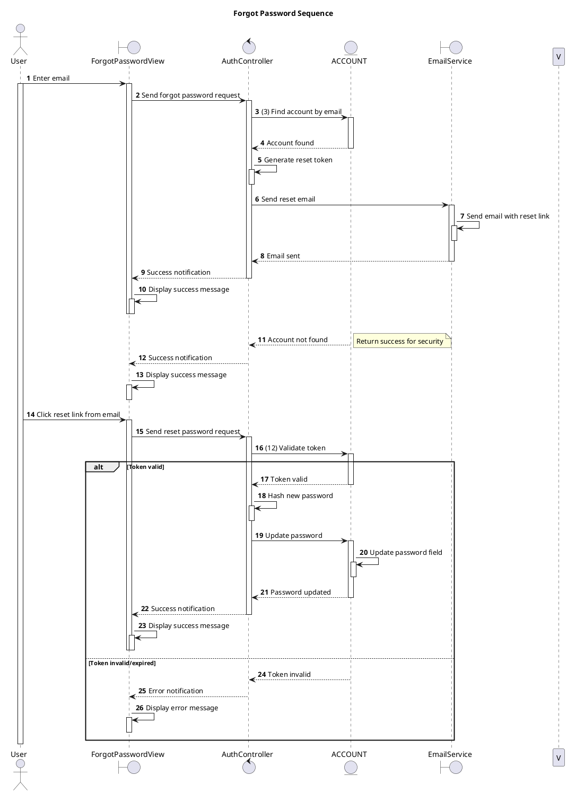

# Sequence Forgot Password

## Description

This sequence diagram describes the Forgot Password flow for users in the Private Clinic Management System.

## Diagram

<!-- diagram id="sequence-auth-forgot-password" -->

