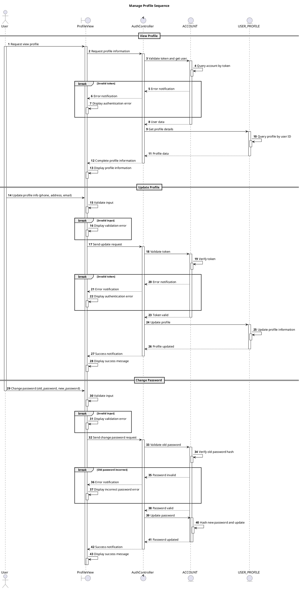

# Sequence Manage Profile

## Description

This sequence diagram describes the Profile Management flow for users in the Private Clinic Management System.

## Diagram

<!-- diagram id="sequence-auth-manage-profile" -->

