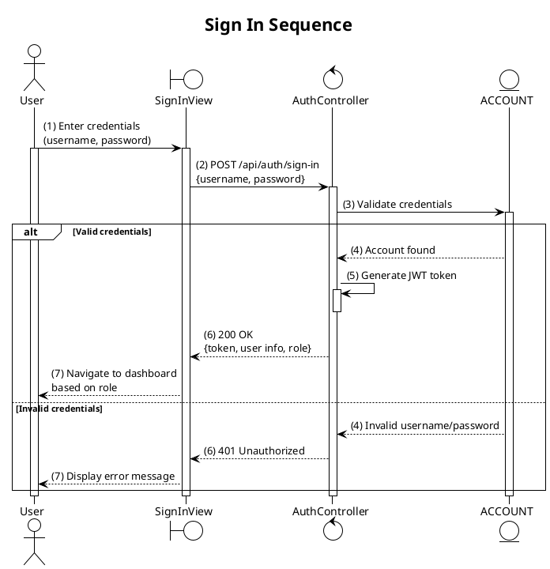

# Sequence Sign In

## Description

This sequence diagram describes the Sign In flow for users in the Private Clinic Management System.

## Diagram

<!-- diagram id="sequence-auth-sign-in" -->

```plantuml
@startuml
!theme plain

actor User as U
boundary SignInView as SIV
control AuthController as AC
entity ACCOUNT as A

title Sign In Sequence

U -> SIV: (1) Enter credentials\n(username, password)
activate U
activate SIV

SIV -> AC: (2) POST /api/auth/sign-in\n{username, password}
activate AC

AC -> A: (3) Validate credentials
activate A

alt Valid credentials
    A --> AC: (4) Account found
    AC -> AC: (5) Generate JWT token
    activate AC
    deactivate AC
    AC --> SIV: (6) 200 OK\n{token, user info, role}
    SIV --> U: (7) Navigate to dashboard\nbased on role
else Invalid credentials
    A --> AC: (4) Invalid username/password
    AC --> SIV: (6) 401 Unauthorized
    SIV --> U: (7) Display error message
end

deactivate A
deactivate AC
deactivate SIV
deactivate U

@enduml
```
