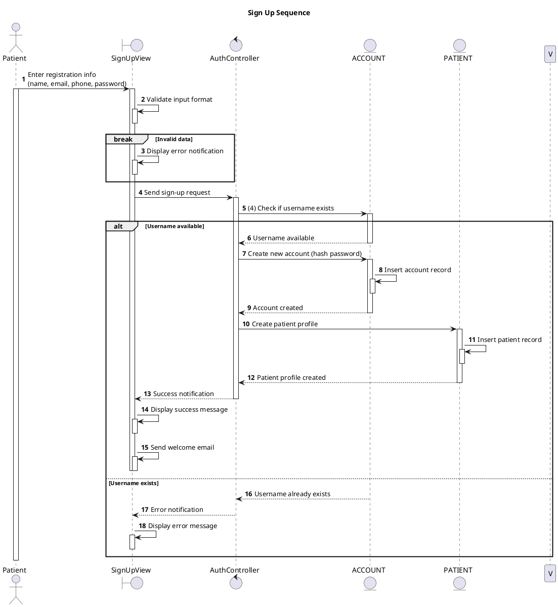

# Sequence Sign Up

## Description

This sequence diagram describes the Sign Up flow for new patients in the Private Clinic Management System.

## Diagram

<!-- diagram id="sequence-auth-sign-up" -->

