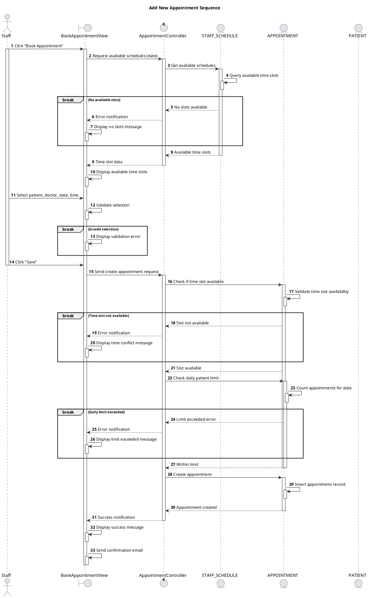

# Sequence Add New Appointment

## Description

This sequence diagram describes booking a new appointment.

## Diagram

<!-- diagram id="sequence-manage-appointment-add-new" -->

```plantuml
@startuml
autonumber

actor Staff as St
boundary BookAppointmentView as BAV
control AppointmentController as AC
entity STAFF_SCHEDULE as SS
entity APPOINTMENT as A
entity PATIENT as P

title Add New Appointment Sequence

St -> BAV: Click "Book Appointment"
activate St
activate BAV

BAV -> AC: Request available schedules (date)
activate AC

AC -> SS: Get available schedules
activate SS
SS -> SS: Query available time slots
activate SS
deactivate SS

break No available slots
  AC <-- SS: No slots available
  BAV <-- AC: Error notification
  BAV -> BAV: Display no slots message
  activate BAV
  deactivate BAV
end

AC <-- SS: Available time slots
deactivate SS

BAV <-- AC: Time slot data
deactivate AC
BAV -> BAV: Display available time slots
activate BAV
deactivate BAV

St -> BAV: Select patient, doctor, date, time

BAV -> BAV: Validate selection
activate BAV
deactivate BAV

break Invalid selection
  BAV -> BAV: Display validation error
  activate BAV
  deactivate BAV
end

St -> BAV: Click "Save"
deactivate St

BAV -> AC: Send create appointment request
activate AC

AC -> A: Check if time slot available
activate A
A -> A: Validate time slot availability
activate A
deactivate A

break Time slot not available
  AC <-- A: Slot not available
  BAV <-- AC: Error notification
  BAV -> BAV: Display time conflict message
  activate BAV
  deactivate BAV
end

AC <-- A: Slot available

AC -> A: Check daily patient limit
activate A
A -> A: Count appointments for date
activate A
deactivate A

break Daily limit exceeded
  AC <-- A: Limit exceeded error
  BAV <-- AC: Error notification
  BAV -> BAV: Display limit exceeded message
  activate BAV
  deactivate BAV
end

AC <-- A: Within limit
deactivate A
deactivate A

AC -> A: Create appointment
activate A
A -> A: Insert appointment record
activate A
deactivate A
AC <-- A: Appointment created
deactivate A

BAV <-- AC: Success notification
deactivate AC
BAV -> BAV: Display success message
activate BAV
deactivate BAV
BAV -> BAV: Send confirmation email
activate BAV
deactivate BAV

deactivate BAV

@enduml
```
