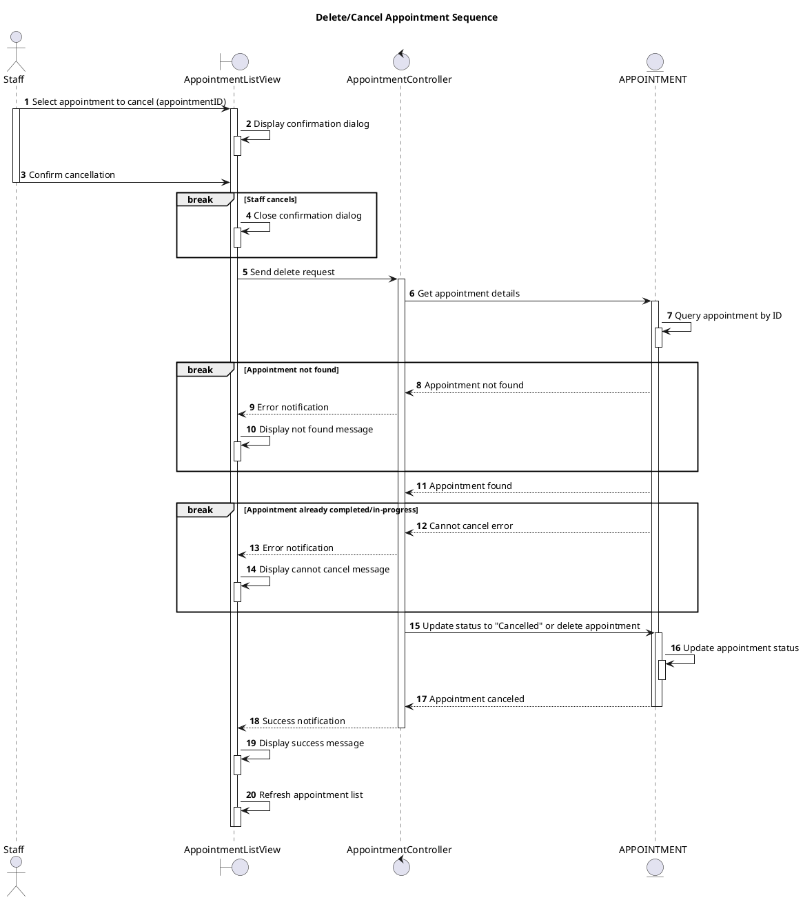

# Sequence Delete Appointment

## Description

This sequence diagram describes canceling/deleting an appointment.

## Diagram

<!-- diagram id="sequence-manage-appointment-delete" -->



    AC --> V: (9) 409 Conflict
    V --> U: (10) Display error message

end

deactivate A
deactivate AC
deactivate V

@enduml

```

```
