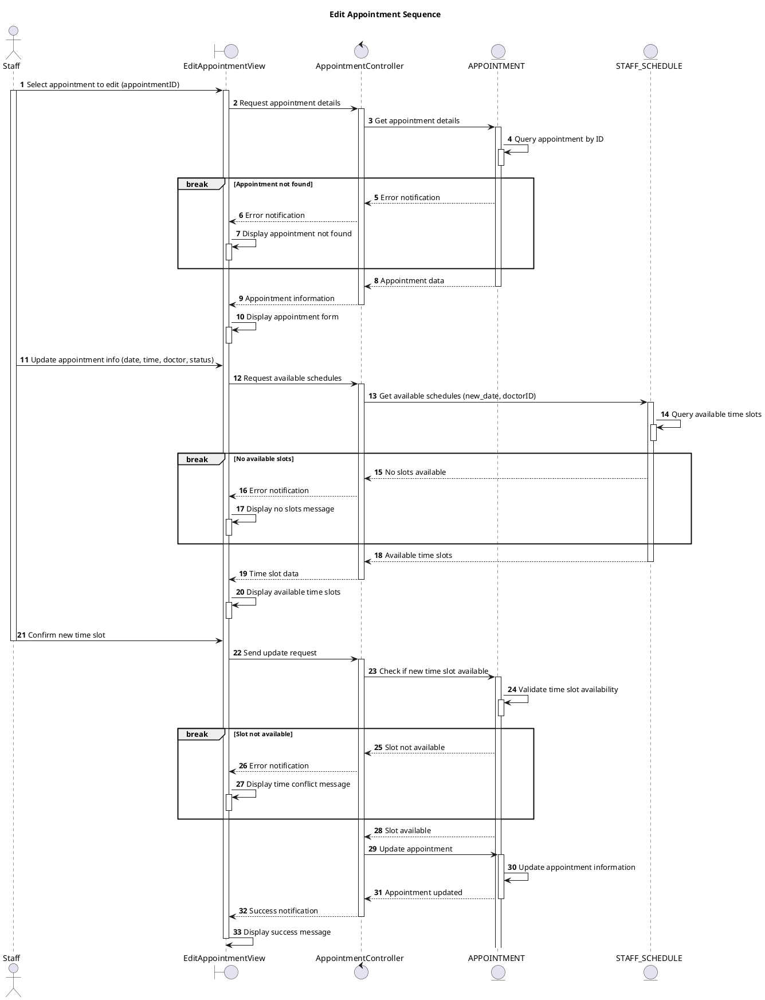

# Sequence Edit Appointment

## Description

This sequence diagram describes editing an existing appointment.

## Diagram

<!-- diagram id="sequence-manage-appointment-edit" -->

```plantuml
@startuml
autonumber

actor Staff as St
boundary EditAppointmentView as EAV
control AppointmentController as AC
entity APPOINTMENT as A
entity STAFF_SCHEDULE as SS

title Edit Appointment Sequence

St -> EAV: Select appointment to edit (appointmentID)
activate St
activate EAV

EAV -> AC: Request appointment details
activate AC

AC -> A: Get appointment details
activate A
A -> A: Query appointment by ID
activate A
deactivate A

break Appointment not found
  AC <-- A: Error notification
  EAV <-- AC: Error notification
  EAV -> EAV: Display appointment not found
  activate EAV
  deactivate EAV
end

AC <-- A: Appointment data
deactivate A

EAV <-- AC: Appointment information
deactivate AC
EAV -> EAV: Display appointment form
activate EAV
deactivate EAV

St -> EAV: Update appointment info (date, time, doctor, status)

EAV -> AC: Request available schedules
activate AC

AC -> SS: Get available schedules (new_date, doctorID)
activate SS
SS -> SS: Query available time slots
activate SS
deactivate SS

break No available slots
  AC <-- SS: No slots available
  EAV <-- AC: Error notification
  EAV -> EAV: Display no slots message
  activate EAV
  deactivate EAV
end

AC <-- SS: Available time slots
deactivate SS

EAV <-- AC: Time slot data
deactivate AC
EAV -> EAV: Display available time slots
activate EAV
deactivate EAV

St -> EAV: Confirm new time slot
deactivate St

EAV -> AC: Send update request
activate AC

AC -> A: Check if new time slot available
activate A
A -> A: Validate time slot availability
activate A
deactivate A

break Slot not available
  AC <-- A: Slot not available
  EAV <-- AC: Error notification
  EAV -> EAV: Display time conflict message
  activate EAV
  deactivate EAV
end

AC <-- A: Slot available

AC -> A: Update appointment
activate A
A -> A: Update appointment information
A --> AC: Appointment updated
deactivate A

EAV <-- AC: Success notification
deactivate AC
EAV -> EAV: Display success message

deactivate EAV

deactivate St

@enduml
```
