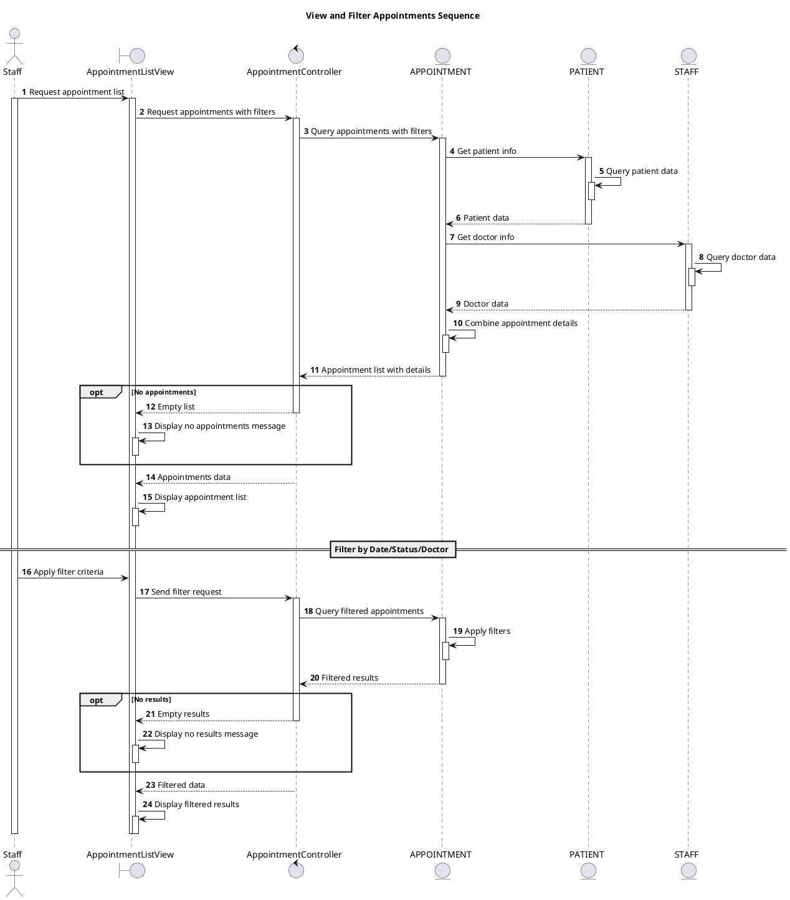

# Sequence View and Filter Appointments

## Description

This sequence diagram describes viewing and filtering appointments.

## Diagram

<!-- diagram id="sequence-manage-appointment-view-and-filter" -->



U -> V: (11) Apply filters\n(date, status, doctorID)

V -> AC: (12) GET /api/appointments\n{token, date, status, doctorID}
activate AC

AC -> A: (13) Query with filters
activate A
A --> AC: (14) Filtered appointments
deactivate A

AC --> V: (15) 200 OK\n{appointments[]}
V --> U: (16) Display filtered results

deactivate AC
deactivate V

@enduml

```

```
