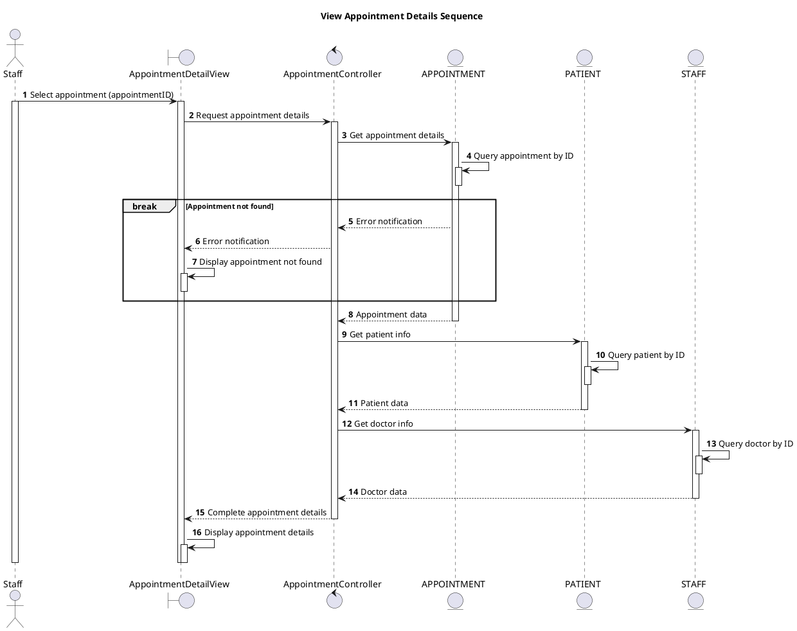

# Sequence View Appointment Details

## Description

This sequence diagram describes viewing detailed information of an appointment.

## Diagram

<!-- diagram id="sequence-manage-appointment-view-details" -->

