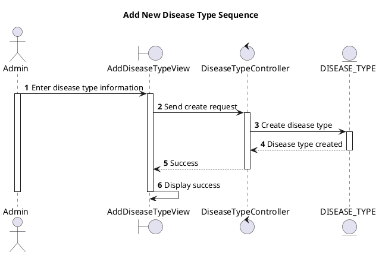

# Sequence Add New Disease Type

## Description

Standard CRUD add sequence.

## Diagram

<!-- diagram id="sequence-manage-disease-type-add-new" -->

```plantuml
@startuml
autonumber

actor Admin as A
boundary AddDiseaseTypeView as ADV
control DiseaseTypeController as DC
entity DISEASE_TYPE as DT

title Add New Disease Type Sequence

A -> ADV: Enter disease type information
activate A
activate ADV
ADV -> DC: Send create request
activate DC
DC -> DT: Create disease type
activate DT
DC <-- DT: Disease type created
deactivate DT
ADV <-- DC: Success
deactivate DC
ADV -> ADV: Display success
deactivate ADV
deactivate A

@enduml
```
