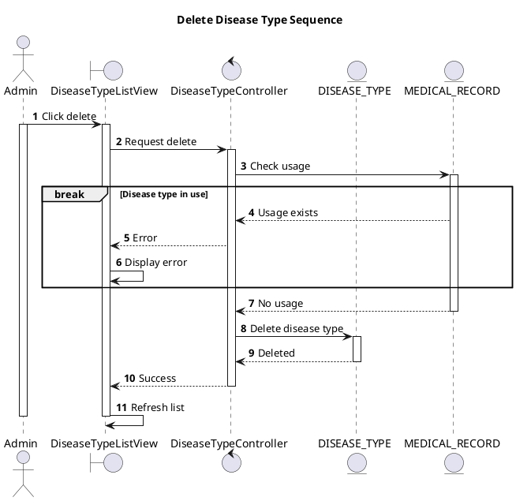

# Sequence Delete Disease Type

## Description

Standard CRUD delete sequence with constraint check.

## Diagram

<!-- diagram id="sequence-manage-disease-type-delete" -->

```plantuml
@startuml
autonumber

actor Admin as A
boundary DiseaseTypeListView as DLV
control DiseaseTypeController as DC
entity DISEASE_TYPE as DT
entity MEDICAL_RECORD as MR

title Delete Disease Type Sequence

A -> DLV: Click delete
activate A
activate DLV
DLV -> DC: Request delete
activate DC
DC -> MR: Check usage
activate MR
break Disease type in use
  DC <-- MR: Usage exists
  DLV <-- DC: Error
  DLV -> DLV: Display error
end
DC <-- MR: No usage
deactivate MR
DC -> DT: Delete disease type
activate DT
DC <-- DT: Deleted
deactivate DT
DLV <-- DC: Success
deactivate DC
DLV -> DLV: Refresh list
deactivate DLV
deactivate A

@enduml
```
