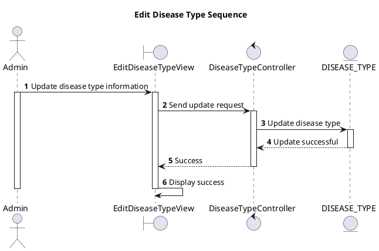

# Sequence Edit Disease Type

## Description

Standard CRUD edit sequence.

## Diagram

<!-- diagram id="sequence-manage-disease-type-edit" -->

```plantuml
@startuml
autonumber

actor Admin as A
boundary EditDiseaseTypeView as EDV
control DiseaseTypeController as DC
entity DISEASE_TYPE as DT

title Edit Disease Type Sequence

A -> EDV: Update disease type information
activate A
activate EDV
EDV -> DC: Send update request
activate DC
DC -> DT: Update disease type
activate DT
DC <-- DT: Update successful
deactivate DT
EDV <-- DC: Success
deactivate DC
EDV -> EDV: Display success
deactivate EDV
deactivate A

@enduml
```
