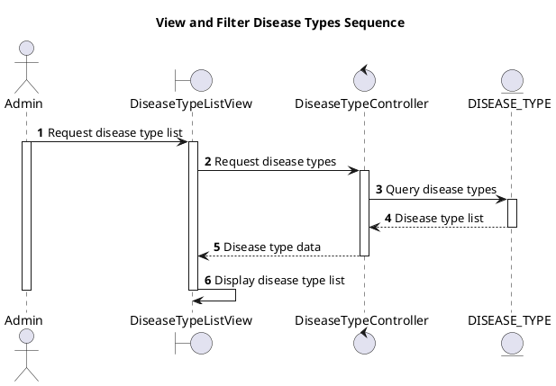

# Sequence View and Filter Disease Types

## Description

Standard CRUD view list sequence.

## Diagram

<!-- diagram id="sequence-manage-disease-type-view-list" -->

```plantuml
@startuml
autonumber

actor Admin as A
boundary DiseaseTypeListView as DLV
control DiseaseTypeController as DC
entity DISEASE_TYPE as DT

title View and Filter Disease Types Sequence

A -> DLV: Request disease type list
activate A
activate DLV
DLV -> DC: Request disease types
activate DC
DC -> DT: Query disease types
activate DT
DC <-- DT: Disease type list
deactivate DT
DLV <-- DC: Disease type data
deactivate DC
DLV -> DLV: Display disease type list
deactivate DLV
deactivate A

@enduml
```
