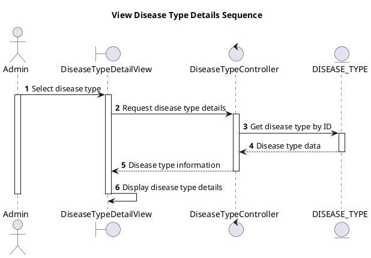

# Sequence View Disease Type Details

## Description

Standard CRUD view details sequence.

## Diagram

<!-- diagram id="sequence-manage-disease-type-view-details" -->

```plantuml
@startuml
autonumber

actor Admin as A
boundary DiseaseTypeDetailView as DDV
control DiseaseTypeController as DC
entity DISEASE_TYPE as DT

title View Disease Type Details Sequence

A -> DDV: Select disease type
activate A
activate DDV
DDV -> DC: Request disease type details
activate DC
DC -> DT: Get disease type by ID
activate DT
DC <-- DT: Disease type data
deactivate DT
DDV <-- DC: Disease type information
deactivate DC
DDV -> DDV: Display disease type details
deactivate DDV
deactivate A

@enduml
```
