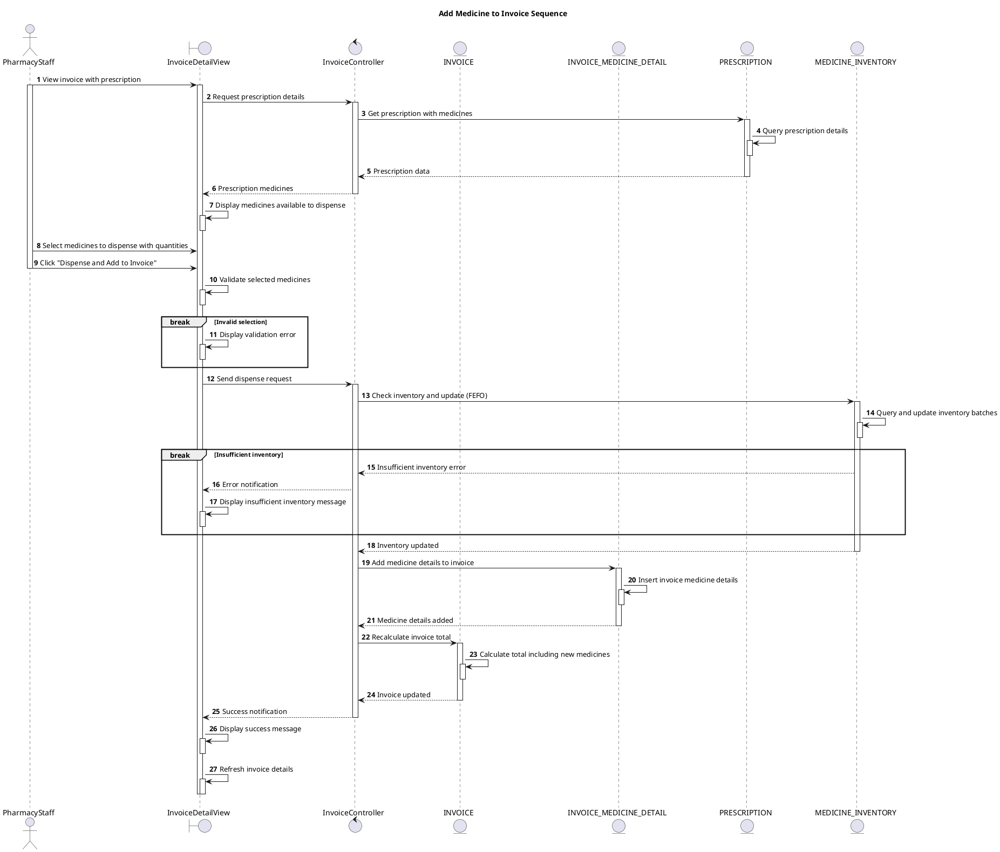

# Sequence Add Medicine to Invoice

## Description

This sequence diagram describes adding medicine to invoice (from prescription dispensing).

## Diagram

<!-- diagram id="sequence-manage-invoice-add-medicine" -->

