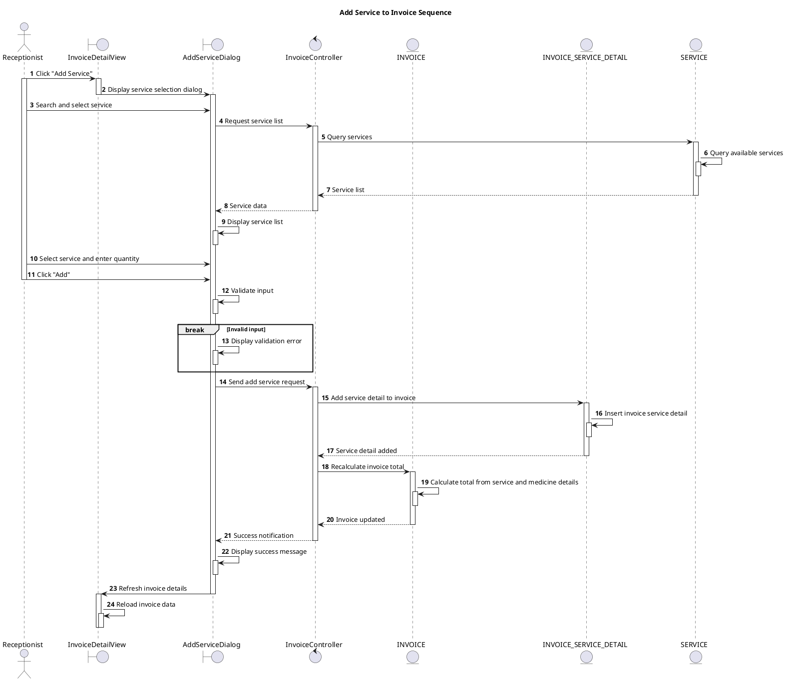

# Sequence Add Service to Invoice

## Description

This sequence diagram describes adding a service to an existing invoice.

## Diagram

<!-- diagram id="sequence-manage-invoice-add-service" -->

```plantuml
@startuml
autonumber

actor Receptionist as R
boundary InvoiceDetailView as IDV
boundary AddServiceDialog as ASD
control InvoiceController as IC
entity INVOICE as I
entity INVOICE_SERVICE_DETAIL as ISD
entity SERVICE as S

title Add Service to Invoice Sequence

R -> IDV: Click "Add Service"
activate R
activate IDV

IDV -> ASD: Display service selection dialog
deactivate IDV
activate ASD

R -> ASD: Search and select service
ASD -> IC: Request service list
activate IC

IC -> S: Query services
activate S
S -> S: Query available services
activate S
deactivate S
IC <-- S: Service list
deactivate S

ASD <-- IC: Service data
deactivate IC
ASD -> ASD: Display service list
activate ASD
deactivate ASD

R -> ASD: Select service and enter quantity
R -> ASD: Click "Add"
deactivate R

ASD -> ASD: Validate input
activate ASD
deactivate ASD

break Invalid input
  ASD -> ASD: Display validation error
  activate ASD
  deactivate ASD
end

ASD -> IC: Send add service request
activate IC

IC -> ISD: Add service detail to invoice
activate ISD
ISD -> ISD: Insert invoice service detail
activate ISD
deactivate ISD
IC <-- ISD: Service detail added
deactivate ISD

IC -> I: Recalculate invoice total
activate I
I -> I: Calculate total from service and medicine details
activate I
deactivate I
IC <-- I: Invoice updated
deactivate I

ASD <-- IC: Success notification
deactivate IC
ASD -> ASD: Display success message
activate ASD
deactivate ASD
ASD -> IDV: Refresh invoice details
deactivate ASD
activate IDV
IDV -> IDV: Reload invoice data
activate IDV
deactivate IDV

deactivate IDV

@enduml
```
