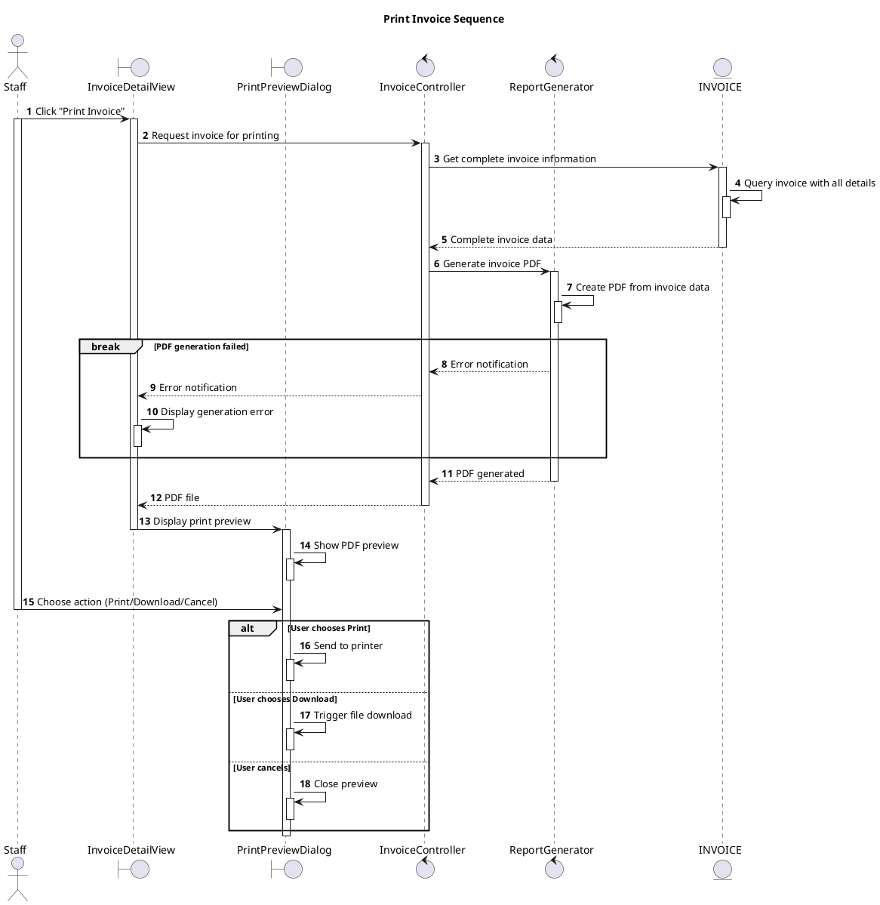

# Sequence Print Invoice

## Description

This sequence diagram describes generating and printing invoice.

## Diagram

<!-- diagram id="sequence-manage-invoice-print" -->

```plantuml
@startuml
autonumber

actor Staff as St
boundary InvoiceDetailView as IDV
boundary PrintPreviewDialog as PPD
control InvoiceController as IC
control ReportGenerator as RG
entity INVOICE as I

title Print Invoice Sequence

St -> IDV: Click "Print Invoice"
activate St
activate IDV

IDV -> IC: Request invoice for printing
activate IC

IC -> I: Get complete invoice information
activate I
I -> I: Query invoice with all details
activate I
deactivate I
IC <-- I: Complete invoice data
deactivate I

IC -> RG: Generate invoice PDF
activate RG
RG -> RG: Create PDF from invoice data
activate RG
deactivate RG

break PDF generation failed
  IC <-- RG: Error notification
  IDV <-- IC: Error notification
  IDV -> IDV: Display generation error
  activate IDV
  deactivate IDV
end

IC <-- RG: PDF generated
deactivate RG

IDV <-- IC: PDF file
deactivate IC
IDV -> PPD: Display print preview
deactivate IDV
activate PPD
PPD -> PPD: Show PDF preview
activate PPD
deactivate PPD

St -> PPD: Choose action (Print/Download/Cancel)
deactivate St

alt User chooses Print
  PPD -> PPD: Send to printer
  activate PPD
  deactivate PPD
else User chooses Download
  PPD -> PPD: Trigger file download
  activate PPD
  deactivate PPD
else User cancels
  PPD -> PPD: Close preview
  activate PPD
  deactivate PPD
end

deactivate PPD

@enduml
```
