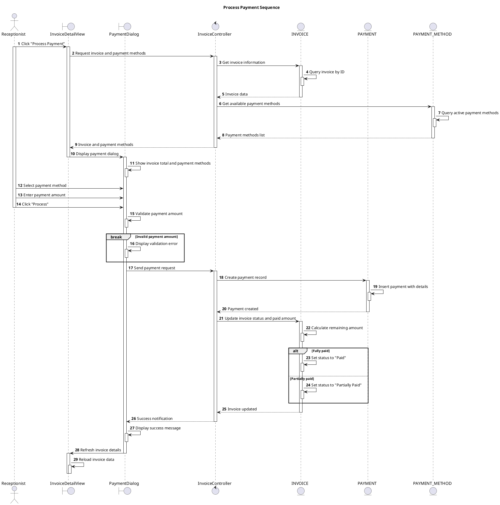

# Sequence Process Payment

## Description

This sequence diagram describes processing payment for an invoice.

## Diagram

<!-- diagram id="sequence-manage-invoice-process-payment" -->

```plantuml
@startuml
autonumber

actor Receptionist as R
boundary InvoiceDetailView as IDV
boundary PaymentDialog as PD
control InvoiceController as IC
entity INVOICE as I
entity PAYMENT as PM
entity PAYMENT_METHOD as PMT

title Process Payment Sequence

R -> IDV: Click "Process Payment"
activate R
activate IDV

IDV -> IC: Request invoice and payment methods
activate IC

IC -> I: Get invoice information
activate I
I -> I: Query invoice by ID
activate I
deactivate I
IC <-- I: Invoice data
deactivate I

IC -> PMT: Get available payment methods
activate PMT
PMT -> PMT: Query active payment methods
activate PMT
deactivate PMT
IC <-- PMT: Payment methods list
deactivate PMT

IDV <-- IC: Invoice and payment methods
deactivate IC
IDV -> PD: Display payment dialog
deactivate IDV
activate PD
PD -> PD: Show invoice total and payment methods
activate PD
deactivate PD

R -> PD: Select payment method
R -> PD: Enter payment amount
R -> PD: Click "Process"
deactivate R

PD -> PD: Validate payment amount
activate PD
deactivate PD

break Invalid payment amount
  PD -> PD: Display validation error
  activate PD
  deactivate PD
end

PD -> IC: Send payment request
activate IC

IC -> PM: Create payment record
activate PM
PM -> PM: Insert payment with details
activate PM
deactivate PM
IC <-- PM: Payment created
deactivate PM

IC -> I: Update invoice status and paid amount
activate I
I -> I: Calculate remaining amount
activate I
deactivate I

alt Fully paid
  I -> I: Set status to "Paid"
  activate I
  deactivate I
else Partially paid
  I -> I: Set status to "Partially Paid"
  activate I
  deactivate I
end

IC <-- I: Invoice updated
deactivate I

PD <-- IC: Success notification
deactivate IC
PD -> PD: Display success message
activate PD
deactivate PD
PD -> IDV: Refresh invoice details
deactivate PD
activate IDV
IDV -> IDV: Reload invoice data
activate IDV
deactivate IDV

deactivate IDV

@enduml
```
