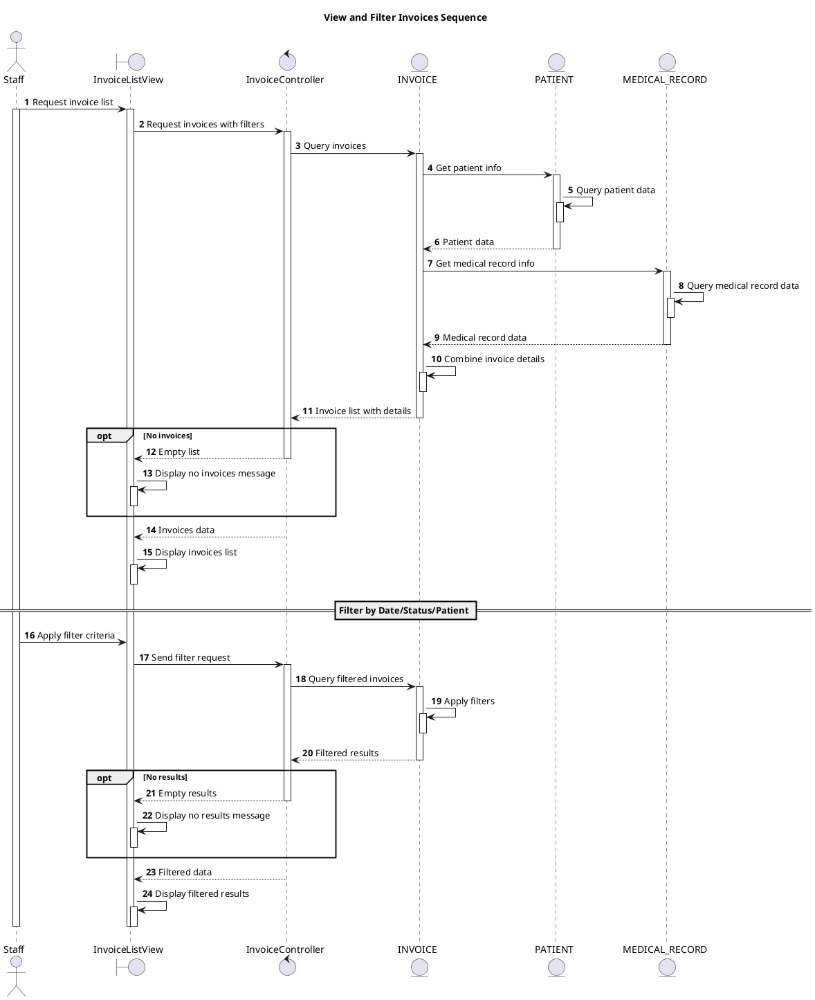

# Sequence View and Filter Invoices

## Description

This sequence diagram describes viewing and filtering invoices.

## Diagram

<!-- diagram id="sequence-manage-invoice-view-and-filter" -->

```plantuml
@startuml
autonumber

actor Staff as St
boundary InvoiceListView as ILV
control InvoiceController as IC
entity INVOICE as I
entity PATIENT as P
entity MEDICAL_RECORD as MR

title View and Filter Invoices Sequence

St -> ILV: Request invoice list
activate St
activate ILV

ILV -> IC: Request invoices with filters
activate IC

IC -> I: Query invoices
activate I

I -> P: Get patient info
activate P
P -> P: Query patient data
activate P
deactivate P
I <-- P: Patient data
deactivate P

I -> MR: Get medical record info
activate MR
MR -> MR: Query medical record data
activate MR
deactivate MR
I <-- MR: Medical record data
deactivate MR

I -> I: Combine invoice details
activate I
deactivate I

IC <-- I: Invoice list with details
deactivate I

opt No invoices
  ILV <-- IC: Empty list
  deactivate IC
  ILV -> ILV: Display no invoices message
  activate ILV
  deactivate ILV
end

ILV <-- IC: Invoices data
deactivate IC
ILV -> ILV: Display invoices list
activate ILV
deactivate ILV

== Filter by Date/Status/Patient ==

St -> ILV: Apply filter criteria
ILV -> IC: Send filter request
activate IC

IC -> I: Query filtered invoices
activate I
I -> I: Apply filters
activate I
deactivate I
IC <-- I: Filtered results
deactivate I

opt No results
  ILV <-- IC: Empty results
  deactivate IC
  ILV -> ILV: Display no results message
  activate ILV
  deactivate ILV
end

ILV <-- IC: Filtered data
deactivate IC
ILV -> ILV: Display filtered results
activate ILV
deactivate ILV

deactivate ILV
deactivate St

@enduml
```
