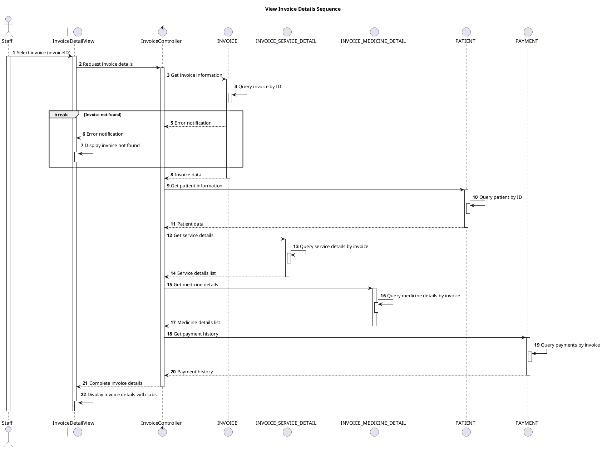

# Sequence View Invoice Details

## Description

This sequence diagram describes viewing detailed information of an invoice.

## Diagram

<!-- diagram id="sequence-manage-invoice-view-details" -->

