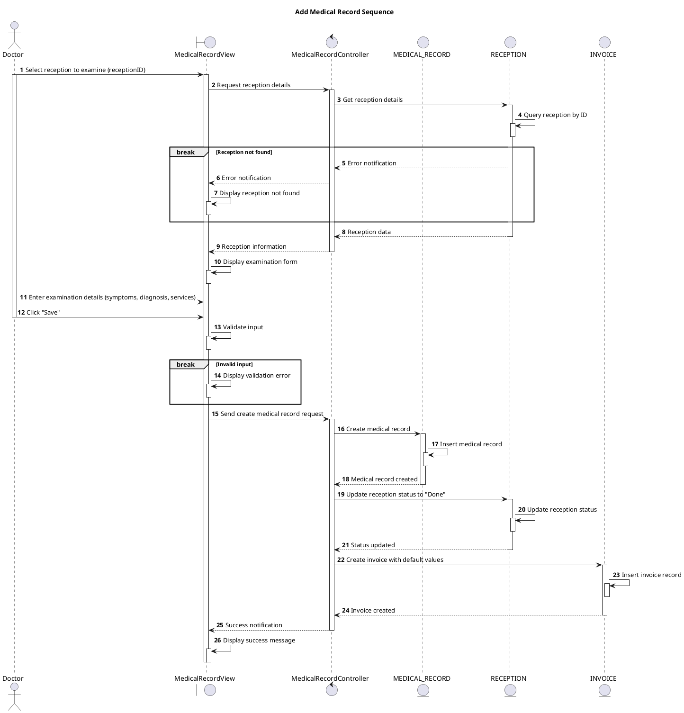

# Sequence Add Medical Record

## Description

This sequence diagram describes creating a new medical record after patient examination.

## Diagram

<!-- diagram id="sequence-manage-medical-record-add-new" -->

