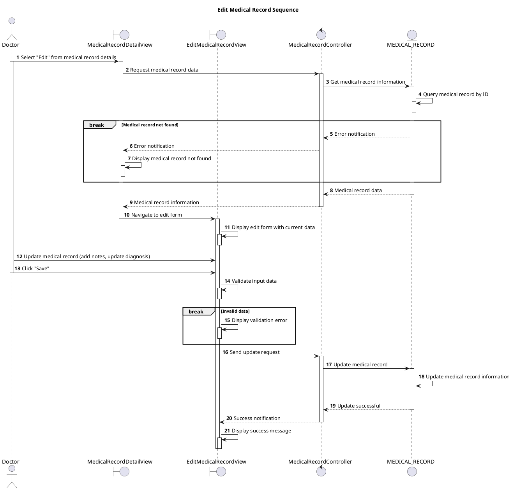

# Sequence Edit Medical Record

## Description

This sequence diagram describes editing an existing medical record (limited to adding notes/corrections).

## Diagram

<!-- diagram id="sequence-manage-medical-record-edit" -->

