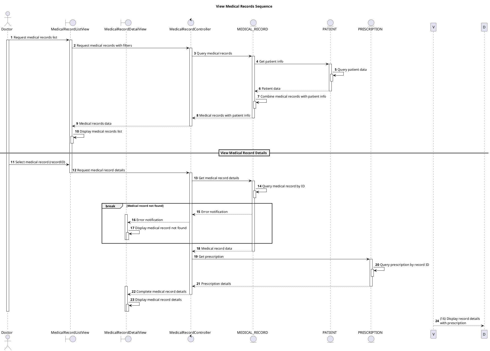

# Sequence View Medical Records

## Description

This sequence diagram describes viewing medical records list.

## Diagram

<!-- diagram id="sequence-manage-medical-record-view-list" -->

```plantuml
@startuml
autonumber

actor Doctor as Dr
boundary MedicalRecordListView as MRLV
boundary MedicalRecordDetailView as MRDV
control MedicalRecordController as MRC
entity MEDICAL_RECORD as MR
entity PATIENT as P
entity PRESCRIPTION as PR

title View Medical Records Sequence

Dr -> MRLV: Request medical records list
activate Dr
activate MRLV

MRLV -> MRC: Request medical records with filters
activate MRC

MRC -> MR: Query medical records
activate MR

MR -> P: Get patient info
activate P
P -> P: Query patient data
activate P
deactivate P
MR <-- P: Patient data
deactivate P

MR -> MR: Combine medical records with patient info
activate MR
deactivate MR

MRC <-- MR: Medical records with patient info
deactivate MR

MRLV <-- MRC: Medical records data
deactivate MRC
MRLV -> MRLV: Display medical records list
activate MRLV
deactivate MRLV

== View Medical Record Details ==

Dr -> MRLV: Select medical record (recordID)
MRLV -> MRC: Request medical record details
deactivate MRLV
activate MRC

MRC -> MR: Get medical record details
activate MR
MR -> MR: Query medical record by ID
activate MR
deactivate MR

break Medical record not found
  MRC <-- MR: Error notification
  activate MRDV
  MRDV <-- MRC: Error notification
  MRDV -> MRDV: Display medical record not found
  activate MRDV
  deactivate MRDV
  deactivate MRDV
end

MRC <-- MR: Medical record data
deactivate MR

MRC -> PR: Get prescription
activate PR
PR -> PR: Query prescription by record ID
activate PR
deactivate PR
MRC <-- PR: Prescription details
deactivate PR

activate MRDV
MRDV <-- MRC: Complete medical record details
deactivate MRC
MRDV -> MRDV: Display medical record details
activate MRDV
deactivate MRDV

deactivate MRDV
deactivate Dr
V --> D: (16) Display record details\nwith prescription

deactivate MRC
deactivate V

@enduml
```
