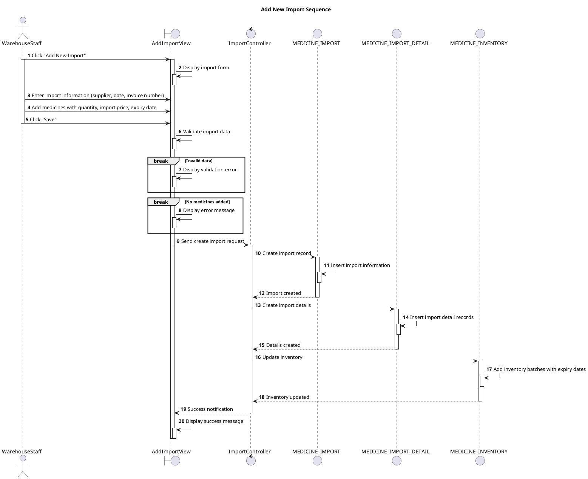

# Sequence Add New Import

## Description

This sequence diagram describes creating a new medicine import record.

## Diagram

<!-- diagram id="sequence-manage-medicine-import-add-new" -->

```plantuml
@startuml
autonumber

actor WarehouseStaff as WS
boundary AddImportView as AIV
control ImportController as IC
entity MEDICINE_IMPORT as MI
entity MEDICINE_IMPORT_DETAIL as MID
entity MEDICINE_INVENTORY as MINV

title Add New Import Sequence

WS -> AIV: Click "Add New Import"
activate WS
activate AIV

AIV -> AIV: Display import form
activate AIV
deactivate AIV

WS -> AIV: Enter import information (supplier, date, invoice number)
WS -> AIV: Add medicines with quantity, import price, expiry date
WS -> AIV: Click "Save"
deactivate WS

AIV -> AIV: Validate import data
activate AIV
deactivate AIV

break Invalid data
  AIV -> AIV: Display validation error
  activate AIV
  deactivate AIV
end

break No medicines added
  AIV -> AIV: Display error message
  activate AIV
  deactivate AIV
end

AIV -> IC: Send create import request
activate IC

IC -> MI: Create import record
activate MI
MI -> MI: Insert import information
activate MI
deactivate MI
IC <-- MI: Import created
deactivate MI

IC -> MID: Create import details
activate MID
MID -> MID: Insert import detail records
activate MID
deactivate MID
IC <-- MID: Details created
deactivate MID

IC -> MINV: Update inventory
activate MINV
MINV -> MINV: Add inventory batches with expiry dates
activate MINV
deactivate MINV
IC <-- MINV: Inventory updated
deactivate MINV

AIV <-- IC: Success notification
deactivate IC
AIV -> AIV: Display success message
activate AIV
deactivate AIV

deactivate AIV

@enduml
```
