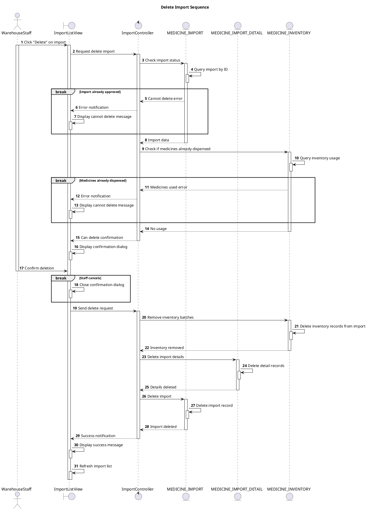

# Sequence Delete Import

## Description

This sequence diagram describes deleting an import record.

## Diagram

<!-- diagram id="sequence-manage-medicine-import-delete" -->

```plantuml
@startuml
autonumber

actor WarehouseStaff as WS
boundary ImportListView as ILV
control ImportController as IC
entity MEDICINE_IMPORT as MI
entity MEDICINE_IMPORT_DETAIL as MID
entity MEDICINE_INVENTORY as MINV

title Delete Import Sequence

WS -> ILV: Click "Delete" on import
activate WS
activate ILV

ILV -> IC: Request delete import
activate IC

IC -> MI: Check import status
activate MI
MI -> MI: Query import by ID
activate MI
deactivate MI

break Import already approved
  IC <-- MI: Cannot delete error
  ILV <-- IC: Error notification
  ILV -> ILV: Display cannot delete message
  activate ILV
  deactivate ILV
end

IC <-- MI: Import data
deactivate MI

IC -> MINV: Check if medicines already dispensed
activate MINV
MINV -> MINV: Query inventory usage
activate MINV
deactivate MINV

break Medicines already dispensed
  IC <-- MINV: Medicines used error
  ILV <-- IC: Error notification
  ILV -> ILV: Display cannot delete message
  activate ILV
  deactivate ILV
end

IC <-- MINV: No usage
deactivate MINV

ILV <-- IC: Can delete confirmation
deactivate IC
ILV -> ILV: Display confirmation dialog
activate ILV
deactivate ILV

WS -> ILV: Confirm deletion
deactivate WS

break Staff cancels
  ILV -> ILV: Close confirmation dialog
  activate ILV
  deactivate ILV
end

ILV -> IC: Send delete request
activate IC

IC -> MINV: Remove inventory batches
activate MINV
MINV -> MINV: Delete inventory records from import
activate MINV
deactivate MINV
IC <-- MINV: Inventory removed
deactivate MINV

IC -> MID: Delete import details
activate MID
MID -> MID: Delete detail records
activate MID
deactivate MID
IC <-- MID: Details deleted
deactivate MID

IC -> MI: Delete import
activate MI
MI -> MI: Delete import record
activate MI
deactivate MI
IC <-- MI: Import deleted
deactivate MI

ILV <-- IC: Success notification
deactivate IC
ILV -> ILV: Display success message
activate ILV
deactivate ILV
ILV -> ILV: Refresh import list
activate ILV
deactivate ILV

deactivate ILV

@enduml
```
