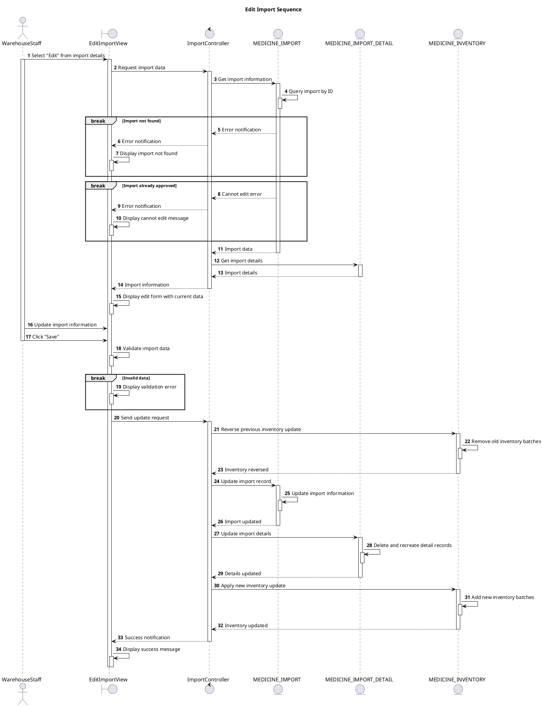

# Sequence Edit Import

## Description

This sequence diagram describes editing an import record.

## Diagram

<!-- diagram id="sequence-manage-medicine-import-edit" -->

```plantuml
@startuml
autonumber

actor WarehouseStaff as WS
boundary EditImportView as EIV
control ImportController as IC
entity MEDICINE_IMPORT as MI
entity MEDICINE_IMPORT_DETAIL as MID
entity MEDICINE_INVENTORY as MINV

title Edit Import Sequence

WS -> EIV: Select "Edit" from import details
activate WS
activate EIV

EIV -> IC: Request import data
activate IC

IC -> MI: Get import information
activate MI
MI -> MI: Query import by ID
activate MI
deactivate MI

break Import not found
  IC <-- MI: Error notification
  EIV <-- IC: Error notification
  EIV -> EIV: Display import not found
  activate EIV
  deactivate EIV
end

break Import already approved
  IC <-- MI: Cannot edit error
  EIV <-- IC: Error notification
  EIV -> EIV: Display cannot edit message
  activate EIV
  deactivate EIV
end

IC <-- MI: Import data
deactivate MI

IC -> MID: Get import details
activate MID
IC <-- MID: Import details
deactivate MID

EIV <-- IC: Import information
deactivate IC
EIV -> EIV: Display edit form with current data
activate EIV
deactivate EIV

WS -> EIV: Update import information
WS -> EIV: Click "Save"
deactivate WS

EIV -> EIV: Validate import data
activate EIV
deactivate EIV

break Invalid data
  EIV -> EIV: Display validation error
  activate EIV
  deactivate EIV
end

EIV -> IC: Send update request
activate IC

IC -> MINV: Reverse previous inventory update
activate MINV
MINV -> MINV: Remove old inventory batches
activate MINV
deactivate MINV
IC <-- MINV: Inventory reversed
deactivate MINV

IC -> MI: Update import record
activate MI
MI -> MI: Update import information
activate MI
deactivate MI
IC <-- MI: Import updated
deactivate MI

IC -> MID: Update import details
activate MID
MID -> MID: Delete and recreate detail records
activate MID
deactivate MID
IC <-- MID: Details updated
deactivate MID

IC -> MINV: Apply new inventory update
activate MINV
MINV -> MINV: Add new inventory batches
activate MINV
deactivate MINV
IC <-- MINV: Inventory updated
deactivate MINV

EIV <-- IC: Success notification
deactivate IC
EIV -> EIV: Display success message
activate EIV
deactivate EIV

deactivate EIV

@enduml
```
