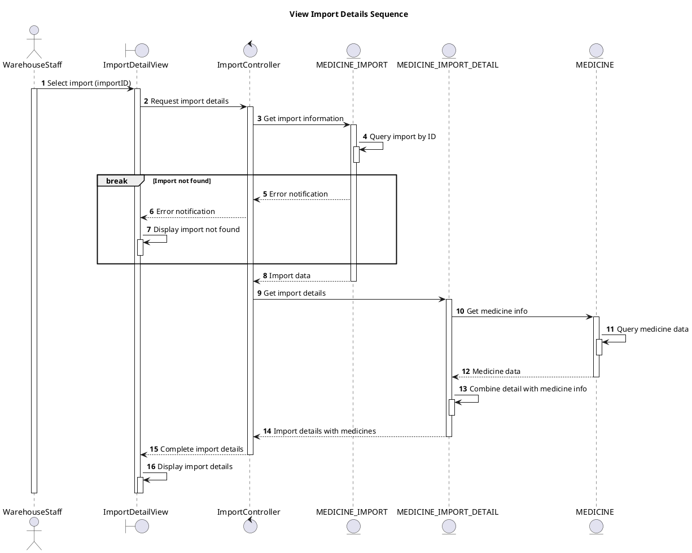

# Sequence View Import Details

## Description

This sequence diagram describes viewing detailed information of an import record.

## Diagram

<!-- diagram id="sequence-manage-medicine-import-view-details" -->

