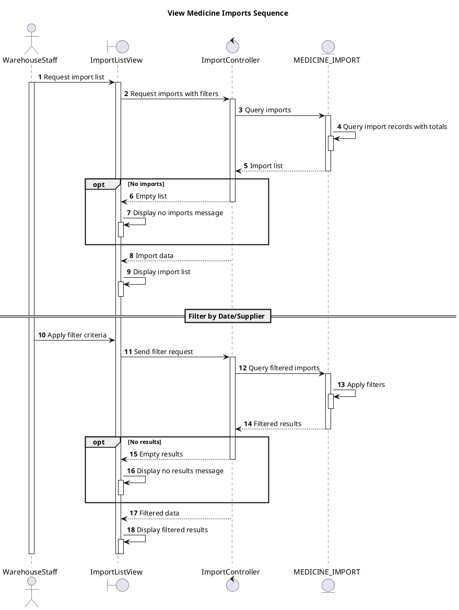

# Sequence View Medicine Imports

## Description

This sequence diagram describes viewing medicine import records.

## Diagram

<!-- diagram id="sequence-manage-medicine-import-view-list" -->

```plantuml
@startuml
autonumber

actor WarehouseStaff as WS
boundary ImportListView as ILV
control ImportController as IC
entity MEDICINE_IMPORT as MI

title View Medicine Imports Sequence

WS -> ILV: Request import list
activate WS
activate ILV

ILV -> IC: Request imports with filters
activate IC

IC -> MI: Query imports
activate MI
MI -> MI: Query import records with totals
activate MI
deactivate MI
IC <-- MI: Import list
deactivate MI

opt No imports
  ILV <-- IC: Empty list
  deactivate IC
  ILV -> ILV: Display no imports message
  activate ILV
  deactivate ILV
end

ILV <-- IC: Import data
deactivate IC
ILV -> ILV: Display import list
activate ILV
deactivate ILV

== Filter by Date/Supplier ==

WS -> ILV: Apply filter criteria
ILV -> IC: Send filter request
activate IC

IC -> MI: Query filtered imports
activate MI
MI -> MI: Apply filters
activate MI
deactivate MI
IC <-- MI: Filtered results
deactivate MI

opt No results
  ILV <-- IC: Empty results
  deactivate IC
  ILV -> ILV: Display no results message
  activate ILV
  deactivate ILV
end

ILV <-- IC: Filtered data
deactivate IC
ILV -> ILV: Display filtered results
activate ILV
deactivate ILV

deactivate ILV
deactivate WS

@enduml
```
