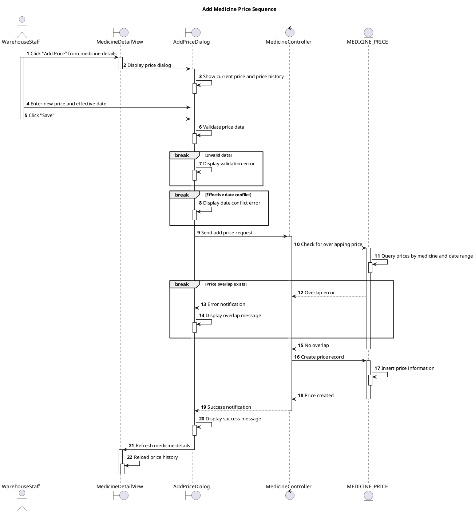

# Sequence Add Medicine Price

## Description

This sequence diagram describes adding a new price for a medicine type.

## Diagram

<!-- diagram id="sequence-manage-medicine-inventory-add-price" -->

