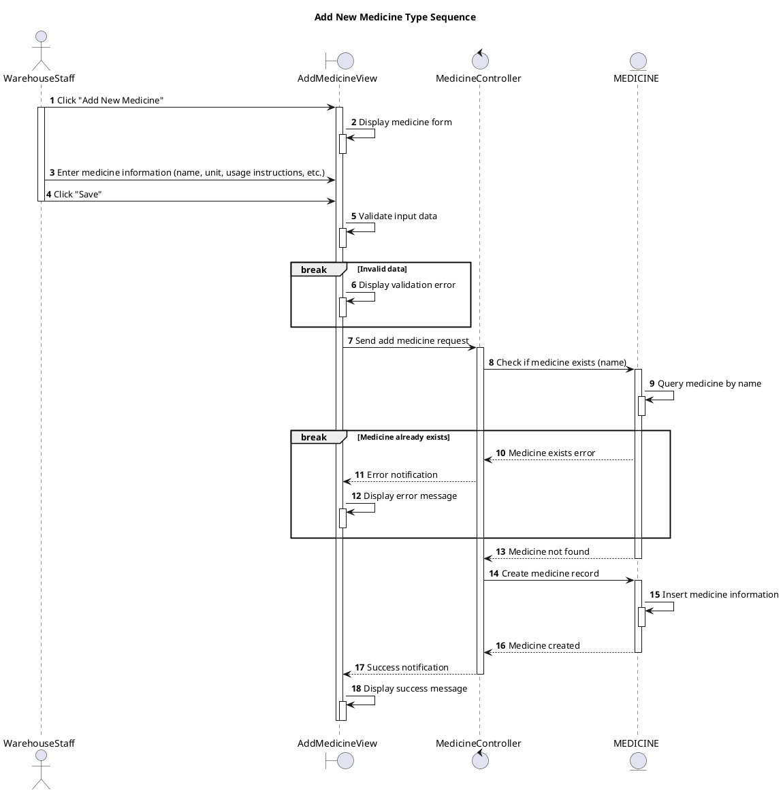

# Sequence Add New Medicine Type

## Description

This sequence diagram describes adding a new medicine type to the system.

## Diagram

<!-- diagram id="sequence-manage-medicine-inventory-add-new" -->

