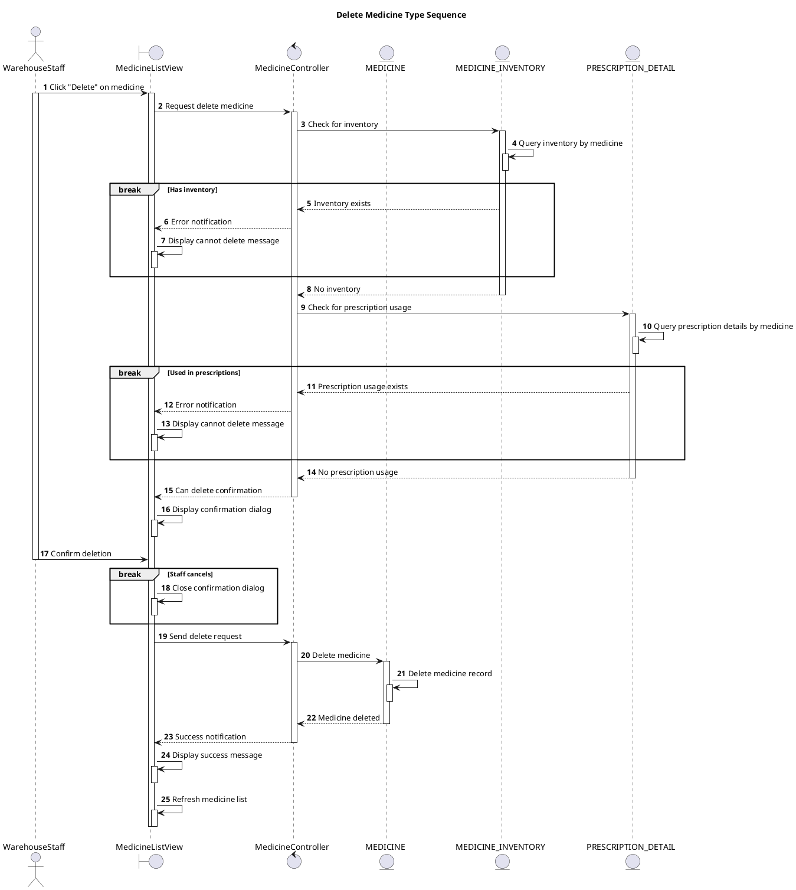

# Sequence Delete Medicine Type

## Description

This sequence diagram describes deleting a medicine type.

## Diagram

<!-- diagram id="sequence-manage-medicine-inventory-delete" -->

```plantuml
@startuml
autonumber

actor WarehouseStaff as WS
boundary MedicineListView as MLV
control MedicineController as MC
entity MEDICINE as M
entity MEDICINE_INVENTORY as MI
entity PRESCRIPTION_DETAIL as PD

title Delete Medicine Type Sequence

WS -> MLV: Click "Delete" on medicine
activate WS
activate MLV

MLV -> MC: Request delete medicine
activate MC

MC -> MI: Check for inventory
activate MI
MI -> MI: Query inventory by medicine
activate MI
deactivate MI

break Has inventory
  MC <-- MI: Inventory exists
  MLV <-- MC: Error notification
  MLV -> MLV: Display cannot delete message
  activate MLV
  deactivate MLV
end

MC <-- MI: No inventory
deactivate MI

MC -> PD: Check for prescription usage
activate PD
PD -> PD: Query prescription details by medicine
activate PD
deactivate PD

break Used in prescriptions
  MC <-- PD: Prescription usage exists
  MLV <-- MC: Error notification
  MLV -> MLV: Display cannot delete message
  activate MLV
  deactivate MLV
end

MC <-- PD: No prescription usage
deactivate PD

MLV <-- MC: Can delete confirmation
deactivate MC
MLV -> MLV: Display confirmation dialog
activate MLV
deactivate MLV

WS -> MLV: Confirm deletion
deactivate WS

break Staff cancels
  MLV -> MLV: Close confirmation dialog
  activate MLV
  deactivate MLV
end

MLV -> MC: Send delete request
activate MC

MC -> M: Delete medicine
activate M
M -> M: Delete medicine record
activate M
deactivate M
MC <-- M: Medicine deleted
deactivate M

MLV <-- MC: Success notification
deactivate MC
MLV -> MLV: Display success message
activate MLV
deactivate MLV
MLV -> MLV: Refresh medicine list
activate MLV
deactivate MLV

deactivate MLV

@enduml
```
