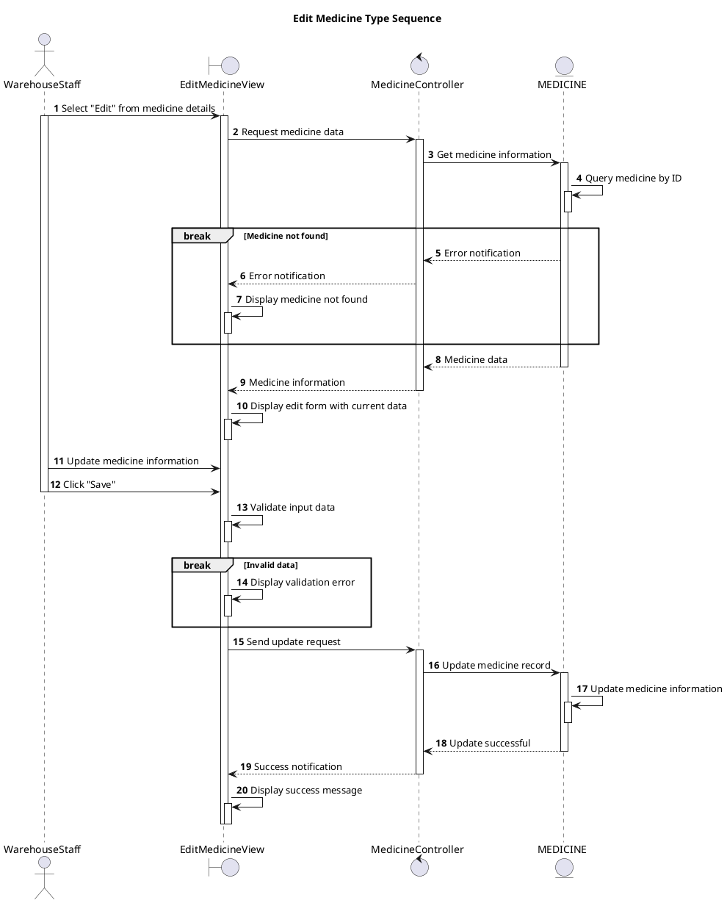

# Sequence Edit Medicine Type

## Description

This sequence diagram describes editing medicine type information.

## Diagram

<!-- diagram id="sequence-manage-medicine-inventory-edit" -->

```plantuml
@startuml
autonumber

actor WarehouseStaff as WS
boundary EditMedicineView as EMV
control MedicineController as MC
entity MEDICINE as M

title Edit Medicine Type Sequence

WS -> EMV: Select "Edit" from medicine details
activate WS
activate EMV

EMV -> MC: Request medicine data
activate MC

MC -> M: Get medicine information
activate M
M -> M: Query medicine by ID
activate M
deactivate M

break Medicine not found
  MC <-- M: Error notification
  EMV <-- MC: Error notification
  EMV -> EMV: Display medicine not found
  activate EMV
  deactivate EMV
end

MC <-- M: Medicine data
deactivate M

EMV <-- MC: Medicine information
deactivate MC
EMV -> EMV: Display edit form with current data
activate EMV
deactivate EMV

WS -> EMV: Update medicine information
WS -> EMV: Click "Save"
deactivate WS

EMV -> EMV: Validate input data
activate EMV
deactivate EMV

break Invalid data
  EMV -> EMV: Display validation error
  activate EMV
  deactivate EMV
end

EMV -> MC: Send update request
activate MC

MC -> M: Update medicine record
activate M
M -> M: Update medicine information
activate M
deactivate M
MC <-- M: Update successful
deactivate M

EMV <-- MC: Success notification
deactivate MC
EMV -> EMV: Display success message
activate EMV
deactivate EMV

deactivate EMV

@enduml
```
