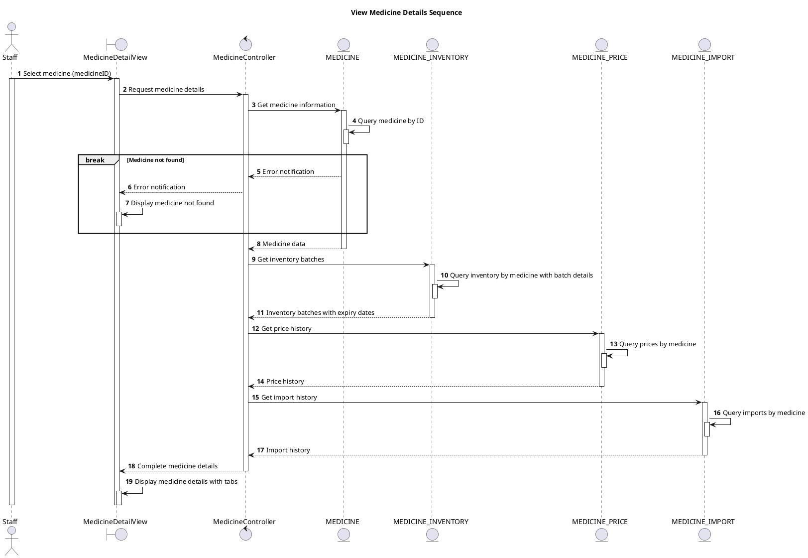

# Sequence View Medicine Details

## Description

This sequence diagram describes viewing detailed information of a medicine type.

## Diagram

<!-- diagram id="sequence-manage-medicine-inventory-view-details" -->

