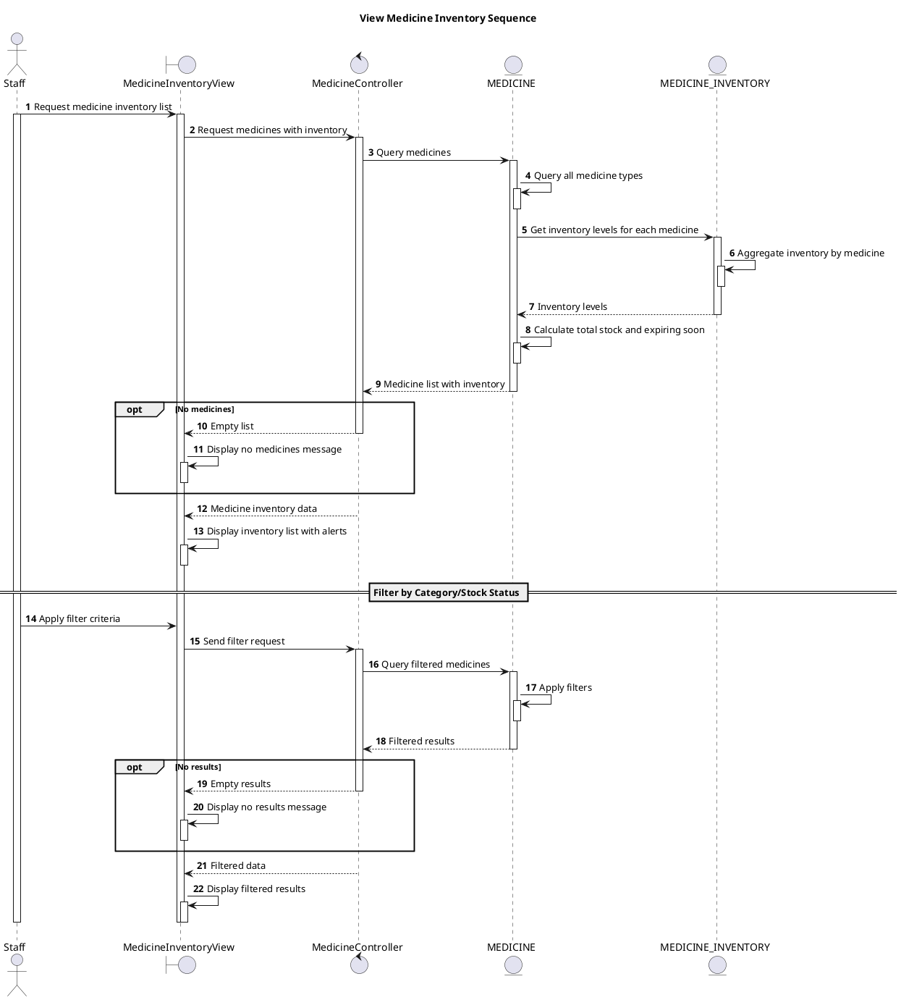

# Sequence View Medicine Inventory

## Description

This sequence diagram describes viewing medicine inventory with stock levels.

## Diagram

<!-- diagram id="sequence-manage-medicine-inventory-view" -->

