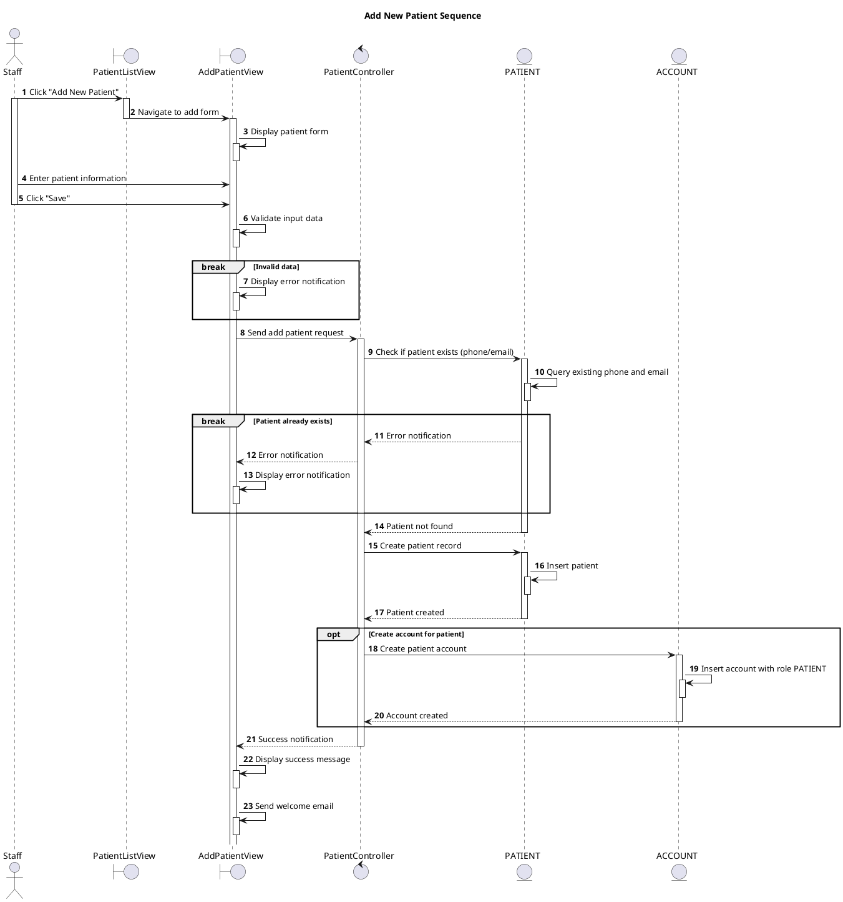

# Sequence Add New Patient

## Description

This sequence diagram describes adding a new patient to the system.

## Diagram

<!-- diagram id="sequence-manage-patient-add-new" -->

```plantuml
@startuml
autonumber

actor Staff as St
boundary PatientListView as PLV
boundary AddPatientView as APV
control PatientController as PC
entity PATIENT as P
entity ACCOUNT as A

title Add New Patient Sequence

St -> PLV: Click "Add New Patient"
activate St
activate PLV
PLV -> APV: Navigate to add form
deactivate PLV
activate APV
APV -> APV: Display patient form
activate APV
deactivate APV

St -> APV: Enter patient information
St -> APV: Click "Save"
deactivate St
APV -> APV: Validate input data
activate APV
deactivate APV

break Invalid data
  APV -> APV: Display error notification
  activate APV
  deactivate APV
end

APV -> PC: Send add patient request
activate PC
PC -> P: Check if patient exists (phone/email)
activate P
P -> P: Query existing phone and email
activate P
deactivate P

break Patient already exists
  PC <-- P: Error notification
  APV <-- PC: Error notification
  APV -> APV: Display error notification
  activate APV
  deactivate APV
end

PC <-- P: Patient not found
deactivate P

PC -> P: Create patient record
activate P
P -> P: Insert patient
activate P
deactivate P
PC <-- P: Patient created
deactivate P

opt Create account for patient
  PC -> A: Create patient account
  activate A
  A -> A: Insert account with role PATIENT
  activate A
  deactivate A
  PC <-- A: Account created
  deactivate A
end

APV <-- PC: Success notification
deactivate PC
APV -> APV: Display success message
activate APV
deactivate APV
APV -> APV: Send welcome email
activate APV
deactivate APV
@enduml
```
