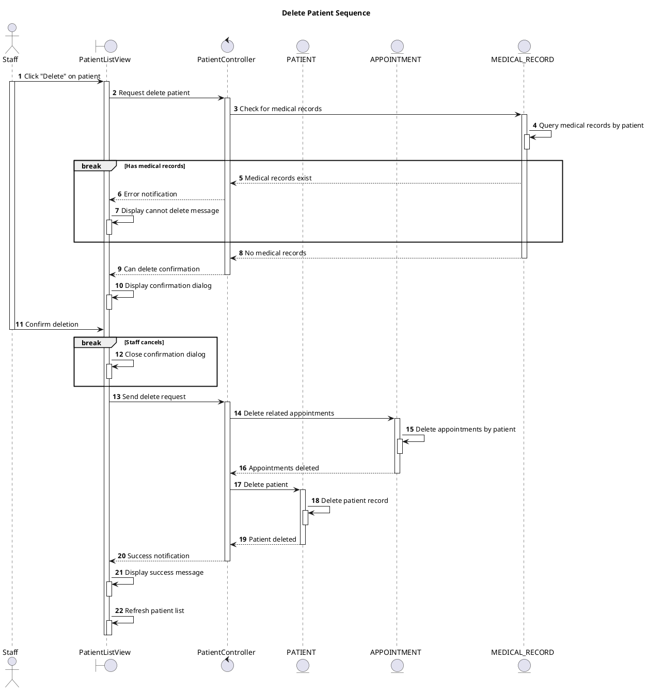

# Sequence Delete Patient

## Description

This sequence diagram describes deleting a patient from the system.

## Diagram

<!-- diagram id="sequence-manage-patient-delete" -->

```plantuml
@startuml
autonumber

actor Staff as St
boundary PatientListView as PLV
control PatientController as PC
entity PATIENT as P
entity APPOINTMENT as A
entity MEDICAL_RECORD as MR

title Delete Patient Sequence

St -> PLV: Click "Delete" on patient
activate St
activate PLV
PLV -> PC: Request delete patient
activate PC

PC -> MR: Check for medical records
activate MR
MR -> MR: Query medical records by patient
activate MR
deactivate MR

break Has medical records
  PC <-- MR: Medical records exist
  PLV <-- PC: Error notification
  PLV -> PLV: Display cannot delete message
  activate PLV
  deactivate PLV
end

PC <-- MR: No medical records
deactivate MR

PLV <-- PC: Can delete confirmation
deactivate PC
PLV -> PLV: Display confirmation dialog
activate PLV
deactivate PLV

St -> PLV: Confirm deletion
deactivate St

break Staff cancels
  PLV -> PLV: Close confirmation dialog
  activate PLV
  deactivate PLV
end

PLV -> PC: Send delete request
activate PC

PC -> A: Delete related appointments
activate A
A -> A: Delete appointments by patient
activate A
deactivate A
PC <-- A: Appointments deleted
deactivate A

PC -> P: Delete patient
activate P
P -> P: Delete patient record
activate P
deactivate P
PC <-- P: Patient deleted
deactivate P

PLV <-- PC: Success notification
deactivate PC
PLV -> PLV: Display success message
activate PLV
deactivate PLV
PLV -> PLV: Refresh patient list
activate PLV
deactivate PLV

deactivate PLV
@enduml
```
