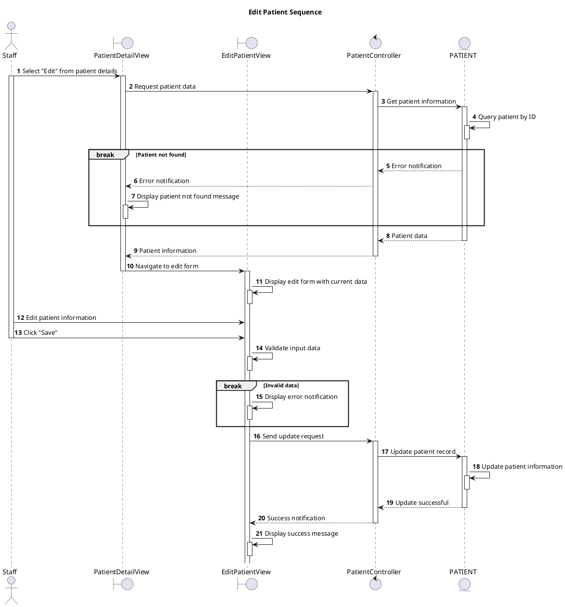

# Sequence Edit Patient

## Description

This sequence diagram describes editing patient information.

## Diagram

<!-- diagram id="sequence-manage-patient-edit" -->

```plantuml
@startuml
autonumber

actor Staff as St
boundary PatientDetailView as PDV
boundary EditPatientView as EPV
control PatientController as PC
entity PATIENT as P

title Edit Patient Sequence

St -> PDV: Select "Edit" from patient details
activate St
activate PDV
PDV -> PC: Request patient data
activate PC
PC -> P: Get patient information
activate P
P -> P: Query patient by ID
activate P
deactivate P

break Patient not found
  PC <-- P: Error notification
  PDV <-- PC: Error notification
  PDV -> PDV: Display patient not found message
  activate PDV
  deactivate PDV
end

PC <-- P: Patient data
deactivate P
PDV <-- PC: Patient information
deactivate PC
PDV -> EPV: Navigate to edit form
deactivate PDV
activate EPV
EPV -> EPV: Display edit form with current data
activate EPV
deactivate EPV

St -> EPV: Edit patient information
St -> EPV: Click "Save"
deactivate St
EPV -> EPV: Validate input data
activate EPV
deactivate EPV

break Invalid data
  EPV -> EPV: Display error notification
  activate EPV
  deactivate EPV
end

EPV -> PC: Send update request
activate PC
PC -> P: Update patient record
activate P
P -> P: Update patient information
activate P
deactivate P
PC <-- P: Update successful
deactivate P

EPV <-- PC: Success notification
deactivate PC
EPV -> EPV: Display success message
activate EPV
deactivate EPV

@enduml
```
