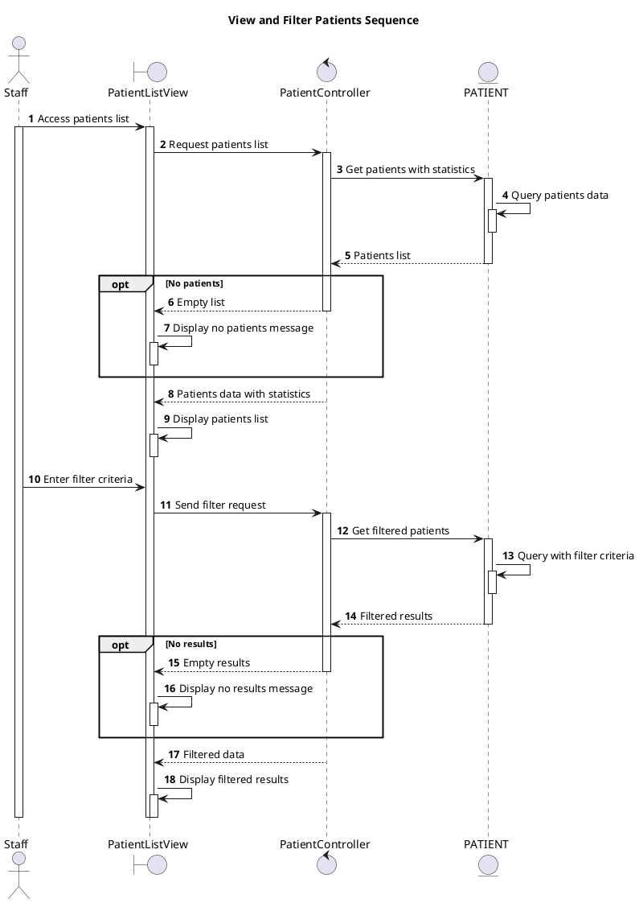

# Sequence View and Filter Patients

## Description

This sequence diagram describes the view and filter patients flow for staff in the Private Clinic Management System.

## Diagram

<!-- diagram id="sequence-manage-patient-view-and-filter" -->

