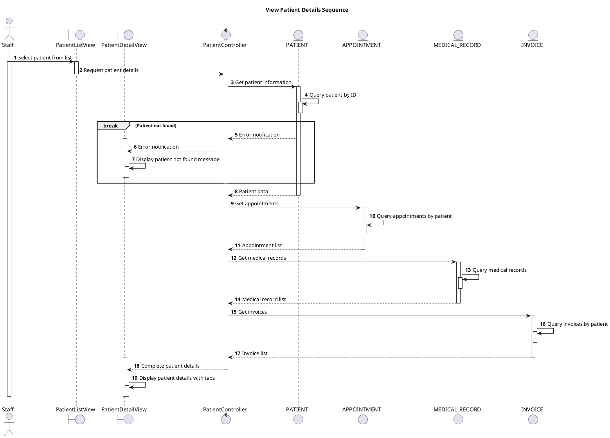

# Sequence View Patient Details

## Description

This sequence diagram describes viewing detailed information of a patient.

## Diagram

<!-- diagram id="sequence-manage-patient-view-details" -->

```plantuml
@startuml
autonumber

actor Staff as St
boundary PatientListView as PLV
boundary PatientDetailView as PDV
control PatientController as PC
entity PATIENT as P
entity APPOINTMENT as A
entity MEDICAL_RECORD as MR
entity INVOICE as I

title View Patient Details Sequence

St -> PLV: Select patient from list
activate St
activate PLV
PLV -> PC: Request patient details
deactivate PLV
activate PC

PC -> P: Get patient information
activate P
P -> P: Query patient by ID
activate P
deactivate P

break Patient not found
  PC <-- P: Error notification
  activate PDV
  PDV <-- PC: Error notification
  PDV -> PDV: Display patient not found message
  activate PDV
  deactivate PDV
  deactivate PDV
end

PC <-- P: Patient data
deactivate P

PC -> A: Get appointments
activate A
A -> A: Query appointments by patient
activate A
deactivate A
PC <-- A: Appointment list
deactivate A

PC -> MR: Get medical records
activate MR
MR -> MR: Query medical records
activate MR
deactivate MR
PC <-- MR: Medical record list
deactivate MR

PC -> I: Get invoices
activate I
I -> I: Query invoices by patient
activate I
deactivate I
PC <-- I: Invoice list
deactivate I

activate PDV
PDV <-- PC: Complete patient details
deactivate PC
PDV -> PDV: Display patient details with tabs
activate PDV
deactivate PDV

deactivate PDV
deactivate St

@enduml
```
