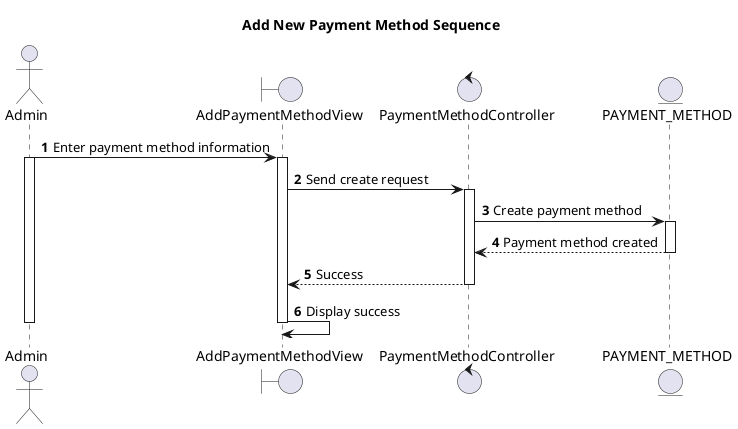

# Sequence Add New Payment Method

## Description

Standard CRUD add sequence.

## Diagram

<!-- diagram id="sequence-manage-payment-method-add-new" -->

```plantuml
@startuml
autonumber

actor Admin as A
boundary AddPaymentMethodView as APV
control PaymentMethodController as PC
entity PAYMENT_METHOD as PM

title Add New Payment Method Sequence

A -> APV: Enter payment method information
activate A
activate APV
APV -> PC: Send create request
activate PC
PC -> PM: Create payment method
activate PM
PC <-- PM: Payment method created
deactivate PM
APV <-- PC: Success
deactivate PC
APV -> APV: Display success
deactivate APV
deactivate A

@enduml
```
