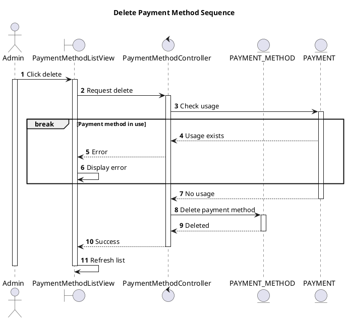

# Sequence Delete Payment Method

## Description

Standard CRUD delete sequence with constraint check.

## Diagram

<!-- diagram id="sequence-manage-payment-method-delete" -->

```plantuml
@startuml
autonumber

actor Admin as A
boundary PaymentMethodListView as PLV
control PaymentMethodController as PC
entity PAYMENT_METHOD as PM
entity PAYMENT as P

title Delete Payment Method Sequence

A -> PLV: Click delete
activate A
activate PLV
PLV -> PC: Request delete
activate PC
PC -> P: Check usage
activate P
break Payment method in use
  PC <-- P: Usage exists
  PLV <-- PC: Error
  PLV -> PLV: Display error
end
PC <-- P: No usage
deactivate P
PC -> PM: Delete payment method
activate PM
PC <-- PM: Deleted
deactivate PM
PLV <-- PC: Success
deactivate PC
PLV -> PLV: Refresh list
deactivate PLV
deactivate A

@enduml
```
