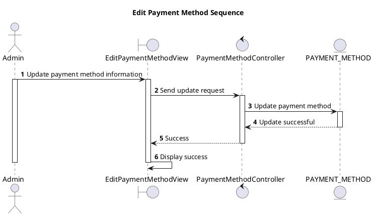

# Sequence Edit Payment Method

## Description

Standard CRUD edit sequence.

## Diagram

<!-- diagram id="sequence-manage-payment-method-edit" -->

```plantuml
@startuml
autonumber

actor Admin as A
boundary EditPaymentMethodView as EPV
control PaymentMethodController as PC
entity PAYMENT_METHOD as PM

title Edit Payment Method Sequence

A -> EPV: Update payment method information
activate A
activate EPV
EPV -> PC: Send update request
activate PC
PC -> PM: Update payment method
activate PM
PC <-- PM: Update successful
deactivate PM
EPV <-- PC: Success
deactivate PC
EPV -> EPV: Display success
deactivate EPV
deactivate A

@enduml
```
