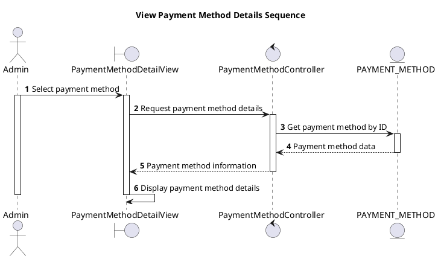

# Sequence View Payment Method Details

## Description

Standard CRUD view details sequence.

## Diagram

<!-- diagram id="sequence-manage-payment-method-view-details" -->

```plantuml
@startuml
autonumber

actor Admin as A
boundary PaymentMethodDetailView as PDV
control PaymentMethodController as PC
entity PAYMENT_METHOD as PM

title View Payment Method Details Sequence

A -> PDV: Select payment method
activate A
activate PDV
PDV -> PC: Request payment method details
activate PC
PC -> PM: Get payment method by ID
activate PM
PC <-- PM: Payment method data
deactivate PM
PDV <-- PC: Payment method information
deactivate PC
PDV -> PDV: Display payment method details
deactivate PDV
deactivate A

@enduml
```
