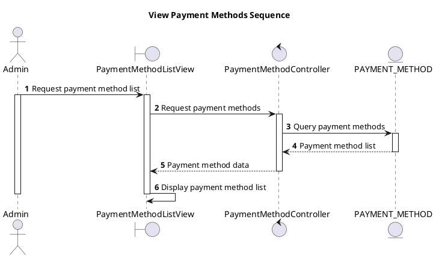

# Sequence View Payment Methods

## Description

Standard CRUD view list sequence.

## Diagram

<!-- diagram id="sequence-manage-payment-method-view-list" -->

```plantuml
@startuml
autonumber

actor Admin as A
boundary PaymentMethodListView as PLV
control PaymentMethodController as PC
entity PAYMENT_METHOD as PM

title View Payment Methods Sequence

A -> PLV: Request payment method list
activate A
activate PLV
PLV -> PC: Request payment methods
activate PC
PC -> PM: Query payment methods
activate PM
PC <-- PM: Payment method list
deactivate PM
PLV <-- PC: Payment method data
deactivate PC
PLV -> PLV: Display payment method list
deactivate PLV
deactivate A

@enduml
```
