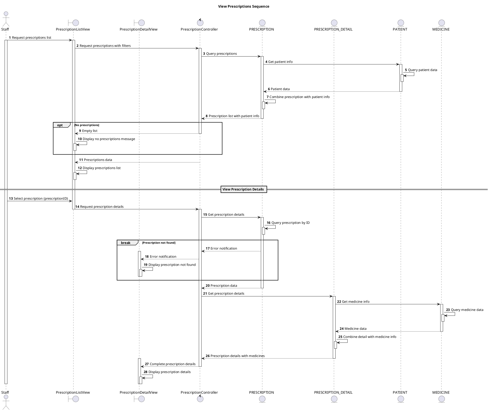

# Sequence View Prescriptions

## Description

This sequence diagram describes viewing prescription list and details.

## Diagram

<!-- diagram id="sequence-manage-prescription-view-list" -->

```plantuml
@startuml
autonumber

actor Staff as St
boundary PrescriptionListView as PLV
boundary PrescriptionDetailView as PDV
control PrescriptionController as PC
entity PRESCRIPTION as PR
entity PRESCRIPTION_DETAIL as PD
entity PATIENT as P
entity MEDICINE as M

title View Prescriptions Sequence

St -> PLV: Request prescriptions list
activate St
activate PLV

PLV -> PC: Request prescriptions with filters
activate PC

PC -> PR: Query prescriptions
activate PR

PR -> P: Get patient info
activate P
P -> P: Query patient data
activate P
deactivate P
PR <-- P: Patient data
deactivate P

PR -> PR: Combine prescription with patient info
activate PR
deactivate PR

PC <-- PR: Prescription list with patient info
deactivate PR

opt No prescriptions
  PLV <-- PC: Empty list
  deactivate PC
  PLV -> PLV: Display no prescriptions message
  activate PLV
  deactivate PLV
end

PLV <-- PC: Prescriptions data
deactivate PC
PLV -> PLV: Display prescriptions list
activate PLV
deactivate PLV

== View Prescription Details ==

St -> PLV: Select prescription (prescriptionID)
PLV -> PC: Request prescription details
deactivate PLV
activate PC

PC -> PR: Get prescription details
activate PR
PR -> PR: Query prescription by ID
activate PR
deactivate PR

break Prescription not found
  PC <-- PR: Error notification
  activate PDV
  PDV <-- PC: Error notification
  PDV -> PDV: Display prescription not found
  activate PDV
  deactivate PDV
  deactivate PDV
end

PC <-- PR: Prescription data
deactivate PR

PC -> PD: Get prescription details
activate PD
PD -> M: Get medicine info
activate M
M -> M: Query medicine data
activate M
deactivate M
PD <-- M: Medicine data
deactivate M

PD -> PD: Combine detail with medicine info
activate PD
deactivate PD
PC <-- PD: Prescription details with medicines
deactivate PD

activate PDV
PDV <-- PC: Complete prescription details
deactivate PC
PDV -> PDV: Display prescription details
activate PDV
deactivate PDV

deactivate PDV
deactivate St

@enduml
```
