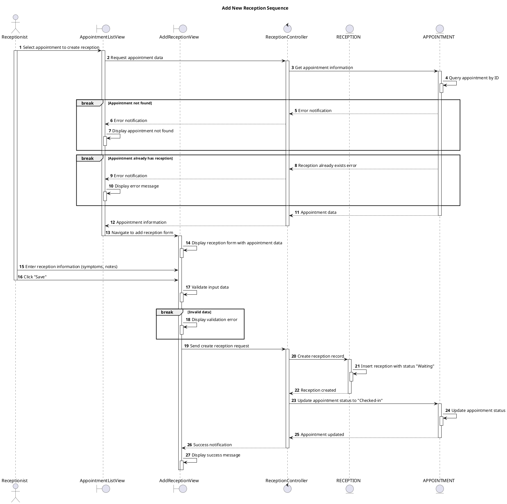

# Sequence Add New Reception

## Description

This sequence diagram describes creating a new reception from an appointment.

## Diagram

<!-- diagram id="sequence-manage-reception-add-new" -->

```plantuml
@startuml
autonumber

actor Receptionist as R
boundary AppointmentListView as ALV
boundary AddReceptionView as ARV
control ReceptionController as RC
entity RECEPTION as RE
entity APPOINTMENT as A

title Add New Reception Sequence

R -> ALV: Select appointment to create reception
activate R
activate ALV

ALV -> RC: Request appointment data
activate RC

RC -> A: Get appointment information
activate A
A -> A: Query appointment by ID
activate A
deactivate A

break Appointment not found
  RC <-- A: Error notification
  ALV <-- RC: Error notification
  ALV -> ALV: Display appointment not found
  activate ALV
  deactivate ALV
end

break Appointment already has reception
  RC <-- A: Reception already exists error
  ALV <-- RC: Error notification
  ALV -> ALV: Display error message
  activate ALV
  deactivate ALV
end

RC <-- A: Appointment data
deactivate A

ALV <-- RC: Appointment information
deactivate RC
ALV -> ARV: Navigate to add reception form
deactivate ALV
activate ARV
ARV -> ARV: Display reception form with appointment data
activate ARV
deactivate ARV

R -> ARV: Enter reception information (symptoms, notes)
R -> ARV: Click "Save"
deactivate R

ARV -> ARV: Validate input data
activate ARV
deactivate ARV

break Invalid data
  ARV -> ARV: Display validation error
  activate ARV
  deactivate ARV
end

ARV -> RC: Send create reception request
activate RC

RC -> RE: Create reception record
activate RE
RE -> RE: Insert reception with status "Waiting"
activate RE
deactivate RE
RC <-- RE: Reception created
deactivate RE

RC -> A: Update appointment status to "Checked-in"
activate A
A -> A: Update appointment status
activate A
deactivate A
RC <-- A: Appointment updated
deactivate A

ARV <-- RC: Success notification
deactivate RC
ARV -> ARV: Display success message
activate ARV
deactivate ARV

deactivate ARV

@enduml
```
