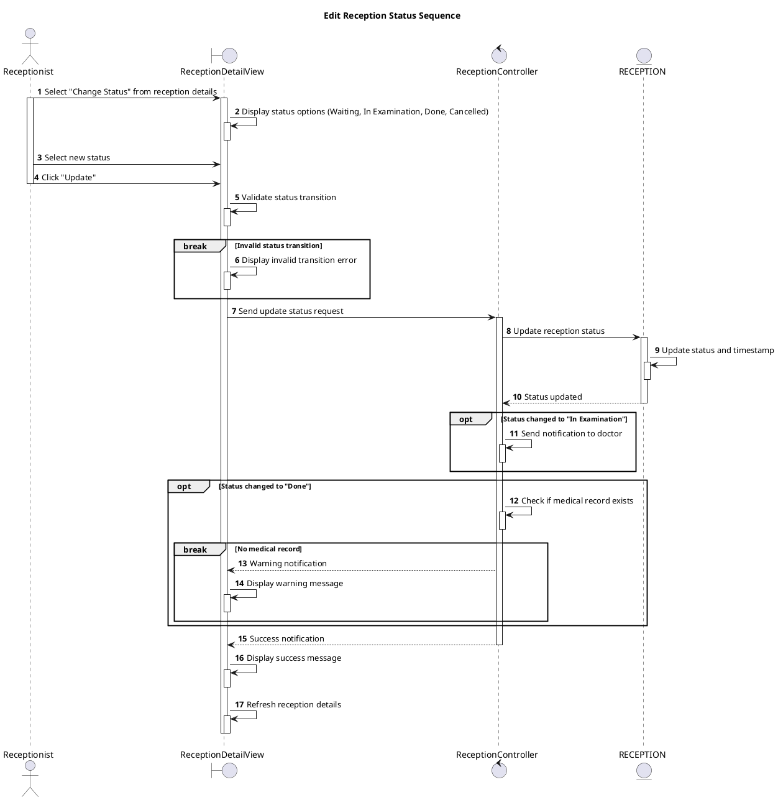

# Sequence Edit Reception Status

## Description

This sequence diagram describes updating reception status.

## Diagram

<!-- diagram id="sequence-manage-reception-edit-status" -->

```plantuml
@startuml
autonumber

actor Receptionist as R
boundary ReceptionDetailView as RDV
control ReceptionController as RC
entity RECEPTION as RE

title Edit Reception Status Sequence

R -> RDV: Select "Change Status" from reception details
activate R
activate RDV

RDV -> RDV: Display status options (Waiting, In Examination, Done, Cancelled)
activate RDV
deactivate RDV

R -> RDV: Select new status
R -> RDV: Click "Update"
deactivate R

RDV -> RDV: Validate status transition
activate RDV
deactivate RDV

break Invalid status transition
  RDV -> RDV: Display invalid transition error
  activate RDV
  deactivate RDV
end

RDV -> RC: Send update status request
activate RC

RC -> RE: Update reception status
activate RE
RE -> RE: Update status and timestamp
activate RE
deactivate RE
RC <-- RE: Status updated
deactivate RE

opt Status changed to "In Examination"
  RC -> RC: Send notification to doctor
  activate RC
  deactivate RC
end

opt Status changed to "Done"
  RC -> RC: Check if medical record exists
  activate RC
  deactivate RC

  break No medical record
    RDV <-- RC: Warning notification
    RDV -> RDV: Display warning message
    activate RDV
    deactivate RDV
  end
end

RDV <-- RC: Success notification
deactivate RC
RDV -> RDV: Display success message
activate RDV
deactivate RDV
RDV -> RDV: Refresh reception details
activate RDV
deactivate RDV

deactivate RDV

@enduml
```
