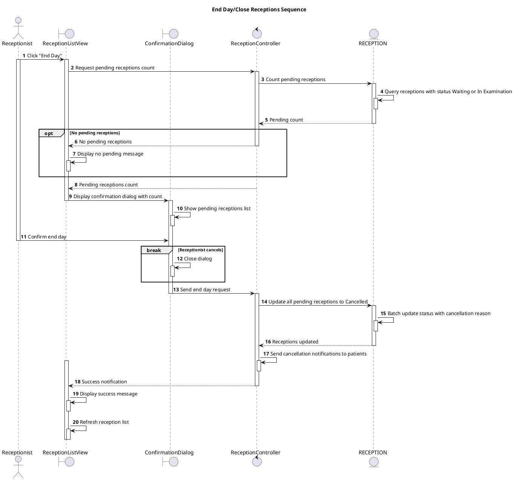

# Sequence End Day/Close Receptions

## Description

This sequence diagram describes closing all pending receptions at end of day.

## Diagram

<!-- diagram id="sequence-manage-reception-end-day" -->

