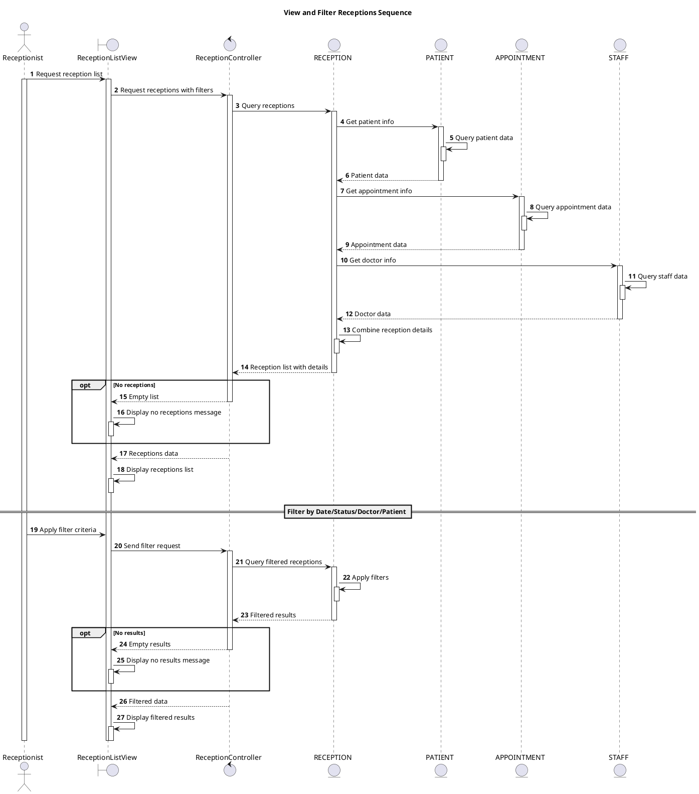

# Sequence View and Filter Receptions

## Description

This sequence diagram describes viewing and filtering receptions.

## Diagram

<!-- diagram id="sequence-manage-reception-view-and-filter" -->

